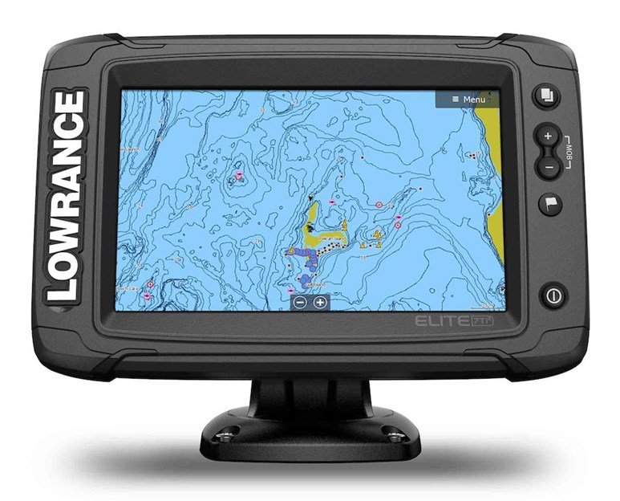
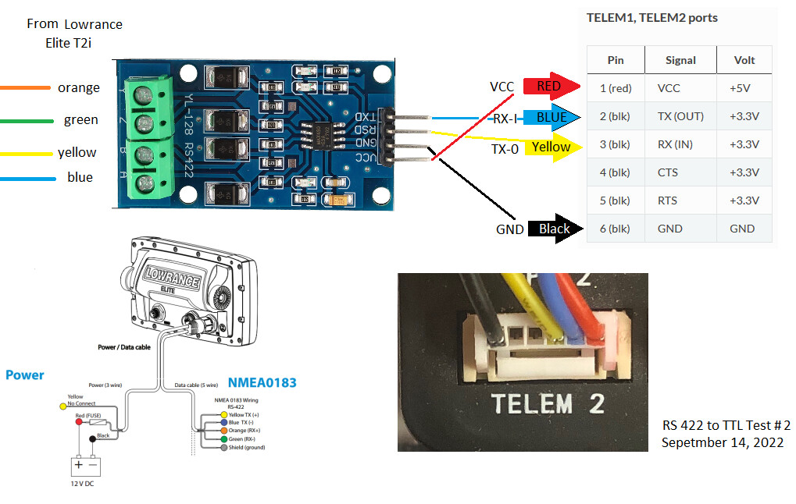

.. _common-lowrance-elite-ti2-sonar:

========================
Lowrance Elite Ti2 Sonar
========================

The `Lowrance Elite Ti2 sonar <https://www.lowrance.com/lowrance/type/fishfinders-chartplotters/elite-7-ti2-us-inland-ai-3-in-1/>`__ can be connected to the autopilot so that the sonar can use the autopilot's position estimate (which is normally better than the sonar's built-in GPS) and the autopilot can record and report the sonar's simple depth.

Discussion of this sonar's setup is `here <https://discuss.ardupilot.org/t/lowrance-nmea-0183-to-cube-orange/86057/8>`__

Hardware Setup
--------------

- Purchase an `RS422 to TTL converter <https://www.amazon.com/LM-bi-directional-Full-duplex-single-chip-microcomputer/dp/B01NGTMROI>`__
- Connect the sonar's NMEA 0183 pins to the left side of the converter as shown above
- Connect one of the autopilot's serial ports to the right side of the converter as shown above

Configuration
-------------

If the autopilot's Serial2 port (aka Telem2) is used then the following parameters should be set:

-  :ref:`SERIAL2_PROTOCOL <SERIAL2_PROTOCOL>` = 9 (Lidar)
-  :ref:`SERIAL2_BAUD <SERIAL2_BAUD>` = 38 (38400 baud) to match the baud rate the Elite is using

These rangefinder parameters should also be set:

-  :ref:`RNGFND1_TYPE <RNGFND1_TYPE>` = 17 (NMEA)
-  :ref:`RNGFND1_MIN_CM <RNGFND1_MIN_CM>` = 13
-  :ref:`RNGFND1_MAX_CM <RNGFND1_MAX_CM>` = 30000 (300m)
-  :ref:`RNGFND1_ORIENT <RNGFND1_ORIENT>` = 25 (down)

Testing the sensor
==================

Distances read by the sensor can be seen in the Mission Planner's Flight
Data screen's Status tab. Look closely for "sonarrange".

.. image:: ../../../images/mp_rangefinder_lidarlite_testing.jpg
    :target: ../_images/mp_rangefinder_lidarlite_testing.jpg
