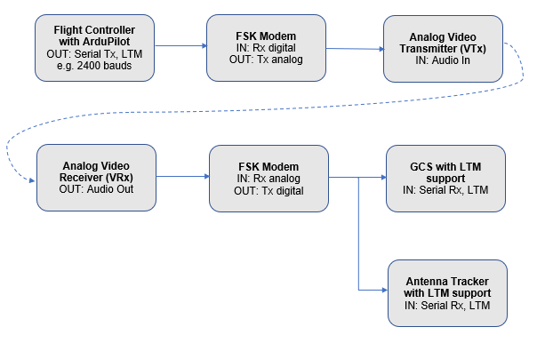
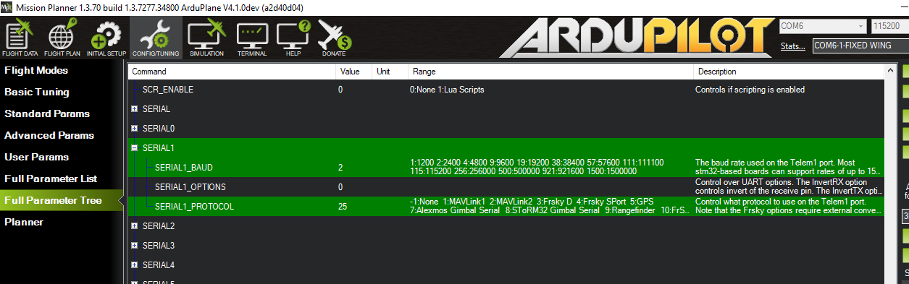
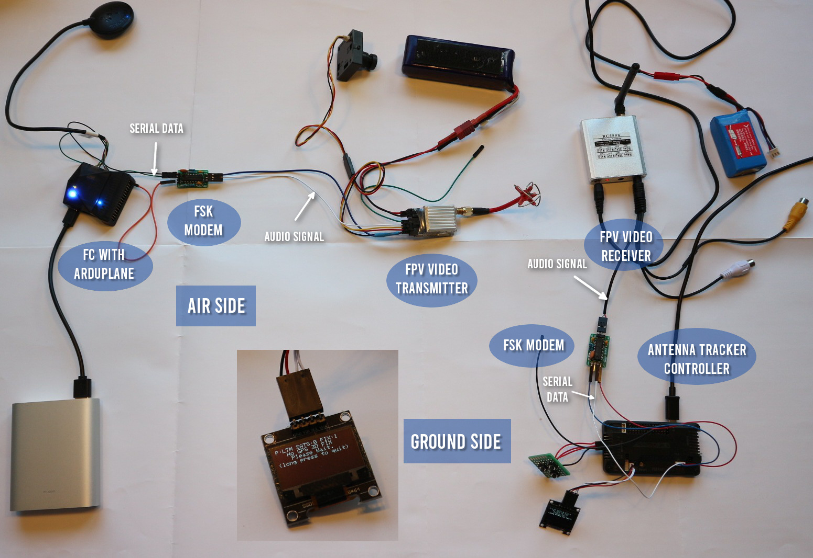
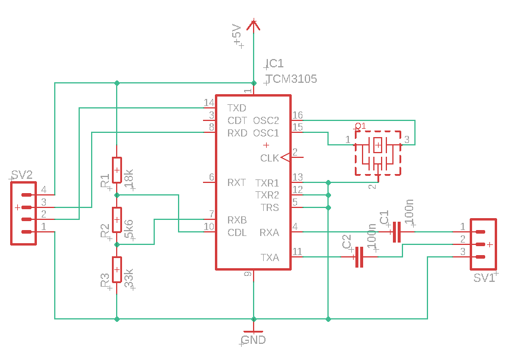
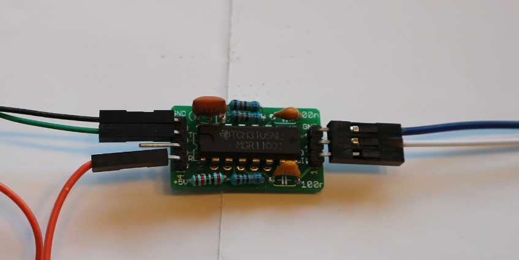

.. _common-ltm-telemetry:

=============
LTM Telemetry
=============

-----------------
Protocol overview
-----------------

Lightweight TeleMetry protocol (LTM) is one-way communication protocol - data downlink from vehicle - that allows you to send most important vehicle data at low band-width / low baud rate, usually at 2400 bauds.

Protocol was introduced by KipK and is used in his Ghetto Station.

Typical use-case is antenna tracking when serial telemetry data from Flight Controller (FC) are transformed by Frequency Shift Keying modulation (FSK) modem to sort of audio signal, that is transferred by audio channel of video transmitter to video receiver on ground side. Consequently it's converted back to digital signal by other FSK modem and processed in antenna tracker (AT) and possibly in Ground Control Station (GCS).

    Block diagram of common LTM telemetry setup

**Implemented protocol frame types at ardupilot side**
  - G-Frame (GPS)
        - contains latitude, longitude, GPS ground speed, no. of visible sats, GPS fix type
        - size 18 Bytes, sent at 2 Hz
  - A-Frame (Attitude)
        - contains vehicle attitude, heading
        - 10B / 5 Hz
  - S-Frame (Status)
        - contains battery voltage, current, receiver RSSI, airspeed from AHRS
        - 11B / 2 Hz

**Protocol limitations**
  - GPS fix data type uses only 2 bits - list of possible values is *0* (No GPS fix), *1* (2D fix), *2* (3D fix). GPS fix values above 2 are mapped to value *2*.

**Links related to LTM telemetry**
  - GhettoStation antenna tracker: `https://github.com/KipK/Ghettostation <https://github.com/KipK/Ghettostation>`_
  - iNAV documentation for LTM protocol: `https://github.com/iNavFlight/inav/wiki/Lightweight-Telemetry-(LTM) <https://github.com/iNavFlight/inav/wiki/Lightweight-Telemetry-(LTM)>`_
  - Protocol overview at quadmeup.com: `https://quadmeup.com/ltm-light-telemetry-protocol/ <https://quadmeup.com/ltm-light-telemetry-protocol>`_

-------------
Configuration
-------------

Parameter **SERIALX_PROTOCOL** has to be set to value *25* to enable LTM output from FC on given serial port.

    LTM configuration screenshot from Mission Planner

.. note::

    Don't forget to set baud rate to appropriate value. If you are using FSK modems, baud rate value depends on capability of modems.

----------------------------------------
Usage example with FPV video transmitter
----------------------------------------

    LTM telemetry wiring example for Plane

------------------------------
FSK modem example with TCM3105
------------------------------

One of the possibilities for FSK modem is to use chip TCM3105. Eagle files for modem schematics and board can be found at `https://github.com/kh4/FSK_modem <https://github.com/kh4/FSK_modem>`_

This modem can work at 1200 or 2400 bauds, baud rate depends on used oscillator.

    FSK modem with TCM3105 schematics example

    FSK modem with TCM3105 photo

.. tip::

    Use 8 MHz oscillator to make modem work at 2400 bauds.
