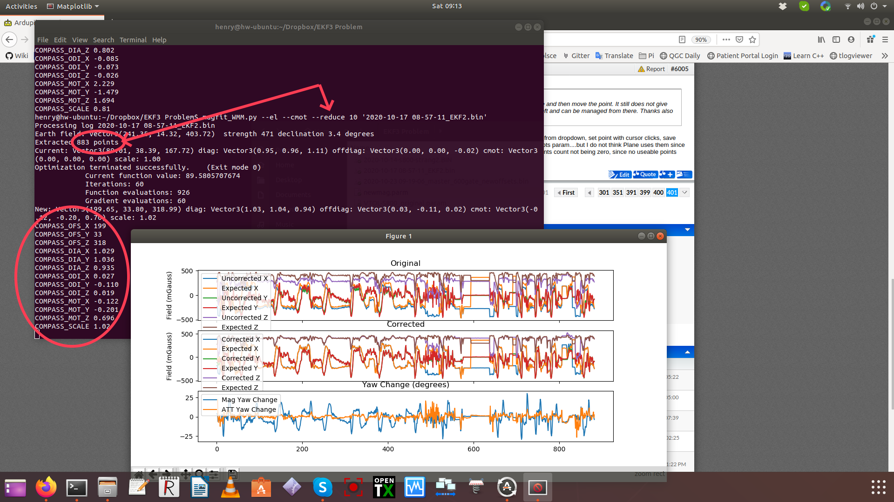
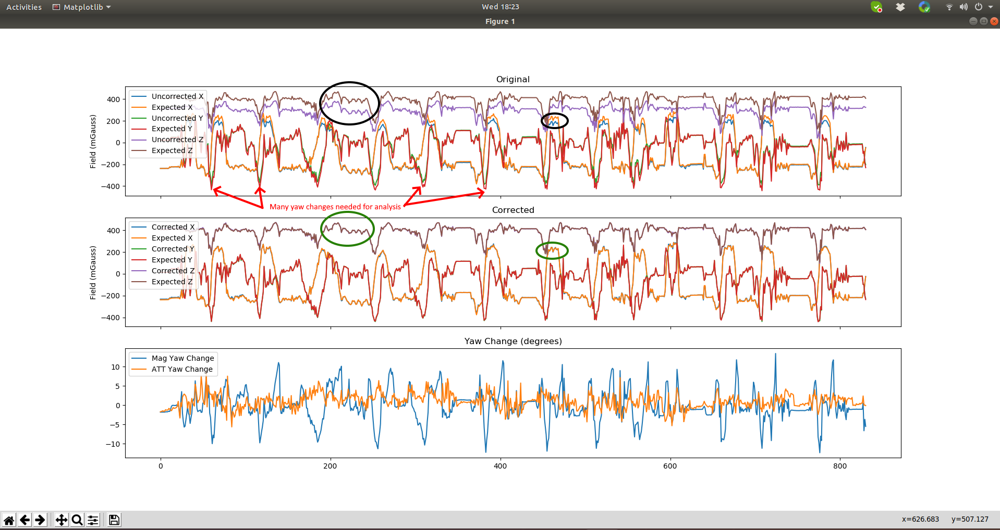

.. _common-magfit:

Refining Calibration Parameters using a Flight Log
==================================================

The compass offsets, scales, diagonals, and even motor compensation can be determined from a flight dataflash log of the vehicle using the magfit_WMM.py utility. This utility is installed when the `build/sim environment <https://ardupilot.org/dev/docs/building-the-code.html>`_ has been installed on your PC, either Linux or Windows.

The image below shows the results of a run on a log file for a single compass plane.

the compass parameters are output after the run and a graph showing the EKF expected mag field vs actual reported before and after changing the params is displayed showing to closer fit. This would result in fewer/smaller compass innovations in the EKF. Compass motor correction is also provided and is assumed that current mode (vs throttle mode) would be used when setting it up.

For large files, the analysis can be very long if all the measurement points are used in large files. This can be shortened and still have good results by reducing the number of points using the ``--reduce`` option. The file above was about 9,000 points but was reduced by taking every 10th point for the analysis.

To use:

::

    magfit_WMM.py [option]...  <logfile path>

options can be show with the ``-h`` option,but the key ones are:

- "--el"  to compute diagonals in addition to offsets
- "--cmot"  to compute motor compensation vs current
- "--reduce SKIPINTERVAL" skips SKIPINTERVAL points between samples used for analysis
- "--mag MAGINSTANCE"  to analyze for a specific MAGINSTANCE number instead of the first mag (1)

Perhaps the most important option is "--condition CONDITION", which determines from which portions of the log, the mag data is analyzed. In order to get a correct fit, the data should be when the vehicle is flying normally and includes several turns. Examples of typical conditional statements are:

--condition 'BARO.Alt > 1', or --condition 'GPS.Spd > 3'

In addition, the file should have many complete 360 degree changes of heading so that all orientations are analyzed.

Finally, the resulting uncorrected, and predicted correction, graphs that are produced should be evaluated to determine if there was a noticeable improvement. Since it is possible that the offsets and other params might actually not be an improvement("over-fitting the data").

To understand how to judge the result, you must first understand the three graphs produced after the analysis. The analysis takes the vehicle's position, attitude, and reported compass fields and compares it to the world wide magnetic field database to determine what the compass fields SHOULD be at each position and predicts the expected field. This is compared to what the compass actually reported during the flight. They should match. 

In this example you can see at certain points (black circles), the Z field and X field have some differences, indicating an improvement in the calibration is possible.

The next panel, shows the results IF the new computed values for offsets,etc. would have been used during the flight. You can see, that even though this compass is not badly calibrated, it could be improved.

Finally, the last panel, is used to show two things. The Mag Yaw change shows how much different the heading reported with the new mag calibration values would be changed if used. You can see at certain points up to 10 degrees heading improvements would occur. Since the biggest improvements were to the X fields that would be reported, this probably was during turns while rolling.

The ATT Yaw change shows how much the EKF yaw estimate would be changed. Since the compass was not badly calibrated, one would expect the changes would not greatly impact the EKF, whose job is to not only take the magnetometer data to determine heading, but also use GPS heading, projections from velocity and position history, etc. In this case, the EKF was doing a good job of compensating for the small errors from compass calibration, so the changes in the EKF yaw estimate are much smaller than the improvements (Mag yaw change) to the compass fields (and implied heading) themselves. Changing the compass calibration parameters from the analysis, in this case, is nice and would slightly improve performance, but is not critical for a plane. A copter could benefit from the change.

Using MAVExplorer's integrated Magfit utility
=============================================

Now MAVExplorer has a Tools menu which includes this utility and allows it to be applied to any portion of the log by simply opening any Graph and zooming (magnifying glass icon) to the area to be analyzed. If no graph is opened, and area selected, then the entire log will be used.

Below is a video of the process.

.. note:: selecting CMOT No Change box, will calculate the CMOT correction values, but not apply them to the corrected graph.

.. youtube:: K7Gn-tXdJSE

Hints and Tips
--------------

- Be sure you have several complete turns during the flight and at least a few minutes of log.
- Be sure you put conditions on the analysis so you do not include data while on the ground or being carried.
- Be sure you have already calibrated the compasses prior to the flight. You can use the tool on very poorly calibrated compasses, but that could be a flight hazard (unless its a plane or vehicle not dependent on compass).
- If you have large COMPASS_MOT values indicating strong motor/battery system interference, be sure that none of those components can shift in flight, resulting in invalidating the compass motor interference corrections you entered.
- The EKF's sole purpose is to filter out sensor inaccuracies and system disturbances. If the ATT yaw change is very large( > 20 degrees), this means that something else is possibly very wrong in the other sensors, or vehicle setup, and needs to be investigated before using the new compass calibration parameter values.

