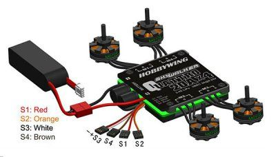

.. _common-magnetic-interference:

=====================
Magnetic Interference
=====================

This article covers general information related to magnetic
interference.

Overview
========

Magnet Interference on a compass can have a serious impact on navigation
on all vehicle types.

This article explains what hardware changes you can make to reduce
magnetic interference on the compass, along with supporting theoretical
discussion. Information on how to set-up your compass can be found on
:ref:`Advanced Compass Setup <common-compass-setup-advanced>`.

[site wiki="copter"]On Copter magnetic interference can cause circling
(also known as "toiletbowling") in Loiter, RTL, AUTO flight
modes.[/site]

See also `Magnetic Declination <https://en.wikipedia.org/wiki/Magnetic_declination>`__
(wikipedia)

Hardware changes to reduce magnetic interference on the compass
===============================================================

#. The best way method is to use an :ref:`external compass <common-external-magnetometer-for-improved-performance>`
   or :ref:`GPS+Compass <common-installing-3dr-ublox-gps-compass-module>`
   module mounted on a mast up and away from magnetic source of
   interference including the power distribution board (PDB).
#. Keep the wires between the PDB, ESCs and battery as short as
   possible.  The wires from the ESCs to the motors are less important
   because they are AC and produce less interference.
#. Twist the wires between the PDB, ESC and battery and use grounded
   shielding where possible.
#. Replace the PDB and ESCs with a 4-in-1 ESC because they tend to
   poroduce less interference probably because their wires are shorter
   and closer together and they also have an aluminum plate on top which
   may help reduce the interference.
#. Add aluminum shielding (even gutter tape) around the wires from the
   ESC to the motors may reduce the AC interference.  Aluminum will not
   help reduce the primary DC interference from the PDB, ESCs and the
   wires connecting them.

Maxwell's Equations - The Magnetic Field on the Axis of a Current Loop
======================================================================

+--------------------------------------+--------------------------------------+
| Geometric details (from `this web    | The application of                   |
| page. <http://hyperphysics.phy-astr. | the \ `Biot-Savart                   |
| gsu.edu/%E2%80%8Chbase/magnetic/curl | law <http://hyperphysics.phy-astr.gs |
| oo.html#c2>`__)                      | u.edu/%E2%80%8Chbase/magnetic/biosav |
|                                      | .html#c1>`__                         |
|                                      | on the centerline of a \ `current    |
|                                      | loop <http://hyperphysics.phy-astr.g |
|                                      | su.edu/%E2%80%8Chbase/magnetic/curlo |
|                                      | o.html#c1>`__ involves               |
|                                      | integrating the z-component.         |
| |loopa|                              |                                      |
|                                      |                                      |
|                                      | |image4|                             |
|                                      |                                      |
|                                      | The symmetry is such that all the    |
|                                      | terms in this element are constant   |
|                                      | except the distance element dL,      |
|                                      | which when integrated just gives the |
|                                      | circumference of the circle. The     |
|                                      | magnetic field is then:              |
|                                      |                                      |
|                                      | |image5|                             |
+--------------------------------------+--------------------------------------+

There are 3 things to get from this drawing and the equation for the
magnetic field B as you move away from a current loop along the Z axis:

#. The magnetic field increases as a function of the enclosed loop area
   Pi R^2

   -  Big loop = big magnetic field
   -  Reduce the magnetic field by twisting the loop to close it. aka
      twist the wires together and keep your return path close to the
      source
   -  In the case where you have a PDB and 4 ESCs you have 4 loops that
      start at the Deans connector on the PDB, go out to the ESC and
      return back to the Deans connector.  In the case of the 4 in 1 ESC
      the current flow is much more concentrated in one area and you
      don't have the big loops so consequently you decrease the magnetic
      field.

#. The magnetic field increases as a function of current

   -  Where there is the option, you can deliver the same power and
      decrease the magnetic field by increasing the voltage and
      decreasing the current.

#. The magnetic field decreases as a function of the cube of the
   distance

   -  It is more complicated when you are close to the loop but when z
      >> R the denominator goes to z^3

There is one more thing and that is that the direction of the magnetic
field depends on the direction that the current flows so when you rotate
a battery it changes the magnetic field produced by the current flowing
in the battery.

It can't be stated enough that minimizing the enclosed loop areas and
moving the compass away from the current will help things work better
and "yes", power distribution boards with big circular thick high
current PC traces on them produce significant semi-spherical fields as
large or larger than their diameter.

Natural and Artificial Magnetic Anomalies Warning
=================================================

.. note::

   The following information has not been objectively tested to
   determine its impact on a vehicle's compass accuracy in flight.

#. Many things can distort the earth's magnetic field in the area you
   are flying:

   -  Steel framed or reinforced concrete buildings, bridges and
      roadways, iron pipes and culverts, high power electric lines,
      heavy equipment, trucks and automobiles, steel tanks, electric
      motors and even computers.
   -  Flying between steel framed or reinforced high rise buildings will
      distort the magnetic field in addition to causing GPS
      multi-pathing.

#. Safe distances for compass calibration

   -  6" (15 cm) minimum: Metal rim glasses, pen/pencil, metal watch
      band, pocket knife, metal zipper/buttons, belt buckle, batteries,
      binoculars, cell phone, keys, camera, camcorder, survey nails,
      metal tape measure.
   -  18" (50 cm) minimum: Clipboard, data collector, computer, GPS
      antenna, 2-way radio, hand gun, hatchet, cell phone case with
      magnetic closure.
   -  6 ft (2 m) minimum: Bicycle, fire hydrant, road signs, sewer cap
      or drain, steel pole, ATV, guy wire, magnets, chain-link fence,
      bar-wire fence, data collectors

      that use a magnet to hold the stylus.
   -  15 ft (5 m) minimum: Electrical box, small car/truck, powerline,
      building with concrete & steel.
   -  30 ft (10 m) minimum: Large truck, metal building, heavy
      machinery.

GPS for yaw
===========

Ardupilot supports the use of GPS heading information to reduce malfunctions caused by changes in the magnetic field in certain environments.
  - `Configure GPS for yaw <https://ardupilot.org/copter/docs/common-gps-for-yaw.html>`__
  
  .. note::

   This feature is available in Copter 4.0.4 (and higher), Plane 4.0.6 (and higher) and Rover 4.1.0 (and higher);Ublox F9p must run firmware version 1.13 or higher.

.. youtube:: Kh_6TynYqEI
    :width: 100%

.. |image3| image:: http://hyperphysics.phy-astr.gsu.edu/%E2%80%8Chbase/magnetic/imgmag/loopa3.gif
    :target: ../_images/loopa3.gif

.. |image2| image:: http://hyperphysics.phy-astr.gsu.edu/%E2%80%8Chbase/magnetic/imgmag/loopa2.gif
    :target: ../_images/loopa2.gif

.. |loopa| image:: ../../../images/loopa.gif
    :target: ../_images/loopa.gif

.. |image5| image:: http://hyperphysics.phy-astr.gsu.edu/%E2%80%8Chbase/magnetic/imgmag/loopa3.gif
    :target: ../_images/loopa3.gif

.. |image4| image:: http://hyperphysics.phy-astr.gsu.edu/%E2%80%8Chbase/magnetic/imgmag/loopa2.gif
    :target: ../_images/loopa2.gif
