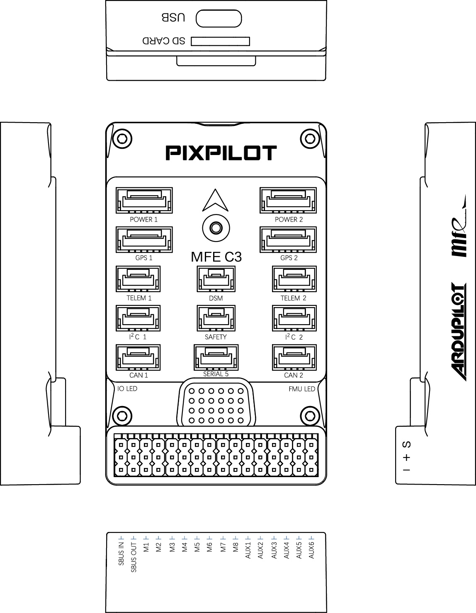

.. _common-makeflyeasy-PixPilot-C3:

========================
makeflyeasy PixPilot-C3
========================

The PixPilot-C3 is a low cost flight controller with fully redundant IMUs. In most cases, an onboard compass is more susceptible to interference, so we removed the onboard compass and used an external compass instead. Integrated high gain buzzer.
The PixPilot-C3 flight controller is sold by a range of resellers listed on the makeflyeasy(http://www.makeflyeasy.com)

Specifications
==============

-  **Processor**:

   -  32-bit STM32F427VIT6 ARM Cortex M4 core with FPU
   -  168 Mhz/256 KB RAM/2 MB Flash
   -  32-bit failsafe co-processor (STMF103)

-  **Sensors**

   -  TWO redundant IMUs (accels and gyros）
   -  Gyro/Accelerometers: two ICM42688-P(SPI)
   -  Barometers: Two redundant BMP388 barometers

-  **Power**

   -  Redundant power supply with automatic failover
   -  Power supply 4V-6V

-  **Interfaces**

   -  14x PWM servo outputs (8 from IO, 6 from FMU)
   -  S.Bus servo output
   -  R/C inputs for CPPM, Spektrum / DSM and S.Bus
   -  5x general-purpose serial ports
   -  2x I2C ports
   -  2x CAN Bus interface
   -  MicroSD card reader
   -  Type-C USB
   -  High-powered piezo buzzer driver
   -  Safety switch / LED
   -  Servo rail BEC independent power input for servos

-  **Dimensions**

   -  Weight 40g
   -  Size 74mm x 45mm x 16mm

UART Mapping
============

 - SERIAL0 -> console (primary mavlink, usually USB)
 - SERIAL1 -> USART2  (telem1,DMA-enabled)
 - SERIAL2 -> USART3  (Telem2,DMA-enabled)
 - SERIAL3 -> UART4   (GPS1)
 - SERIAL4 -> UART8   (GPS2,DMA-enabled)
 - SERIAL5 -> UART7   (USER)
  
Pinouts
=======

Connector pin assignments
=========================

TELEM1, TELEM2 ports
--------------------

.. raw:: html

   <table border="1" class="docutils">
   <tbody>
   <tr>
   <th>Pin</th>
   <th>Signal</th>
   <th>Volt</th>
   </tr>
   <tr>
   <td>1</td>
   <td>VCC</td>
   <td>+5V</td>
   </tr>
   <tr>
   <td>2</td>
   <td>TX (OUT)</td>
   <td>+3.3V</td>
   </tr>
   <tr>
   <td>3</td>
   <td>RX (IN)</td>
   <td>+3.3V</td>
   </tr>
   <tr>
   <td>4</td>
   <td>GND</td>
   <td>GND</td>
   </tr>
   </tbody>
   </table>

I2C1, I2C2 ports
----------------

.. raw:: html

   <table border="1" class="docutils">
   <tbody>
   <tr>
   <th>PIN</th>
   <th>SIGNAL</th>
   <th>VOLT</th>
   </tr>
   <tr>
   <td>1</td>
   <td>VCC</td>
   <td>+5V</td>
   </tr>
   <tr>
   <td>2</td>
   <td>SCL</td>
   <td>+3.3V</td>
   </tr>
   <tr>
   <td>3</td>
   <td>SDA</td>
   <td>+3.3V</td>
   </tr>
   <tr>
   <td>4</td>
   <td>GND</td>
   <td>GND</td>
   </tr>
   </tbody>
   </table>

CAN1, CAN2 ports
----------------

.. raw:: html

   <table border="1" class="docutils">
   <tbody>
   <tr>
   <th>PIN</th>
   <th>SIGNAL</th>
   <th>VOLT</th>
   </tr>
   <tr>
   <td>1</td>
   <td>VCC</td>
   <td>+5V</td>
   </tr>
   <tr>
   <td>2</td>
   <td>CAN_H</td>
   <td>+12V</td>
   </tr>
   <tr>
   <td>3</td>
   <td>CAN_L</td>
   <td>+12V</td>
   </tr>
   <tr>
   <td>4</td>
   <td>GND</td>
   <td>GND</td>
   </tr>
   </tbody>
   </table>

Safety port
----------------------

.. raw:: html

   <table border="1" class="docutils">
   <tbody>
   <tr>
   <th>PIN</th>
   <th>SIGNAL</th>
   <th>VOLT</th>
   </tr>
   <tr>
   <td>1</td>
   <td>VCC</td>
   <td>+5V</td>
   </tr>
   <tr>
   <td>2</td>
   <td>LED</td>
   <td>+5V</td>
   </tr>
   <tr>
   <td>3</td>
   <td>SAFKEY</td>
   <td>+5V</td>
   </tr>
   </tbody>
   </table>

GPS1/I2C1, GPS2/I2C2 ports
--------------------------

.. raw:: html

   <table border="1" class="docutils">
   <tbody>
   <tr>
   <th>PIN</th>
   <th>SIGNAL</th>
   <th>VOLT</th>
   </tr>
   <tr>
   <td>1</td>
   <td>VCC</td>
   <td>+5V</td>
   </tr>
   <tr>
   <td>2</td>
   <td>TX</td>
   <td>+3.3V</td>
   </tr>
   <tr>
   <td>3</td>
   <td>RX</td>
   <td>+3.3V</td>
   </tr>
   <tr>
   <td>4</td>
   <td>SCL</td>
   <td>+3.3V</td>
   </tr>
   <tr>
   <td>5</td>
   <td>SDA</td>
   <td>+3.3V</td>
   </tr>
   <tr>
   <td>6</td>
   <td>GND</td>
   <td>GND</td>
   </tr>
   </tbody>
   </table>

Serial5 port
------------

.. raw:: html

   <table border="1" class="docutils">
   <tbody>
   <tr>
   <th>Pin</th>
   <th>Signal</th>
   <th>Volt</th>
   </tr>
   <tr>
   <td>1</td>
   <td>VCC</td>
   <td>+5V</td>
   </tr>
   <tr>
   <td>2</td>
   <td>TX (OUT)</td>
   <td>+3.3V</td>
   </tr>
   <tr>
   <td>3</td>
   <td>RX (IN)</td>
   <td>+3.3V</td>
   </tr>
   <tr>
   <td>4</td>
   <td>GND</td>
   <td>GND</td>
   </tr>
   </tbody>
   </table>
   
Power1, Power2 ports
--------------------

.. raw:: html

   <table border="1" class="docutils">
   <tbody>
   <tr>
   <th>PIN</th>
   <th>SIGNAL</th>
   <th>VOLT</th>
   </tr>
   <tr>
   <td>1</td>
   <td>VCC</td>
   <td>+5V</td>
   </tr>
   <tr>
   <td>2</td>
   <td>VCC</td>
   <td>+5V</td>
   </tr>
   <tr>
   <td>3</td>
   <td>CURRENT</td>
   <td>+3.3V</td>
   </tr>
   <tr>
   <td>4</td>
   <td>VOLTAGE</td>
   <td>+3.3V</td>
   </tr>
   <tr>
   <td>5</td>
   <td>GND</td>
   <td>GND</td>
   </tr>
   <tr>
   <td>6</td>
   <td>GND</td>
   <td>GND</td>
   </tr>
   </tbody>
   </table>

DSM ports
---------

.. raw:: html

   <table border="1" class="docutils">
   <tbody>
   <tr>
   <th>PIN</th>
   <th>SIGNAL</th>
   <th>VOLT</th>
   </tr>
   <tr>
   <td>1</td>
   <td>VCC</td>
   <td>+3.3V</td>
   </tr>
   <tr>
   <td>2</td>
   <td>RX</td>
   <td>+3.3V</td>
   </tr>
   <tr>
   <td>3</td>
   <td>GND</td>
   <td>GND</td>
   </tr>
   </tbody>
   </table>

RC Input
========

The SBus input pin, which by default is mapped to a timer input, can be used for all ArduPilot supported receiver protocols, except CRSF/ELRS and SRXL2 which require a true UART connection. However, FPort, when connected in this manner, will only provide RC without telemetry. 

To allow CRSF and embedded telemetry available in Fport, CRSF, and SRXL2 receivers, a full UART, such as SERIAL4 (UART8) would need to be used for receiver connections. Below are setups using UART4. :ref:`SERIAL4_PROTOCOL<SERIAL4_PROTOCOL>` should be set to "23".

- FPort would require :ref:`SERIAL4_OPTIONS<SERIAL4_OPTIONS>` be set to "15".

- CRSF would require :ref:`SERIAL4_OPTIONS<SERIAL4_OPTIONS>` be set to "0".

- SRXL2 would require :ref:`SERIAL4_OPTIONS<SERIAL4_OPTIONS>` be set to "4" and connects only the UART4 TX pin.

Any UART can be used for RC system connections in ArduPilot also, and is compatible with all protocols except PPM. See :ref:`common-rc-systems` for details.

PWM Output
----------

The PixPilot-V3 supports up to 14 PWM outputs. First first 8 outputs (labelled S1 to S8) are controlled by a dedicated STM32F103 IO controller. These 8
outputs support all PWM output formats, but not DShot.

The remaining 6 outputs (labelled AUX1 to AUX6) are the "auxiliary"
outputs. These are directly attached to the STM32F427 and support all
PWM protocols as well as DShot.

All 14 PWM outputs have GND on the top row, 5V on the middle row and
signal on the bottom row.

The 8 main PWM outputs are in 3 groups:

 - PWM 1 and 2 in group1
 - PWM 3 and 4 in group2
 - PWM 5, 6, 7 and 8 in group3

The 6 auxiliary PWM outputs are in 2 groups:

 - PWM 1, 2, 3 and 4 in group1
 - PWM 5 and 6 in group2

Channels within the same group need to use the same output rate. If
any channel in a group uses DShot then all channels in the group need
to use DShot.

Battery Monitor Settings
========================

These should already be set by default. However, if lost or changed:

Enable Battery monitor with these parameter settings :

:ref:`BATT_MONITOR<BATT_MONITOR>` =4

Then reboot.

:ref:`BATT_VOLT_PIN<BATT_VOLT_PIN>` 2

:ref:`BATT_CURR_PIN<BATT_CURR_PIN>` 3

:ref:`BATT_VOLT_MULT<BATT_VOLT_MULT>` 18.0

:ref:`BATT_AMP_PERVLT<BATT_AMP_PERVLT>` 24.0

:ref:`BATT2_VOLT_PIN<BATT2_VOLT_PIN>` 14

:ref:`BATT2_CURR_PIN<BATT2_CURR_PIN>` 13

:ref:`BATT2_VOLT_MULT<BATT2_VOLT_MULT>` 18.0

:ref:`BATT2_AMP_PERVLT<BATT2_AMP_PERVLT>` 24.0

DroneCAN capability
===================
There are 2 CAN ports which allow connecting two independant CAN bus outputs. Each of these can have multiple CAN peripheral devices connected. 

Loading Firmware
================

The board comes pre-installed with an ArduPilot compatible bootloader,
allowing the loading of xxxxxx.apj firmware files with any ArduPilot
compatible ground station.

Firmware for these boards can be found `here <https://firmware.ardupilot.org>`_ in  sub-folders labeled "PixPilot-C3".

Where to Buy
============

`makeflyeasy <http://www.makeflyeasy.com>`_

[copywiki destination="plane,copter,rover,blimp"]