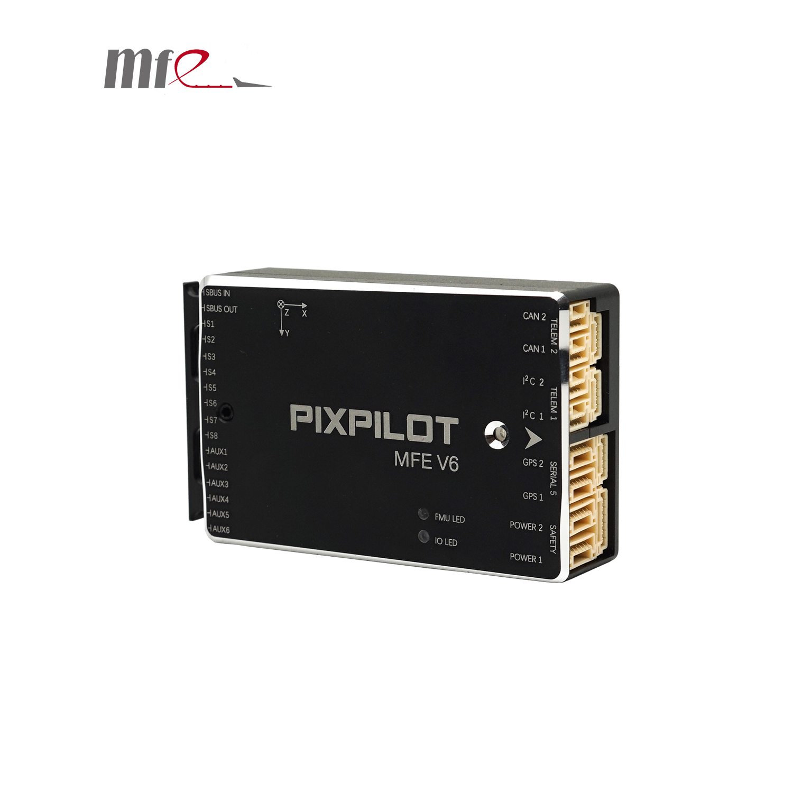

.. _common-makeflyeasy-PixPilot-V6:

========================
makeflyeasy PixPilot-V6
========================

The PixPilot-V6 autopilot is sold by a range of resellers listed on the makeflyeasy(http://www.makeflyeasy.com)

Specifications
==============

-  **Processor**:

   -  32-bit STM32H743VIT6 ARM Cortex M7 core with FPU
   -  480 Mhz/1 MB RAM/2 MB Flash
   -  32-bit failsafe co-processor (STMF103)

-  **Sensors**

   -  Three redundant IMUs (accels, gyros and compass)
   -  Gyro/Accelerometers: two ICM42688-P(SPI), one ICM40605(SPI)
   -  Barometers: Two redundant MS5611 barometers
   -  Compass: IST8310(internal I2C)

-  **Power**

   -  Redundant power supply with automatic failover
   -  Power supply 4V-6V

-  **Interfaces**

   -  14x PWM servo outputs (8 from IO, 6 from FMU)
   -  S.Bus servo output
   -  R/C inputs for CPPM, Spektrum / DSM and S.Bus
   -  5x general purpose serial ports
   -  2x I2C ports
   -  2x CAN Bus interface
   -  MicroSD card reader
   -  Type-C USB
   -  High-powered piezo buzzer driver (on expansion board)
   -  Safety switch / LED

-  **Dimensions**

   -  Weight 62g
   -  Size 76mm x 45mm x 19mm

UART Mapping
============

 - SERIAL0 -> console (primary mavlink, usually USB)
 - SERIAL1 -> USART2  (telem1,DMA-enabled)
 - SERIAL2 -> USART3  (Telem2,DMA-enabled)
 - SERIAL3 -> UART4   (GPS1)
 - SERIAL4 -> UART8   (GPS2)
 - SERIAL5 -> UART7   (USER,DMA-enabled)

Connector pin assignments
=========================

TELEM1, TELEM2 ports
--------------------

.. raw:: html

   <table border="1" class="docutils">
   <tbody>
   <tr>
   <th>Pin</th>
   <th>Signal</th>
   <th>Volt</th>
   </tr>
   <tr>
   <td>1</td>
   <td>VCC</td>
   <td>+5V</td>
   </tr>
   <tr>
   <td>2</td>
   <td>TX (OUT)</td>
   <td>+3.3V</td>
   </tr>
   <tr>
   <td>3</td>
   <td>RX (IN)</td>
   <td>+3.3V</td>
   </tr>
   <tr>
   <td>4</td>
   <td>GND</td>
   <td>GND</td>
   </tr>
   </tbody>
   </table>

I2C1, I2C2 ports
----------------

.. raw:: html

   <table border="1" class="docutils">
   <tbody>
   <tr>
   <th>PIN</th>
   <th>SIGNAL</th>
   <th>VOLT</th>
   </tr>
   <tr>
   <td>1</td>
   <td>VCC</td>
   <td>+5V</td>
   </tr>
   <tr>
   <td>2</td>
   <td>SCL</td>
   <td>+3.3V</td>
   </tr>
   <tr>
   <td>3</td>
   <td>SDA</td>
   <td>+3.3V</td>
   </tr>
   <tr>
   <td>4</td>
   <td>GND</td>
   <td>GND</td>
   </tr>
   </tbody>
   </table>

CAN1, CAN2 ports
----------------

.. raw:: html

   <table border="1" class="docutils">
   <tbody>
   <tr>
   <th>PIN</th>
   <th>SIGNAL</th>
   <th>VOLT</th>
   </tr>
   <tr>
   <td>1</td>
   <td>VCC</td>
   <td>+5V</td>
   </tr>
   <tr>
   <td>2</td>
   <td>CAN_H</td>
   <td>+12V</td>
   </tr>
   <tr>
   <td>3</td>
   <td>CAN_L</td>
   <td>+12V</td>
   </tr>
   <tr>
   <td>4</td>
   <td>GND</td>
   <td>GND</td>
   </tr>
   </tbody>
   </table>

Safety and buzzer port
----------------------

.. raw:: html

   <table border="1" class="docutils">
   <tbody>
   <tr>
   <th>PIN</th>
   <th>SIGNAL</th>
   <th>VOLT</th>
   </tr>
   <tr>
   <td>1</td>
   <td>VCC</td>
   <td>+5V</td>
   </tr>
   <tr>
   <td>2</td>
   <td>LED</td>
   <td>+5V</td>
   </tr>
   <tr>
   <td>3</td>
   <td>SAFKEY</td>
   <td>+5V</td>
   </tr>
   <tr>
   <td>4</td>
   <td>BUZZER</td>
   <td>+5V</td>
   </tr>
   <tr>
   <td>5</td>
   <td>3V+</td>
   <td>+3.3V</td>
   </tr>
   <tr>
   <td>6</td>
   <td>GND</td>
   <td>GND</td>
   </tr>
   </tbody>
   </table>

GPS1/I2C1, GPS2/I2C2 ports
--------------------------

.. raw:: html

   <table border="1" class="docutils">
   <tbody>
   <tr>
   <th>PIN</th>
   <th>SIGNAL</th>
   <th>VOLT</th>
   </tr>
   <tr>
   <td>1</td>
   <td>VCC</td>
   <td>+5V</td>
   </tr>
   <tr>
   <td>2</td>
   <td>TX</td>
   <td>+3.3V</td>
   </tr>
   <tr>
   <td>3</td>
   <td>RX</td>
   <td>+3.3V</td>
   </tr>
   <tr>
   <td>4</td>
   <td>SCL</td>
   <td>+3.3V</td>
   </tr>
   <tr>
   <td>5</td>
   <td>SDA</td>
   <td>+3.3V</td>
   </tr>
   <tr>
   <td>6</td>
   <td>GND</td>
   <td>GND</td>
   </tr>
   </tbody>
   </table>

Serial5 port
------------

.. raw:: html

   <table border="1" class="docutils">
   <tbody>
   <tr>
   <th>Pin</th>
   <th>Signal</th>
   <th>Volt</th>
   </tr>
   <tr>
   <td>1</td>
   <td>VCC</td>
   <td>+5V</td>
   </tr>
   <tr>
   <td>2</td>
   <td>TX (OUT)</td>
   <td>+3.3V</td>
   </tr>
   <tr>
   <td>3</td>
   <td>RX (IN)</td>
   <td>+3.3V</td>
   </tr>
   <tr>
   <td>4</td>
   <td>GND</td>
   <td>GND</td>
   </tr>
   </tbody>
   </table>
   
Power1, Power2 ports
--------------------

.. raw:: html

   <table border="1" class="docutils">
   <tbody>
   <tr>
   <th>PIN</th>
   <th>SIGNAL</th>
   <th>VOLT</th>
   </tr>
   <tr>
   <td>1</td>
   <td>VCC</td>
   <td>+5V</td>
   </tr>
   <tr>
   <td>2</td>
   <td>VCC</td>
   <td>+5V</td>
   </tr>
   <tr>
   <td>3</td>
   <td>CURRENT</td>
   <td>+3.3V</td>
   </tr>
   <tr>
   <td>4</td>
   <td>VOLTAGE</td>
   <td>+3.3V</td>
   </tr>
   <tr>
   <td>5</td>
   <td>GND</td>
   <td>GND</td>
   </tr>
   <tr>
   <td>6</td>
   <td>GND</td>
   <td>GND</td>
   </tr>
   </tbody>
   </table>

RC Input
========

The SBus input pin, which by default is mapped to a timer input, can be used for all ArduPilot supported receiver protocols, except CRSF/ELRS and SRXL2 which require a true UART connection. However, FPort, when connected in this manner, will only provide RC without telemetry. 

To allow CRSF and embedded telemetry available in Fport, CRSF, and SRXL2 receivers, a full UART, such as SERIAL4 (UART8) would need to be used for receiver connections. Below are setups using UART4. :ref:`SERIAL4_PROTOCOL<SERIAL4_PROTOCOL>` should be set to "23".

- FPort would require :ref:`SERIAL4_OPTIONS<SERIAL4_OPTIONS>` be set to "15".

- CRSF would require :ref:`SERIAL4_OPTIONS<SERIAL4_OPTIONS>` be set to "0".

- SRXL2 would require :ref:`SERIAL4_OPTIONS<SERIAL4_OPTIONS>` be set to "4" and connects only the UART4 TX pin.

Any UART can be used for RC system connections in ArduPilot also, and is compatible with all protocols except PPM. See :ref:`common-rc-systems` for details.

Battery Monitor Settings
========================

These should already be set by default. However, if lost or changed:

Enable Battery monitor with these parameter settings :

:ref:`BATT_MONITOR<BATT_MONITOR>` =4

Then reboot.

:ref:`BATT_VOLT_PIN<BATT_VOLT_PIN>` 14

:ref:`BATT_CURR_PIN<BATT_CURR_PIN>` 15

:ref:`BATT_VOLT_MULT<BATT_VOLT_MULT>` 18.0

:ref:`BATT_AMP_PERVLT<BATT_AMP_PERVLT>` 24.0

:ref:`BATT2_VOLT_PIN<BATT2_VOLT_PIN>` 13

:ref:`BATT2_CURR_PIN<BATT2_CURR_PIN>` 4

:ref:`BATT2_VOLT_MULT<BATT2_VOLT_MULT>` 18.0

:ref:`BATT2_AMP_PERVLT<BATT2_AMP_PERVLT>` 24.0

DroneCAN capability
===================
There are 2 CAN ports which allow connecting two independant CAN bus outputs. Each of these can have multiple CAN peripheral devices connected. 

Loading Firmware
================

The board comes pre-installed with an ArduPilot compatible bootloader,
allowing the loading of xxxxxx.apj firmware files with any ArduPilot
compatible ground station.

Firmware for these boards can be found `here <https://firmware.ardupilot.org>`_ in  sub-folders labeled "PixPilot-V6".

Where to Buy
============

`makeflyeasy <http://www.makeflyeasy.com>`_
`aliexpress <https://www.aliexpress.com/store/1101471828>`_

[copywiki destination="plane,copter,rover,blimp"]