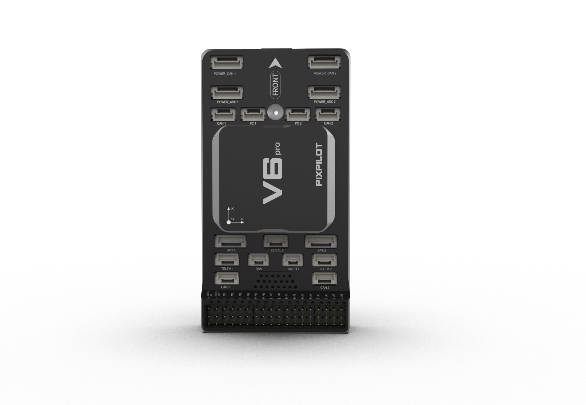

.. _common-makeflyeasy-PixPilot-V6PRO:

==========================
Makeflyeasy PixPilot-V6PRO
==========================

The PixPilot-V6PRO autopilot is sold by a range of resellers listed on the `makeflyeasy <https://www.makeflyeasy.com>`__

Specifications
==============

-  **Processor**:

   -  32-bit STM32H743VIT6 ARM Cortex M7 core with FPU
   -  480 Mhz/1 MB RAM/2 MB Flash
   -  32-bit failsafe co-processor (STMF103)

-  **Sensors**

   -  Three redundant IMUs (accels, gyros and compass)
   -  Gyro/Accelerometers: two ICM42688-P(SPI), one ICM40605(SPI)
   -  Barometers: Two redundant BMP388 barometers

-  **Power**

   -  Redundant power supply with automatic failover
   -  Power supply 4V-6V

-  **Interfaces**

   -  16x PWM servo outputs (8 from IO, 6 from FMU)
   -  S.Bus servo output
   -  R/C inputs for PPM,DSM and S.Bus
   -  5x general purpose serial ports
   -  2x I2C ports
   -  4x CAN Bus interface
   -  MicroSD card reader
   -  Type-C USB
   -  High-powered piezo buzzer driver (on expansion board)
   -  Safety switch

-  **Dimensions**

   -  Weight 62g
   -  Size 94mm x 49mm x 23mm

UART Mapping
============

 - SERIAL0 -> console (primary mavlink, usually USB)
 - SERIAL1 -> USART2  (telem1,DMA-enabled)
 - SERIAL2 -> USART3  (Telem2,DMA-enabled)
 - SERIAL3 -> UART4   (GPS1)(TX is DMA capable)
 - SERIAL4 -> UART8   (GPS2) (RX is DMA capable)
 - SERIAL5 -> UART7   (USER,DMA-enabled)

Connector pin assignments
=========================

POWER_CAN 1 port, POWER_CAN 2 ports
-----------------------------------

.. raw:: html

   <table border="1" class="docutils">
   <tbody>
   <tr>
   <th>PIN</th>
   <th>SIGNAL</th>
   <th>VOLT</th>
   </tr>
   <tr>
   <td>1</td>
   <td>VCC</td>
   <td>+5V</td>
   </tr>
   <tr>
   <td>2</td>
   <td>VCC</td>
   <td>+5V</td>
   </tr>
   <tr>
   <td>3</td>
   <td>CAN_H</td>
   <td>+12V</td>
   </tr>
   <tr>
   <td>4</td>
   <td>CAN_L</td>
   <td>+12V</td>
   </tr>
   <tr>
   <td>5</td>
   <td>GND</td>
   <td>GND</td>
   </tr>
   <tr>
   <td>6</td>
   <td>GND</td>
   <td>GND</td>
   </tr>
   </tbody>
   </table>

TELEM1, TELEM2 ports
--------------------

.. raw:: html

   <table border="1" class="docutils">
   <tbody>
   <tr>
   <th>Pin</th>
   <th>Signal</th>
   <th>Volt</th>
   </tr>
   <tr>
   <td>1</td>
   <td>VCC</td>
   <td>+5V</td>
   </tr>
   <tr>
   <td>2</td>
   <td>TX (OUT)</td>
   <td>+3.3V</td>
   </tr>
   <tr>
   <td>3</td>
   <td>RX (IN)</td>
   <td>+3.3V</td>
   </tr>
   <tr>
   <td>4</td>
   <td>GND</td>
   <td>GND</td>
   </tr>
   </tbody>
   </table>

I2C1, I2C2 ports
----------------

.. raw:: html

   <table border="1" class="docutils">
   <tbody>
   <tr>
   <th>PIN</th>
   <th>SIGNAL</th>
   <th>VOLT</th>
   </tr>
   <tr>
   <td>1</td>
   <td>VCC</td>
   <td>+5V</td>
   </tr>
   <tr>
   <td>2</td>
   <td>SCL</td>
   <td>+3.3V</td>
   </tr>
   <tr>
   <td>3</td>
   <td>SDA</td>
   <td>+3.3V</td>
   </tr>
   <tr>
   <td>4</td>
   <td>GND</td>
   <td>GND</td>
   </tr>
   </tbody>
   </table>

CAN1, CAN2 ports
----------------

.. raw:: html

   <table border="1" class="docutils">
   <tbody>
   <tr>
   <th>PIN</th>
   <th>SIGNAL</th>
   <th>VOLT</th>
   </tr>
   <tr>
   <td>1</td>
   <td>VCC</td>
   <td>+5V</td>
   </tr>
   <tr>
   <td>2</td>
   <td>CAN_H</td>
   <td>+12V</td>
   </tr>
   <tr>
   <td>3</td>
   <td>CAN_L</td>
   <td>+12V</td>
   </tr>
   <tr>
   <td>4</td>
   <td>GND</td>
   <td>GND</td>
   </tr>
   </tbody>
   </table>

DSM port
--------

.. raw:: html

   <table border="1" class="docutils">
   <tbody>
   <tr>
   <th>PIN</th>
   <th>SIGNAL</th>
   <th>VOLT</th>
   </tr>
   <tr>
   <td>1</td>
   <td>VCC</td>
   <td>+5V</td>
   </tr>
   <tr>
   <td>2</td>
   <td>DSM_IN</td>
   <td>+5V</td>
   </tr>
   <tr>
   <td>3</td>
   <td>GND</td>
   <td>GND</td>
   </tr>
   </tbody>
   </table>

Safety and buzzer port
----------------------

.. raw:: html

   <table border="1" class="docutils">
   <tbody>
   <tr>
   <th>PIN</th>
   <th>SIGNAL</th>
   <th>VOLT</th>
   </tr>
   <tr>
   <td>1</td>
   <td>VCC</td>
   <td>+5V</td>
   </tr>
   <tr>
   <td>2</td>
   <td>LED</td>
   <td>+5V</td>
   </tr>
   <tr>
   <td>3</td>
   <td>Safety Switch</td>
   <td>+5V</td>
   </tr>
   </tbody>
   </table>

GPS1/I2C1, GPS2/I2C2 ports
--------------------------

.. raw:: html

   <table border="1" class="docutils">
   <tbody>
   <tr>
   <th>PIN</th>
   <th>SIGNAL</th>
   <th>VOLT</th>
   </tr>
   <tr>
   <td>1</td>
   <td>VCC</td>
   <td>+5V</td>
   </tr>
   <tr>
   <td>2</td>
   <td>TX</td>
   <td>+3.3V</td>
   </tr>
   <tr>
   <td>3</td>
   <td>RX</td>
   <td>+3.3V</td>
   </tr>
   <tr>
   <td>4</td>
   <td>SCL</td>
   <td>+3.3V</td>
   </tr>
   <tr>
   <td>5</td>
   <td>SDA</td>
   <td>+3.3V</td>
   </tr>
   <tr>
   <td>6</td>
   <td>GND</td>
   <td>GND</td>
   </tr>
   </tbody>
   </table>

Serial 5 port
-------------

.. raw:: html

   <table border="1" class="docutils">
   <tbody>
   <tr>
   <th>Pin</th>
   <th>Signal</th>
   <th>Volt</th>
   </tr>
   <tr>
   <td>1</td>
   <td>VCC</td>
   <td>+5V</td>
   </tr>
   <tr>
   <td>2</td>
   <td>TX (OUT)</td>
   <td>+3.3V</td>
   </tr>
   <tr>
   <td>3</td>
   <td>RX (IN)</td>
   <td>+3.3V</td>
   </tr>
   <tr>
   <td>4</td>
   <td>GND</td>
   <td>GND</td>
   </tr>
   </tbody>
   </table>
   
Power_ADC 1, Power_ADC 2 ports
------------------------------

.. raw:: html

   <table border="1" class="docutils">
   <tbody>
   <tr>
   <th>PIN</th>
   <th>SIGNAL</th>
   <th>VOLT</th>
   </tr>
   <tr>
   <td>1</td>
   <td>VCC</td>
   <td>+5V</td>
   </tr>
   <tr>
   <td>2</td>
   <td>VCC</td>
   <td>+5V</td>
   </tr>
   <tr>
   <td>3</td>
   <td>CURRENT</td>
   <td>+3.3V</td>
   </tr>
   <tr>
   <td>4</td>
   <td>VOLTAGE</td>
   <td>+3.3V</td>
   </tr>
   <tr>
   <td>5</td>
   <td>GND</td>
   <td>GND</td>
   </tr>
   <tr>
   <td>6</td>
   <td>GND</td>
   <td>GND</td>
   </tr>
   </tbody>
   </table>

Battery Monitor Settings
========================

The Power_ADC 1 monitor is enabled by default and the Power_ADC 2 monitor parameters are preset, even though it is not enabled by default.. However, if lost or changed:

:ref:`BATT_MONITOR<BATT_MONITOR>` =4

Then reboot.

:ref:`BATT_VOLT_PIN<BATT_VOLT_PIN__AP_BattMonitor_Analog>` 14

:ref:`BATT_CURR_PIN<BATT_CURR_PIN__AP_BattMonitor_Analog>` 15

:ref:`BATT_VOLT_MULT<BATT_VOLT_MULT__AP_BattMonitor_Analog>` 18.0

:ref:`BATT_AMP_PERVLT<BATT_AMP_PERVLT__AP_BattMonitor_Analog>` 24.0

:ref:`BATT2_VOLT_PIN<BATT2_VOLT_PIN__AP_BattMonitor_Analog>` 13

:ref:`BATT2_CURR_PIN<BATT2_CURR_PIN__AP_BattMonitor_Analog>` 4

:ref:`BATT2_VOLT_MULT<BATT2_VOLT_MULT__AP_BattMonitor_Analog>` 18.0

:ref:`BATT2_AMP_PERVLT<BATT2_AMP_PERVLT__AP_BattMonitor_Analog>` 24.0

DroneCAN PMUs would need to be enabled using a ``BATTx_MONITOR`` = "8".

DroneCAN capability
===================
There are 4 CAN ports which allow connecting two independent CAN bus outputs. Each of these can have multiple CAN peripheral devices connected. There are also two separate CAN POWER ports for easy access to CAN-PMUs.

Loading Firmware
================

The board comes pre-installed with an ArduPilot compatible bootloader,
allowing the loading of xxxxxx.apj firmware files with any ArduPilot
compatible ground station.

Firmware for these boards can be found `here <https://firmware.ardupilot.org>`_ in  sub-folders labeled "PixPilot-V6PRO".

Where to Buy
============

`makeflyeasy <https://www.makeflyeasy.com>`_
`aliexpress <https://www.aliexpress.com/store/1101471828>`_

[copywiki destination="plane,copter,rover,blimp"]