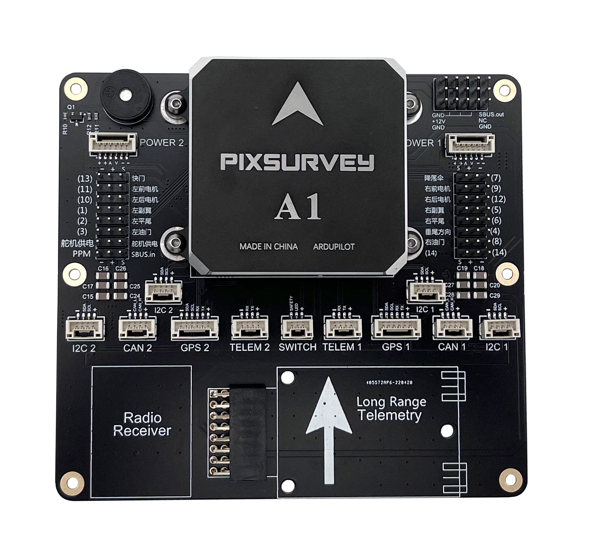

.. _common-makeflyeasy-PixSurveyA1:

=======================
makeflyeasy PixSurveyA1
=======================

Specifications
==============

-  **Processor**:

   -  32-bit STM32F427VIT6 ARM Cortex M4 core with FPU
   -  168 Mhz/256 KB RAM/2 MB Flash
   -  32-bit failsafe co-processor (STMF103)

-  **Sensors**

   -  Three redundant IMUs (accels, gyros and compass)
   -  Gyro/Accelerometers: ICM20948 or MPU9250, ICM20602, MPU6000
   -  Barometers: Two redundant MS5611 barometers
   -  Compass: AK8960 or AK09916

-  **Power**

   -  Redundant power supply with automatic failover
   -  Power supply 4.8V-5.8V

-  **Interfaces**

   -  14x PWM servo outputs (8 from IO, 6 from FMU)
   -  S.Bus servo output
   -  R/C inputs for CPPM, Spektrum / DSM and S.Bus
   -  5x general purpose serial ports
   -  2x I2C ports
   -  2x CAN Bus interface
   -  MicroSD card reader
   -  Type-C USB
   -  High-powered piezo buzzer driver (on expansion board)
   -  Safety switch / LED

-  **Dimensions**

   -  Weight 117g
   -  Size 110mm x 100mm x 23mm

UART Mapping
============

 - SERIAL0 -> console (primary mavlink, usually USB)
 - SERIAL1 -> USART2 (telem1)
 - SERIAL2 -> USART3 (Telem2) RTS/CTS pins
 - SERIAL3 -> UART4 (primary GPS)
 - SERIAL4 -> UART8 (GPS2)

Connector pin assignments
==========================

TELEM1, TELEM2 ports
--------------------

.. raw:: html

   <table border="1" class="docutils">
   <tbody>
   <tr>
   <th>Pin</th>
   <th>Signal</th>
   <th>Volt</th>
   </tr>
   <tr>
   <td>1</td>
   <td>VCC</td>
   <td>+5V</td>
   </tr>
   <tr>
   <td>2</td>
   <td>TX (OUT)</td>
   <td>+3.3V</td>
   </tr>
   <tr>
   <td>3</td>
   <td>RX (IN)</td>
   <td>+3.3V</td>
   </tr>
   <tr>
   <td>4</td>
   <td>GND</td>
   <td>GND</td>
   </tr>
   </tbody>
   </table>

I2C1, I2C2 port
---------------
.. raw:: html

   <table border="1" class="docutils">
   <tbody>
   <tr>
   <th>PIN</th>
   <th>SIGNAL</th>
   <th>VOLT</th>
   </tr>
   <tr>
   <td>1</td>
   <td>VCC</td>
   <td>+5V</td>
   </tr>
   <tr>
   <td>2</td>
   <td>SCL</td>
   <td>+3.3V</td>
   </tr>
   <tr>
   <td>3</td>
   <td>SDA</td>
   <td>+3.3V</td>
   </tr>
   <tr>
   <td>4</td>
   <td>GND</td>
   <td>GND</td>
   </tr>
   </tbody>
   </table>

CAN1, CAN2 port
---------------

.. raw:: html

   <table border="1" class="docutils">
   <tbody>
   <tr>
   <th>PIN</th>
   <th>SIGNAL</th>
   <th>VOLT</th>
   </tr>
   <tr>
   <td>1</td>
   <td>VCC</td>
   <td>+5V</td>
   </tr>
   <tr>
   <td>2</td>
   <td>CAN_H</td>
   <td>+12V</td>
   </tr>
   <tr>
   <td>3</td>
   <td>CAN_L</td>
   <td>+12V</td>
   </tr>
   <tr>
   <td>4</td>
   <td>GND</td>
   <td>GND</td>
   </tr>
   </tbody>
   </table>

Safety port
-----------
.. raw:: html

    <table border="1" class="docutils">
   <tbody>
   <tr>
   <th>PIN</th>
   <th>SIGNAL</th>
   <th>VOLT</th>
   </tr>
   <tr>
   <td>1</td>
   <td>VCC</td>
   <td>+5V</td>
   </tr>
   <tr>
   <td>2</td>
   <td>LED</td>
   <td>+3.3V</td>
   </tr>
   <tr>
   <td>3</td>
   <td>SafKey</td>
   <td>+3.3V</td>
   </tr>
   </tbody>
   </table>

GPS1/I2C1, GPS2/I2C2 ports
--------------------------

.. raw:: html

   <table border="1" class="docutils">
   <tbody>
   <tr>
   <th>PIN</th>
   <th>SIGNAL</th>
   <th>VOLT</th>
   </tr>
   <tr>
   <td>1</td>
   <td>VCC</td>
   <td>+5V</td>
   </tr>
   <tr>
   <td>2</td>
   <td>TX</td>
   <td>+3.3V</td>
   </tr>
   <tr>
   <td>3</td>
   <td>RX</td>
   <td>+3.3V</td>
   </tr>
   <tr>
   <td>4</td>
   <td>SCL</td>
   <td>+3.3V</td>
   </tr>
   <tr>
   <td>5</td>
   <td>SDA</td>
   <td>+3.3V</td>
   </tr>
   <tr>
   <td>6</td>
   <td>GND</td>
   <td>GND</td>
   </tr>
   </tbody>
   </table>

Power1, Power2 ports
--------------------

.. raw:: html

   <table border="1" class="docutils">
   <tbody>
   <tr>
   <th>PIN</th>
   <th>SIGNAL</th>
   <th>VOLT</th>
   </tr>
   <tr>
   <td>1</td>
   <td>VCC</td>
   <td>+5V</td>
   </tr>
   <tr>
   <td>2</td>
   <td>VCC</td>
   <td>+5V</td>
   </tr>
   <tr>
   <td>3</td>
   <td>CURRENT</td>
   <td>+3.3V</td>
   </tr>
   <tr>
   <td>4</td>
   <td>VOLTAGE</td>
   <td>+3.3V</td>
   </tr>
   <tr>
   <td>5</td>
   <td>GND</td>
   <td>GND</td>
   </tr>
   <tr>
   <td>6</td>
   <td>GND</td>
   <td>GND</td>
   </tr>
   </tbody>
   </table>

RC Input
========
The PPM/SBus.in pin, which by default is mapped to a timer input, can be used for all ArduPilot supported receiver protocols, except CRSF/ELRS and SRXL2 which require a true UART connection. However, FPort, when connected in this manner, will only provide RC without telemetry. 

To allow CRSF and embedded telemetry available in Fport, CRSF, and SRXL2 receivers, a full UART, such as SERIAL4 (UART8) would need to be used for receiver connections. Below are setups using UART4. :ref:`SERIAL4_PROTOCOL<SERIAL4_PROTOCOL>` should be set to "23".

- FPort would require :ref:`SERIAL4_OPTIONS<SERIAL6_OPTIONS>` be set to "15".

- CRSF would require :ref:`SERIAL4_OPTIONS<SERIAL6_OPTIONS>` be set to "0".

- SRXL2 would require :ref:`SERIAL4_OPTIONS<SERIAL6_OPTIONS>` be set to "4" and connects only the UART4 TX pin.

Any UART can be used for RC system connections in ArduPilot also, and is compatible with all protocols except PPM. See :ref:`common-rc-systems` for details.

PWM Output
==========

The PixSurveyA1 supports up to 14 PWM outputs. All 14 outputs
support all normal PWM output formats. All FMU outputs (9-14) support DShot.

The 6 FMU outputs are in 4 groups:

 - Outputs 9, 10, 11 and 12 in group1
 - Outputs 13 and 14 in group2

FMU outputs within the same group need to use the same output rate and protocol. If
any output in a group uses DShot then all channels in that group need
to use DShot.

Battery Monitor Settings
========================

These should already be set by default. However, if lost or changed:

Enable Battery monitor with these parameter settings :

:ref:`BATT_MONITOR<BATT_MONITOR>` =4

Then reboot.

:ref:`BATT_VOLT_PIN<BATT_VOLT_PIN>` 2

:ref:`BATT_CURR_PIN<BATT_CURR_PIN>` 3

:ref:`BATT_VOLT_MULT<BATT_VOLT_MULT>` 18

:ref:`BATT_AMP_PERVLT<BATT_AMP_PERVLT>` 24

:ref:`BATT2_VOLT_PIN<BATT2_VOLT_PIN>` 13

:ref:`BATT2_CURR_PIN<BATT2_CURR_PIN>` 14

:ref:`BATT2_VOLT_MULT<BATT2_VOLT_MULT>` 18

:ref:`BATT2_AMP_PERVLT<BATT2_AMP_PERVLT>` 24

Where to Buy
============

`makeflyeasy <https://www.makeflyeasy.com>`_
`aliexpress <https://th.aliexpress.com/item/1005003505282459.html?pdp_npi=2%40dis%21USD%21US%20%24175.00%21US%20%24175.00%21%21%21%21%21%402132e4d516582952034474821e775e%2112000026091310279%21sh&spm=a2g0o.store_pc_home.productList_2002152534578.subject_1&gatewayAdapt=4itemAdapt>`_

[copywiki destination="plane,copter,rover,blimp"]