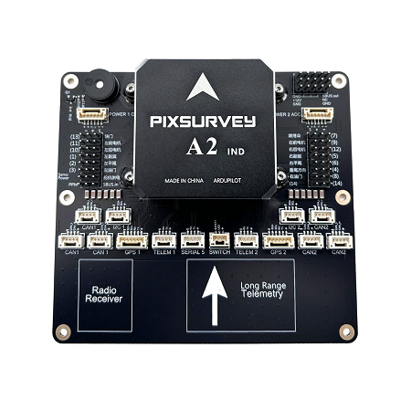

.. _common-makeflyeasy-PixSurveyA2-IND:

===========================
makeflyeasy PixSurveyA2-IND
===========================

The PixSurveyA2-IND flight controller is an upgrade to PixSurveyA2, with better sensors and a better power solution. It is sold by a range of resellers listed on the makeflyeasy(http://www.makeflyeasy.com)

Specifications
==============

-  **Processor**:

   -  STM32H743 32-bit processor
   -  32-bit failsafe co-processor (STMF103)

-  **Sensors**

   -  Three redundant IMUs (accels, gyros and compass)
   -  Gyro/Accelerometers: two IIM-42652(SPI), one ICM40605(SPI)
   -  Barometers: Two redundant BMP388 barometers

-  **Power**

   -  Redundant power supply with automatic failover
   -  Power supply 4V-6V

-  **Interfaces**

   -  14x PWM servo outputs (8 from IO, 6 from FMU)
   -  S.Bus  output
   -  R/C inputs for CPPM and S.Bus
   -  5x general purpose serial ports
   -  2x I2C ports
   -  2x CAN Bus (Six interfaces are provided)
   -  MicroSD card reader
   -  Type-C USB
   -  High-powered piezo buzzer driver
   -  Safety switch / LED interfaces 
   -  Servo rail BEC independent power input for servos
   -  12V Power Output

-  **Dimensions**

   -  Weight 117g
   -  Size 110mm x 100mm x 23mm

UART Mapping
============

 - SERIAL0 -> console (primary mavlink, usually USB)
 - SERIAL1 -> USART2  (telem1,DMA-enabled)
 - SERIAL2 -> USART3  (Telem2,DMA-enabled)
 - SERIAL3 -> UART4   (GPS1)
 - SERIAL4 -> UART8   (GPS2,DMA-enabled)
 - SERIAL5 -> UART7   (USER)
  

Connector pin assignments
=========================

TELEM1, TELEM2 ports
--------------------

.. raw:: html

   <table border="1" class="docutils">
   <tbody>
   <tr>
   <th>Pin</th>
   <th>Signal</th>
   <th>Volt</th>
   </tr>
   <tr>
   <td>1</td>
   <td>VCC</td>
   <td>+5V</td>
   </tr>
   <tr>
   <td>2</td>
   <td>TX (OUT)</td>
   <td>+3.3V</td>
   </tr>
   <tr>
   <td>3</td>
   <td>RX (IN)</td>
   <td>+3.3V</td>
   </tr>
   <tr>
   <td>4</td>
   <td>GND</td>
   <td>GND</td>
   </tr>
   </tbody>
   </table>

I2C1, I2C2 ports
----------------

.. raw:: html

   <table border="1" class="docutils">
   <tbody>
   <tr>
   <th>PIN</th>
   <th>SIGNAL</th>
   <th>VOLT</th>
   </tr>
   <tr>
   <td>1</td>
   <td>VCC</td>
   <td>+5V</td>
   </tr>
   <tr>
   <td>2</td>
   <td>SCL</td>
   <td>+3.3V</td>
   </tr>
   <tr>
   <td>3</td>
   <td>SDA</td>
   <td>+3.3V</td>
   </tr>
   <tr>
   <td>4</td>
   <td>GND</td>
   <td>GND</td>
   </tr>
   </tbody>
   </table>

CAN1, CAN2 ports
----------------

.. raw:: html

   <table border="1" class="docutils">
   <tbody>
   <tr>
   <th>PIN</th>
   <th>SIGNAL</th>
   <th>VOLT</th>
   </tr>
   <tr>
   <td>1</td>
   <td>VCC</td>
   <td>+5V</td>
   </tr>
   <tr>
   <td>2</td>
   <td>CAN_H</td>
   <td>+12V</td>
   </tr>
   <tr>
   <td>3</td>
   <td>CAN_L</td>
   <td>+12V</td>
   </tr>
   <tr>
   <td>4</td>
   <td>GND</td>
   <td>GND</td>
   </tr>
   </tbody>
   </table>

Safety and LED port
-------------------

.. raw:: html

   <table border="1" class="docutils">
   <tbody>
   <tr>
   <th>PIN</th>
   <th>SIGNAL</th>
   <th>VOLT</th>
   <tr>
   <td>1</td>
   <td>VCC</td>
   <td>+3.3V</td>
   </tr>
   <tr>
   <td>2</td>
   <td>LED</td>
   <td>+3.3V</td>
   </tr>
   <tr>
   <td>3</td>
   <td>SAFKEY</td>
   <td>+3.3V</td>
   </tr>
   </tbody>
   </table>

GPS1/I2C1, GPS2/I2C2 ports
--------------------------

.. raw:: html

   <table border="1" class="docutils">
   <tbody>
   <tr>
   <th>PIN</th>
   <th>SIGNAL</th>
   <th>VOLT</th>
   </tr>
   <tr>
   <td>1</td>
   <td>VCC</td>
   <td>+5V</td>
   </tr>
   <tr>
   <td>2</td>
   <td>TX</td>
   <td>+3.3V</td>
   </tr>
   <tr>
   <td>3</td>
   <td>RX</td>
   <td>+3.3V</td>
   </tr>
   <tr>
   <td>4</td>
   <td>SCL</td>
   <td>+3.3V</td>
   </tr>
   <tr>
   <td>5</td>
   <td>SDA</td>
   <td>+3.3V</td>
   </tr>
   <tr>
   <td>6</td>
   <td>GND</td>
   <td>GND</td>
   </tr>
   </tbody>
   </table>

Serial5 port
------------

.. raw:: html

   <table border="1" class="docutils">
   <tbody>
   <tr>
   <th>Pin</th>
   <th>Signal</th>
   <th>Volt</th>
   </tr>
   <tr>
   <td>1</td>
   <td>VCC</td>
   <td>+5V</td>
   </tr>
   <tr>
   <td>2</td>
   <td>TX (OUT)</td>
   <td>+3.3V</td>
   </tr>
   <tr>
   <td>3</td>
   <td>RX (IN)</td>
   <td>+3.3V</td>
   </tr>
   <tr>
   <td>4</td>
   <td>GND</td>
   <td>GND</td>
   </tr>
   </tbody>
   </table>
   
Power1 ports
--------------------

.. raw:: html

   <table border="1" class="docutils">
   <tbody>
   <tr>
   <th>PIN</th>
   <th>SIGNAL</th>
   <th>VOLT</th>
   </tr>
   <tr>
   <td>1</td>
   <td>VCC</td>
   <td>+5V</td>
   </tr>
   <tr>
   <td>2</td>
   <td>VCC</td>
   <td>+5V</td>
   </tr>
   <tr>
   <td>3</td>
   <td>CAN_H</td>
   <td>+12V</td>
   </tr>
   <tr>
   <td>4</td>
   <td>CAN_L</td>
   <td>+12V</td>
   </tr>
   <tr>
   <td>5</td>
   <td>GND</td>
   <td>GND</td>
   </tr>
   <tr>
   <td>6</td>
   <td>GND</td>
   <td>GND</td>
   </tr>
   </tbody>
   </table>
   
Power2 ports
--------------------

.. raw:: html

   <table border="1" class="docutils">
   <tbody>
   <tr>
   <th>PIN</th>
   <th>SIGNAL</th>
   <th>VOLT</th>
   </tr>
   <tr>
   <td>1</td>
   <td>VCC</td>
   <td>+5V</td>
   </tr>
   <tr>
   <td>2</td>
   <td>VCC</td>
   <td>+5V</td>
   </tr>
   <tr>
   <td>3</td>
   <td>CURRENT</td>
   <td>+3.3V</td>
   </tr>
   <tr>
   <td>4</td>
   <td>VOLTAGE</td>
   <td>+3.3V</td>
   </tr>
   <tr>
   <td>5</td>
   <td>GND</td>
   <td>GND</td>
   </tr>
   <tr>
   <td>6</td>
   <td>GND</td>
   <td>GND</td>
   </tr>
   </tbody>
   </table>

12V Power Output port
---------------------

.. raw:: html

   <table border="1" class="docutils">
   <tbody>
   <tr>
   <th>Pin</th>
   <th>Signal</th>
   <th>Volt</th>
   </tr>
   <tr>
   <td>1</td>
   <td>GND</td>
   <td>GND</td>
   </tr>
   <tr>
   <td>2</td>
   <td>VCC</td>
   <td>+12V</td>
   </tr>
   <tr>
   <td>3</td>
   <td>GND</td>
   <td>GND</td>
   </tr>
   </tbody>
   </table>

S.BUS Output port
-----------------

.. raw:: html

   <table border="1" class="docutils">
   <tbody>
   <tr>
   <th>Pin</th>
   <th>Signal</th>
   <th>Volt</th>
   </tr>
   <tr>
   <td>1</td>
   <td>SBUS.out</td>
   <td>+3.3V</td>
   </tr>
   <tr>
   <td>2</td>
   <td>NC</td>
   <td>NC</td>
   </tr>
   <tr>
   <td>3</td>
   <td>GND</td>
   <td>GND</td>
   </tr>
   </tbody>
   </table>

RC Input
========

All compatible RC protocols can be decoded by attaching the Receiver's output to the SBUS input pin next to the Servo/Output VCC input connector.
Note that some protocols such as CRSF or FPort including telemetry, require connection to, and setup of, one of the UARTs instead of this pin. 

Compass
=======

PixSurveyA2-IND does not have a built-in compass, please use an external compass.

Battery Monitor Settings
========================

These should already be set by default. However, if lost or changed:

Enable Battery monitor with these parameter settings :
 - :ref:`BATT1_MONITOR<BATT_MONITOR>` 8
 - :ref:`BATT2_MONITOR<BATT_MONITOR>` 4

Then reboot.
- :ref:`BATT2_VOLT_PIN<BATT2_VOLT_PIN__AP_BattMonitor>` 13
- :ref:`BATT2_CURR_PIN<BATT2_CURR_PIN__AP_BattMonitor>` 4
- :ref:`BATT2_VOLT_MULT<BATT2_VOLT_MULT__AP_BattMonitor>` 18.0
- :ref:`BATT2_AMP_PERVLT<BATT2_AMP_PERVLT__AP_BattMonitor>` 24.0

note:OSDs will by default display the first battery monitor unless the second battery monitor panel is setup in OSD parameters.

DroneCAN capability
===================
There are 2 CAN ports that allow connecting two independent CAN bus outputs. Each of these can have multiple CAN peripheral devices connected.

Loading Firmware
================

The board comes pre-installed with an ArduPilot compatible bootloader,
allowing the loading of xxxxxx.apj firmware files with any ArduPilot
compatible ground station.

Firmware for these boards can be found `here <https://firmware.ardupilot.org>`_ in  sub-folders labeled "PixSurveyA2-IND".

Where to Buy
============

`makeflyeasy <http://www.makeflyeasy.com>`_

[copywiki destination="plane,copter,rover,blimp,sub"].. _common-makeflyeasy-PixSurveyA2-IND:
