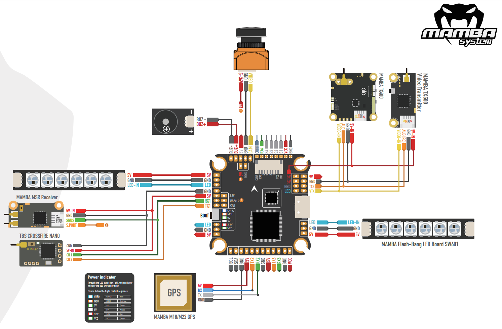

.. _common-mamba-basic-mk3:

===================================
Mamba Basic F405 Flight Controllers
===================================

The Mamba Basic line of autopilots are produced by [Diatone](https://www.diatone.us).

Features
========

 - STM32F405RGT6 microcontroller
 - MPU6000 IMU
 - AT7456E OSD
 - 4 UARTs
 - 4 PWM outputs

Barometer-less Operation
========================

This autopilot does not include a barometer sensor for altitude information and therefore has restricted modes of operation:

Plane
-----
An altitude source must be provided for any operation. Attach a GPS and follow the instructions in :ref:`common-gps-for-alt`.

Copter
------
Arming and operation in ACRO and STABILIZE modes is possible. It is also possible to arm and fly in ALTHOLD, but altitude hold performance relies on accelerometer/gyro exclusively and could be exceptionally poor, even resulting in a crash so is not recommended. As with Plane you can use a GPS for altitude data, but Rangefinders and Beacons can also be used and the ``EK3_SCRX_POSZ`` parameters set appropriately.

Rover
-----
Rover does not require an altitude source and the ``EK3_SCRX_POSZ`` parameters can be set to "0"

Where to Buy
============

`DiatoneUSA <https://www.diatone.us/collections/basic-fc/products/mb-f405-mk3-fc>`__

Pinout
======

UART Mapping
============

The UARTs are marked Rn and Tn in the above pinouts. The Rn pin is the
receive pin for UARTn. The Tn pin is the transmit pin for UARTn.

=========  ================ ===========
  Name     Pin              Function  
=========  ================ ===========
  SERIAL0  COMPUTER          USB  
  SERIAL1  PPM/RX1/SBUS/TX1  UART1 (RC Input)  
  SERIAL2  TX2/RX2           UART2 (Empty)  
  SERIAL3  TX3/RX3           UART3 (Telem1)  
  SERIAL4  TX4/RX4           UART4 (Empty)  
  SERIAL6  TX6/RX6           UART6 (GPS) 
=========  ================ =========== 

RC Input
========
 
The PPM pin, which by default is mapped to a timer input, can be used for all ArduPilot supported receiver protocols, except CRSF/ELRS and SRXL2 which require a true UART connection. However, FPort, when connected in this manner, will only provide RC without telemetry. 

To allow CRSF and embedded telemetry available in Fport, CRSF, and SRXL2 receivers, the SBUS pin can also be configured to be used as true UART1 RX pin for use with bi-directional systems by setting the :ref:`BRD_ALT_CONFIG<BRD_ALT_CONFIG>` to “1” so it becomes the SERIAL1 port's RX input pin.

With this option, :ref:`SERIAL1_PROTOCOL<SERIAL1_PROTOCOL>` must be set to "23", and:

- PPM is not supported.

- SBUS/DSM/SRXL connects to the PPM pin, but SBUS is not supported without an external inverter.

- FPort requires connection to T1 and PPM(R1) via a bi-directional inverter. See :ref:`common-FPort-receivers`.

- CRSF also requires a T1 connection, in addition to PPM (R1), and automatically provides telemetry.

- SRXL2 requires a connection to T1 and automatically provides telemetry.  Set :ref:`SERIAL1_OPTIONS<SERIAL1_OPTIONS>` to "4".

Any UART can be used for RC system connections in ArduPilot also, and is compatible with all protocols except PPM (SBUS requires external inversion). See :ref:`common-rc-systems` for details.

  
OSD Support
===========

The Mamba F405 MK2 has an integrated OSD enabled by :ref:`OSD_TYPE<OSD_TYPE>` =` 1 (MAX7456 driver).

PWM Output
==========

The Mamba F405 MK2 supports up to 4 PWM outputs. The pads for motor output ESC1 to ESC4 on the above diagram are for the 4 outputs. All 4 outputs support DShot as well as all PWM types.

The outputs are all in one group.

Channels within the same group need to use the same output rate. If
any channel in a group uses DShot then all channels in the group need
to use DShot.

Battery Monitoring
==================

The board has a built-in voltage sensor. The voltage sensor can handle up to 6S
LiPo batteries. An external current sense input is also provided.

The correct battery setting parameters are:

 - :ref:`BATT_MONITOR<BATT_MONITOR>` = 3 for voltage only or = 4 if external current sense is also used.
 - :ref:`BATT_VOLT_PIN<BATT_VOLT_PIN>` = 11
 - :ref:`BATT_VOLT_MULT<BATT_VOLT_MULT>` = 11.0
 - :ref:`BATT_CURR_PIN<BATT_CURR_PIN>` = 13
 - :ref:`BATT_AMP_PERVLT<BATT_AMP_PERVLT>` depends on external current sensor used

Compass
=======

The Mamba Basic autopilots do not have a builting compass, but you can attach an external compass using I2C on the SDA and SCL pads or refer to :ref:`common-compassless`.

Firmware
========

Firmware for this board can be found `here <https://firmware.ardupilot.org>`__ in  sub-folders labeled "MambaF405US-I2C".

Initial firmware load can be done with DFU by plugging in USB with the
bootloader button pressed. Then you should load the "with_bl.hex"
firmware. See :ref:`common-loading-firmware-onto-chibios-only-boards`.

Once the initial firmware is loaded you can update the firmware using
any ArduPilot ground station software. Updates should be done with the
".apj" firmware files.

[copywiki destination="plane,copter,rover,blimp"]