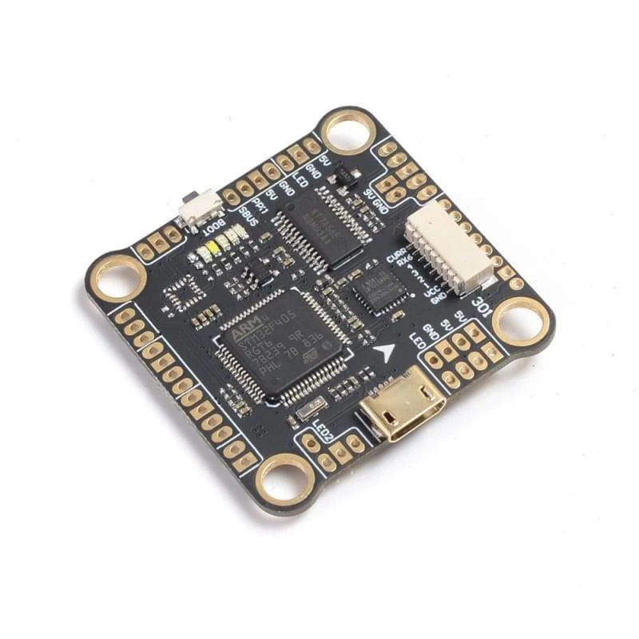
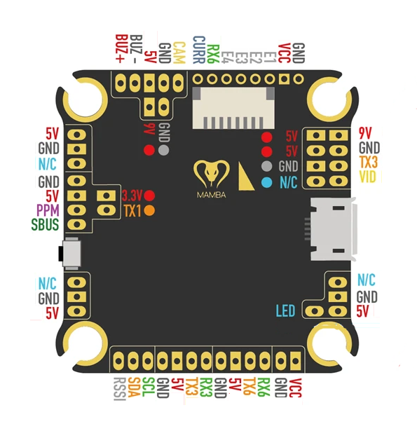

.. _common-mamba405-mk2:

================================
Mamba F405 MK2 Flight Controller
================================

The Mamba F405 MK2 is an autopilot produced by
`Diatone <https://www.diatone.us>`__.

.. warning:: This autopilot does not have a barometer. An external barometer can be added, or operation with an alternate altitude sensor, such as GPS for outdoor use or rangefinder for indoor applications is supported, with caveats. In Plane, if GPS is lost, then the user should switch to a non-navigation, non-altitude holding mode immediately. In Copter, operation is allowed using GPS, but not recommended, due to the imprecision in altitude hold modes. Bear in mind if GPS fails and the vehicle is using it for altitude information, a crash can eventually result due to lack of accurate altitude information.See :ref:`common-gps-for-alt` for more information.

Features
========

-  STM32F405RGT6 microcontroller
-  MPU6000 IMU
-  AT7456E OSD
-  3 UARTs
-  5 PWM outputs

Barometer-less Operation
========================

This autopilot does not include a barometer sensor for altitude information and therefore has restricted modes of operation:

Plane
-----
An altitude source must be provided for any operation. Attach a GPS and follow the instructions in :ref:`common-gps-for-alt`.

Copter
------
Arming and operation in ACRO and STABILIZE modes is possible. It is also possible to arm and fly in ALTHOLD, but altitude hold performance relies on accelerometer/gyro exclusively and could be exceptionally poor, even resulting in a crash so is not recommended. As with Plane you can use a GPS for altitude data, but Rangefinders and Beacons can also be used and the ``EK3_SCRX_POSZ`` parameters set appropriately.

Rover
-----
Rover does not require an altitude source and the ``EK3_SCRX_POSZ`` parameters can be set to "0"

Where to buy
============

Available from multiple retailers and directly from the vendor at `diatone.us <https://www.diatone.us/products/mamba-f405-flight-controller-mk2>`__

Pinout
======

   Mamba F405 MK2 Board

UART Mapping
============

======= ========== ===================
Name    Pin labels Function
======= ========== ===================
SERIAL0            USB
SERIAL1 PPM / SBUS RC Input (SBUS pin MUST be used for RC input unless alt config used)
SERIAL3 TX3 / RX3  UART3 (IRC Tramp)
SERIAL6 TX6 / RX6  UART6 (ESC Telemetry)
======= ========== ===================

=============== ================
BRD_ALT_CONFIG  PPM pin function
=============== ================
ALT 0 (default) tied internally to an inverter, cannot be driven from the outside
ALT 1           RX1(PPM)/TX1  
=============== ================

RC Input
========

RC input is configured on the SBUS pin which drives the UART1 RX pin via an inverter. It supports all RC unidirectional protocols (ie Not PPM, FPORT or other bidirectional protocols with telemetry). :ref:`BRD_ALT_CONFIG<BRD_ALT_CONFIG>` = 1 enables the RX1 pin for use with bidrectional RX like CRSF.

OSD Support
===========

The Mamba F405 MK2 has an integrated OSD.

PWM Output
==========

The Mamba F405 MK2 supports up to 5 PWM outputs. The pads for motor
output ESC1 to ESC4 on the above diagram are for the 4 outputs. The first 4
outputs support Bi-Directional DShot as well as all PWM types.

All the output channels are in the same group.

Channels within the same group need to use the same output rate and protocol. If any
channel in a group uses DShot then all channels in the group need to use
DShot.

- PWM1,4 Group1
- PWM 2,3 Group2
- PMW5 Group 3

Battery Monitoring
==================

The board has a built-in voltage sensor. The voltage sensor can handle
up to 6S LiPo batteries. An external current sensor input is also provided on the ESC connector.

The correct battery setting parameters are:

-  :ref:`BATT_MONITOR<BATT_MONITOR>` = 3
-  :ref:`BATT_VOLT_PIN<BATT_VOLT_PIN>` = 11
-  :ref:`BATT_VOLT_MULT<BATT_VOLT_MULT>` 11.0
-  :ref:`BATT_CURR_PIN<BATT_CURR_PIN>` =  13
-  :ref:`BATT_AMP_PERVLT<BATT_AMP_PERVLT>` = 25 with the Diattone 40A ESC sometimes bundled with the autopilot.

Compass
=======

The Mamba F405 MK2 does not have a built-in compass, but you can attach
an external compass using I2C on the SDA and SCL pads.

Flashing Firmware
========================
Usually these boards are sold pre-flashed with betaflight / INav firwares and require both firmware and bootloader to be updated if you want to use ArduPilot, as an ArduPilot-compatible bootloader is required for subsequent ArduPilot firmware-upgrade handling.

See :ref:`common-loading-firmware-onto-chibios-only-boards`

[copywiki destination="plane,copter,rover,blimp"]
