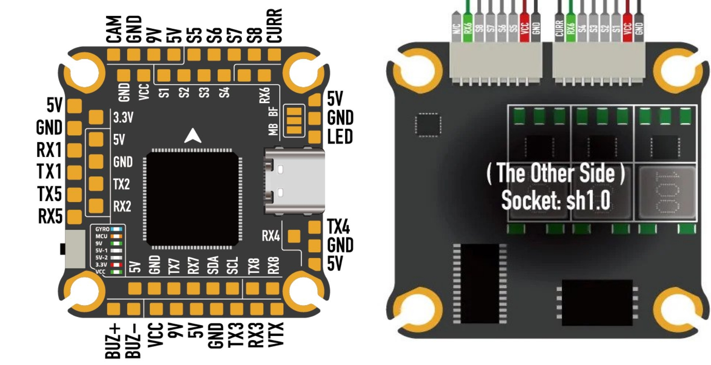

.. _common-mambaH743v4:
[copywiki destination="plane,copter,rover,blimp"]
============
Mamba H743v4
============

The MambaH743v4 is an autopilot produced by `Diatone <https://www.diatone.us>`__.

Specifications
==============

-  **Processor**

   -  STM32H743 32-bit processor running at 480 MHz
   -  OSD - AT7456E
   -  128MB Data Log Flash

-  **Sensors**

   -  Dual MPU6000 (Version A) or BMI270 (Version B)
   -  DPS280

-  **Power**

   -  6.8V ~ 26V DC input power
   -  5V 3A BEC for peripherals
   -  9V 3A BEC for video

-  **Interfaces**

   -  8 UARTS
   -  9x PWM outputs
   -  I2C ports for external compass, airspeed sensor, etc.
   -  USB port

-  **Size and Dimensions**

   - 38mm x 38mm x 7.5mm
   - 11g

Pinout
======

UART Mapping
============

The UARTs are marked RXn and TXn in the above pinouts. The RXn pin is the receive pin for UARTn. The TXn pin is the transmit pin for UARTn. Default protocols for each port are shown and may be changed by the user.

-   SERIAL0 -> USB
-   SERIAL1 -> USART1 (RX/SBUS, DMA-enabled)
-   SERIAL2 -> USART2 (TELEM2)
-   SERIAL3 -> USART3 (GPS)
-   SERIAL4 -> UART4 (GPS, DMA-enabled)
-   SERIAL5 -> UART5 
-   SERIAL6 -> USART6 (ESC Telemetry)
-   SERIAL7 -> UART7 (DMA-enabled)
-   SEIRAL8 -> UART8

RC Input
========

RC input is configured on the RX1 (UART1_RX) pin. It supports all serial RC protocols.

:ref:`SERIAL1_PROTOCOL<SERIAL1_PROTOCOL>` is set to "23" by default, and:

- PPM is not supported.

- SBUS/DSM/SRXL connects to the RX1 pin, but SBUS requires that the :ref:`SERIAL1_OPTIONS<SERIAL1_OPTIONS>` be set to "3".

- FPort requires connection to TX1 and :ref:`SERIAL7_OPTIONS<SERIAL7_OPTIONS>` be set to "7".

- CRSF also requires a TX1 connection, in addition to RX1, and automatically provides telemetry. Set :ref:`SERIAL1_OPTIONS<SERIAL7_OPTIONS>` to "0".

- SRXL2 requires a connection to TX1 and automatically provides telemetry.  Set :ref:`SERIAL1_OPTIONS<SERIAL1_OPTIONS>` to "4".

Any UART can be used for RC system connections in ArduPilot also, and is compatible with all protocols except PPM. See :ref:`common-rc-systems` for details.

FrSky Telemetry
===============

FrSky Telemetry is supported using any UART TX pin. You need to set the following parameters to enable support for FrSky S.PORT (example given for UART5)

- :ref:`SERIAL5_PROTOCOL<SERIAL5_PROTOCOL>` = 10
- :ref:`SERIAL5_OPTIONS<SERIAL5_OPTIONS>` = 7

OSD Support
============

The MambaH743v4 supports OSD using :ref:`OSD_TYPE<OSD_TYPE>` = 1 (MAX7456 driver).

PWM Output
===========

The MambaH743v4 supports up to 9 PWM outputs. The pads for motor output M1 to M8 are provided on both the motor connectors and on separate pads, plus M9 on a separate pad for LED strip or another PWM output.

The PWM is in 4 groups:

-   PWM 1-4 in group1
-   PWM 5,6 in group2
-   PWM 7,8 in group3
-   PWM 9 in group4

Channels within the same group need to use the same output rate. If any channel in a group uses DShot then all channels in the group need to use DShot. Channels 1-8 support bi-directional DShot.

Battery Monitoring
==================

The board does not have a built-in current sensor. The voltage sensor can handle up to 6S LiPo batteries.

Typical battery setting parameters are:

-   :ref:`BATT_MONITOR<BATT_MONITOR>` = 4
-   :ref:`BATT_VOLT_PIN<BATT_VOLT_PIN>` = 11
-   :ref:`BATT_CURR_PIN<BATT_CURR_PIN>` = 13
-   :ref:`BATT_VOLT_MULT<BATT_VOLT_MULT>` = 11.1
-   :ref:`BATT_AMP_PERVLT<BATT_AMP_PERVLT>` = 64 (will depend on external current sensor)

Compass
=======

The MambaH743v4 does not have a builtin compass, but you can attach an external compass using I2C on the SDA and SCL pads.

Firmware
========

Firmware for this board can be found `here <https://firmware.ardupilot.org>`_ in  sub-folders labeled "MambaH743v4"".

Loading Firmware
================

Initial firmware load can be done with DFU by plugging in USB with the
bootloader button pressed. Then you should load the "with_bl.hex"
firmware, using your favourite DFU loading tool.

Once the initial firmware is loaded you can update the firmware using
any ArduPilot ground station software. Later updates should be done with the
\*.apj firmware files.