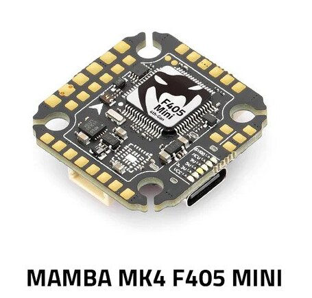
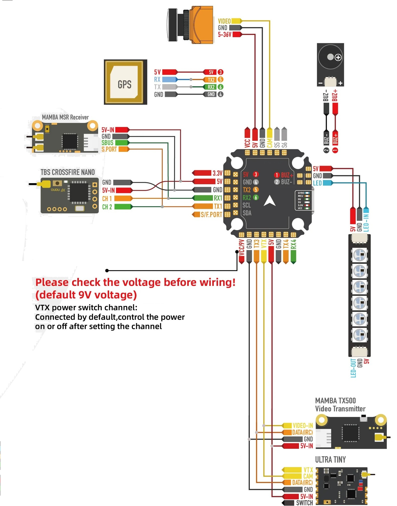
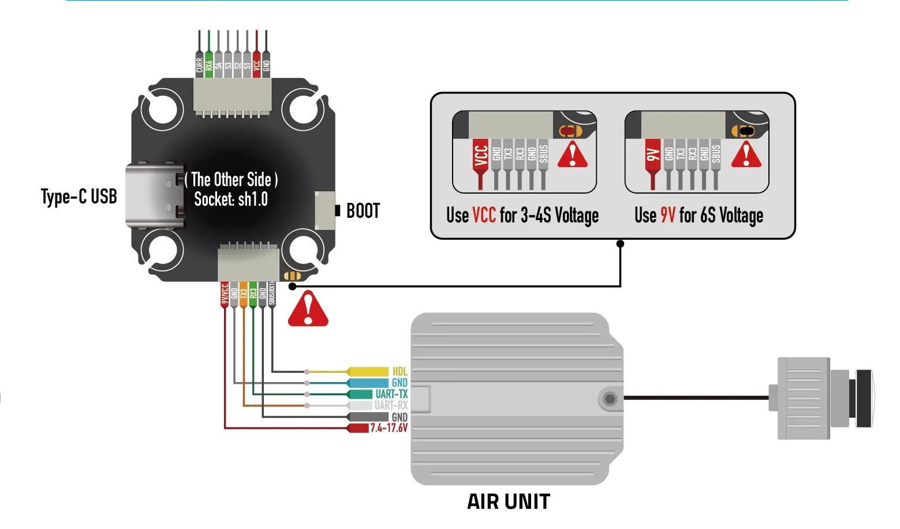

.. _common-mambaf405-mini:

[copywiki destination="plane,copter,rover,blimp"]
==================
Mamba MK4 F405Mini
==================

The Mamba MK4 F405Mini is an autopilot produced by `Diatone <https://www.diatone.us>`__.

Specifications
==============

-  **Processor**

   -  STM32F405 32-bit processor running at 168 MHz
   -  OSD - AT7456E
   -  128Kb (16MB) Data Log Flash (:ref:`LOG_BACKEND_TYPE<LOG_BACKEND_TYPE>` = 2)

-  **Sensors**

   -  Accelerometer/Gryo: MPU6000 (Version A) or IMC42688 (Version B)
   -  SPL06 Barometer

-  **Power**

   -  6.8V ~ 26V DC input power
   -  5V 2.5A BEC for peripherals
   -  9V 2A BEC for video

-  **Interfaces**

   -  4 UARTS
   -  7x PWM outputs (one is used for serial LED)
   -  I2C port for external compass, airspeed sensor, etc.
   -  USB port

-  **Size and Dimensions**

   - 29mm x 29.5mm x 6.5mm, 20mm x 20mmx mounting
   - 6g

Pinout
======

UART Mapping
============

The UARTs are marked RXn and TXn in the above pinouts. The RXn pin is the receive pin for UARTn. The TXn pin is the transmit pin for UARTn. Default protocols for each port are shown and may be changed by the user.

-   SERIAL0 -> USB
-   SERIAL1 -> USART1 (RX/SBUS)
-   SERIAL2 -> USART2 (GPS, DMA-enabled)
-   SERIAL3 -> USART3 (User, TX has DMA capability, on DJI AIR connector)
-   SERIAL4 -> UART4  (User, TX has DMA capability)
-   SERIAL5 -> UART5  (Unavailable, not pinned out)
-   SERIAL6 -> USART6 (RX only, ESC Telem, DMA capable)

RC Input
========

RC input is configured on the RX1 (UART1_RX) pin. It supports all serial RC protocols.

:ref:`SERIAL1_PROTOCOL<SERIAL1_PROTOCOL>` is set to "23" by default, and:

- PPM is not supported.

- SBUS/DSM/SRXL connects to the RX1 pin, but SBUS requires that the :ref:`SERIAL1_OPTIONS<SERIAL1_OPTIONS>` be set to "3".

- FPort requires connection to TX1 and :ref:`SERIAL7_OPTIONS<SERIAL7_OPTIONS>` be set to "7".

- CRSF also requires a TX1 connection, in addition to RX1, and automatically provides telemetry. Set :ref:`SERIAL1_OPTIONS<SERIAL7_OPTIONS>` to "0".

- SRXL2 requires a connection to TX1 and automatically provides telemetry.  Set :ref:`SERIAL1_OPTIONS<SERIAL1_OPTIONS>` to "4".

Any UART can be used for RC system connections in ArduPilot also, and is compatible with all protocols except PPM. See :ref:`common-rc-systems` for details.

FrSky Telemetry
===============

FrSky Telemetry is supported using any UART TX pin. You need to set the following parameters to enable support for FrSky S.PORT (example given for UART4)

- :ref:`SERIAL4_PROTOCOL<SERIAL4_PROTOCOL>` = 10
- :ref:`SERIAL4_OPTIONS<SERIAL4_OPTIONS>` = 7

OSD Support
============

The Mamba MK4 F405Mini supports internal OSD using :ref:`OSD_TYPE<OSD_TYPE>` = 1 (MAX7456 driver).

DJI Video
=========

A standard DJI video connector is provided. Set :ref:`OSD_TYPE<OSD_TYPE>` to "3" (MSP) or "5" (DisplayPort) depending on use, and set :ref:`SERIAL3_PROTOCOL<SERIAL3_PROTOCOL>` to "32" (MSP) or "42" (DisplayPort) also.

PWM Output
===========

The Mamba MK4 F405Mini supports up to 7 PWM outputs, all are DShot capable. The pads for motor output M1 to M4 are provided on  the motor connector and are BDShot capable, plus there is M7 on a separate pad for LED strip or another PWM output.

The PWM is in 4 groups:

-   PWM 1,2 in group1  (if used for :ref:`GPIOs <common-gpios>` their reference pin numbers are 50 and 51, respectively)
-   PWM 3,4 in group2 (if used for :ref:`GPIOs <common-gpios>` their reference pin numbers are 52 and 53, respectively)
-   PWM 5,6 in group3 (if used for :ref:`GPIOs <common-gpios>` their reference pin numbers are 54 and 55, respectively)
-   PWM 7 (LED) in group4 (if used for :ref:`GPIOs <common-gpios>` its reference pin number is 56)

Channels within the same group need to use the same output rate. If any channel in a group uses DShot then all channels in the group need to use DShot. Channels 1-4 support bi-directional DShot.

Battery Monitoring
==================

The board does not have a built-in current sensor. The voltage sensor can handle up to 6S LiPo batteries.

Typical battery setting parameters are:

-   :ref:`BATT_MONITOR<BATT_MONITOR>` = 4
-   :ref:`BATT_VOLT_PIN<BATT_VOLT_PIN>` = 11
-   :ref:`BATT_CURR_PIN<BATT_CURR_PIN>` = 13
-   :ref:`BATT_VOLT_MULT<BATT_VOLT_MULT>` = 11.1
-   :ref:`BATT_AMP_PERVLT<BATT_AMP_PERVLT>` = 64 (will depend on external current sensor)

Compass
=======

The Mamba MK4 F405Mini does not have a built-in compass, but you can attach an external compass using I2C on the SDA and SCL pads.

RSSI
====

Analog RSSI input, if used, :ref:`RSSI_ANA_PIN<RSSI_ANA_PIN>` should be set to "12".

Loading Firmware
================

Firmware for this board can be found `here <https://firmware.ardupilot.org>`_ in  sub-folders labeled "MambaF405-2022".

Initial firmware load can be done with DFU by plugging in USB with the
bootloader button pressed. Then you should load the "with_bl.hex"
firmware, using your favourite DFU loading tool. See :ref:`common-loading-firmware-onto-chibios-only-boards`.

Once the initial firmware is loaded you can update the firmware using
any ArduPilot ground station software. Later updates should be done with the
\*.apj firmware files.