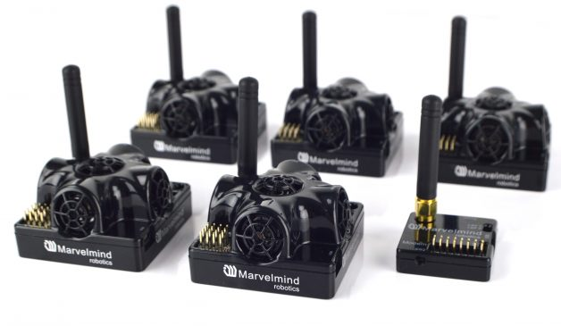

.. _common-marvelmind:

=================================
Marvelmind for Non-GPS navigation
=================================

This article explains how a `MarvelMind <https://marvelmind.com/>`__ system can be as a short-range substitude for a GPS allowing position control modes like Auto and Guided.
See the `user manual <https://marvelmind.com/pics/marvelmind_navigation_system_manual.pdf>`__ for more details on the system.

.. note::

   Support was added in Copter-3.6 and Rover-3.3.
   This wiki page is a work-in-progress.

*image courtesy of marvelmind.com*

Required Hardware
=================

* `Marvelmind Starter Set <https://marvelmind.com/product/starter-set-hw-v4-9-plastic-housing/>`__

Connecting to a flight controller
=================================

- ensure the mavelmind is firmware version 5.77 (or higher)
- ensure that Copter-3.6 (or higher) or Rover-3.3 is loaded onto the flight controller and connect with a Ground Station (i.e. Mission Planner).
- enable the :ref:`EKF3 as described here <common-apm-navigation-extended-kalman-filter-overview>`
- set :ref:`EK3_ALT_SOURCE <EK3_ALT_SOURCE>` to 3 (means using Marvelmind for altitude)
- set :ref:`BCN_TYPE <BCN_TYPE>` to 2 (means using Marvelmind system)
- set :ref:`BCN_LATITUDE <BCN_LATITUDE>`, :ref:`BCN_LONGITUDE <BCN_LONGITUDE>` and :ref:`BCN_ALT <BCN_ALT>` to match your actual location.  Getting these values exactly correct is not particularly important although getting it close is required in order for the compass's declination to be correctly looked up from the small database held within ArduPilot.
- set :ref:`BCN_ORIENT_YAW <BCN_ORIENT_YAW>` to the heading from the origin anchor to the 2nd anchor.  One way to capture this value is to stand at the origin holding the vehicle so that it's nose points towards the second beacon.  Read the vehicle's heading from the HUD and enter this value into :ref:`BCN_ORIENT_YAW <BCN_ORIENT_YAW>`
- set :ref:`GPS_TYPE <GPS_TYPE>` to 0 to disable the GPS
- set :ref:`ARMING_CHECK <ARMING_CHECK>` to -9 to disable the GPS arming check
- set :ref:`SERIAL1_BAUD <SERIAL1_BAUD>` to 115 to set telemetry1's baud rate to 115200 (if using Telem2 set :ref:`SERIAL2_BAUD <SERIAL2_BAUD>` instead)
- set :ref:`SERIAL1_PROTOCOL <SERIAL1_PROTOCOL>` to 13 to enable receiving data from the marvelmind (If using Telem2 set :ref:`SERIAL2_PROTOCOL <SERIAL2_PROTOCOL>` instead)
- set :ref:`BRD_SER1_RTSCTS <BRD_SER1_RTSCTS>` to 0 to ensure telem1 does not use flow control (If using Telem2 set :ref:`BRD_SER2_RTSCTS <BRD_SER2_RTSCTS>` instead, not required if using Serial4/5)

Ground Testing
==============

- Connect the Flight Controller to a ground station
- After about 1 minute the vehicle's position should jump to the lattitude, longitude you input during the configuration step (above)
- Check that the vehicle's position is relatively stable (i.e. moving around less than one meter)
- Walk the vehicle around between the anchors and ensure that it's position on the map updates correctly

DataFlash logging
=================

The distance to the beacons can be found in the dataflash log's BCN message's D0, D1, D2, D3 fields.
