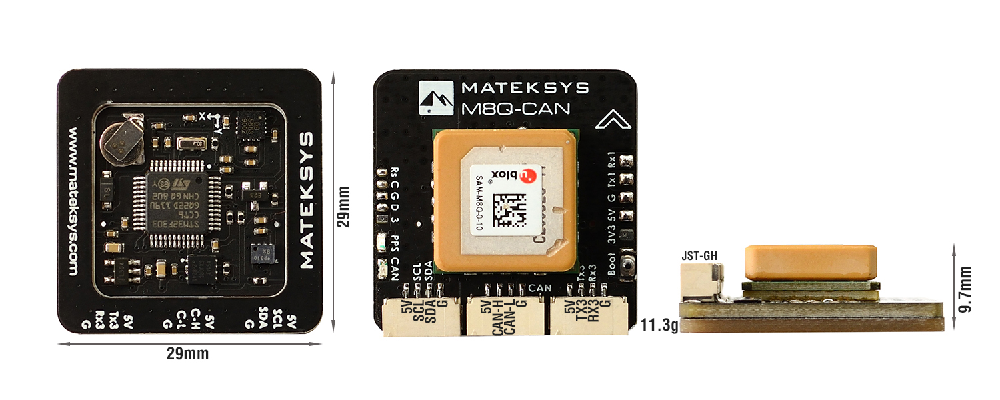
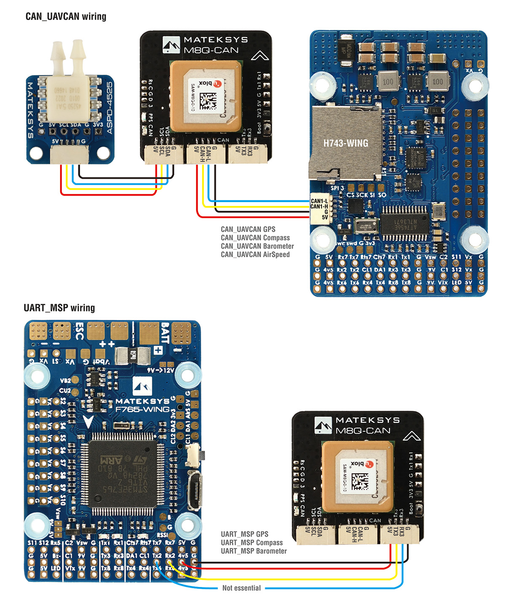

.. _common-matek-m8q:

=================================
Matek M8Q UAVCAN/MSP GPS/MAG/BARO
=================================

Based on ArudPilots' AP_Pheriph firmware, the Matek M8Q is a GPS+COMPASS+BAROMETER peripheral with CAN/UAVCAN and MSP interfaces to the autopilot, plus an I2C expansion bus for additional peripherals, such as airspeed sensors. 

Features
========

ArduPilot AP_Periph F303 CAN node integrating:
  - GPS SAM-M8Q (GPS, GLONASS, Galileo)
  - Magnetic Compass QMC5883L
  - Barometer DPS310
  - CAN bootloader LED, Blue
      - Fast blinking, No communication between CAN node and Flight Controllers
      - Slow blinking, Communicating between CAN node and Flight Controllers
  - GPS PPS LED, Green
      - Blinking(1Hz) when GPS has 3D fixed
  - Boot button
Interfaces:
  - CAN,/UAVCAN Connection to autopilot
  - I2C JST-GH connector, external AirSpeed sensor
  - UART for alternate connection to autopilot via MSP
  - JST-GH connectors
Specifications:
  - Input voltage range: 4~6V
  - Power consumption: 100mA
  - Operating Temperatures: -20~80 °C
  - Size: 29mm*29mm*9.7mm
  - Weight:11.3g

Wiring
======

Setup
=====

UAVCAN
------
- :ref:`CAN_D1_PROTOCOL<CAN_D1_PROTOCOL>`   = 1
- :ref:`CAN_P1_DRIVER<CAN_P1_DRIVER>`       = 1
- :ref:`GPS_TYPE<GPS_TYPE>`                 = 9 (UAVCAN)
- :ref:`COMPASS_TYPEMASK<COMPASS_TYPEMASK>` = 0 (or make sure UAVCAN bit is not checked)

if Airspeed sensor is connected to I2C port,

- :ref:`ARSPD_TYPE<ARSPD_TYPE>`   = 	8 (UAVCAN)
- :ref:`ARSPD_USE<ARSPD_USE>`     = 	1

The default airspeed sensor is expected to be a "DLVR-L10D" type , if not then you must use the SL-CAN interface to set and type in the internal firmware. In Mission Planner go to Setup > Optional Hardware > UAVCAN >  SLCan Mode CAN1  > Parameters

if using an:

- MS4525    set ARSP_TYPE -> 1,
- MS5525    set ARSP_TYPE -> 5 (note: only an MS5525 with address 0x77 can be used to avoid conflict with DPS310 barometer.)
- SDP3X     set ARSP_TYPE -> 6
- DLVR-L10D set ARSP_TYPE -> 9
- the Write, and reboot

MSP
---

- ``SERIALx_PROTOCOL``                      = 32  (MSP) where x is the SERIAL port used for connection on autopilot
- :ref:`GPS_TYPE<GPS_TYPE>`                 = 19 (MSP)
- :ref:`BARO_PROBE_EXT<BARO_PROBE_EXT>`     = 4096  (MSP Baro)
- :ref:`BARO_PRIMARY<BARO_PRIMARY>`         = 1  (If you want to use MSP baro as primary baro, otherwise leave as default)
- :ref:`COMPASS_TYPEMASK<COMPASS_TYPEMASK>` = 0 (or make sure MSP bit is not checked)

MSP Firmware Update
===================

Prior to September 2020, MSP connection was not supported. However, you may update to the new firmware by following the guide `here <http://www.mateksys.com/?portfolio=m8q-can#tab-id-8>`_.

Where to Buy
============

`Matek M8Q-CAN <http://www.mateksys.com/?portfolio=m8q-can>`_

