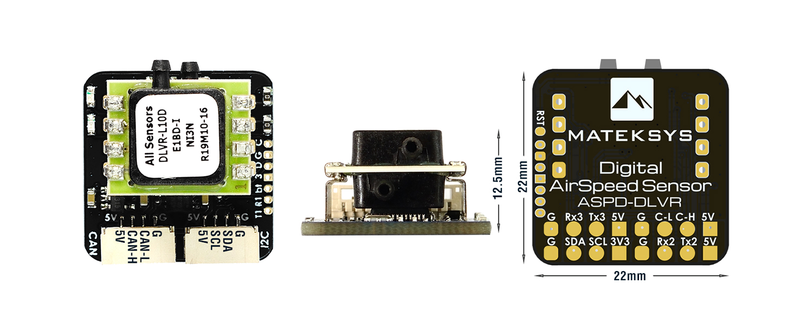
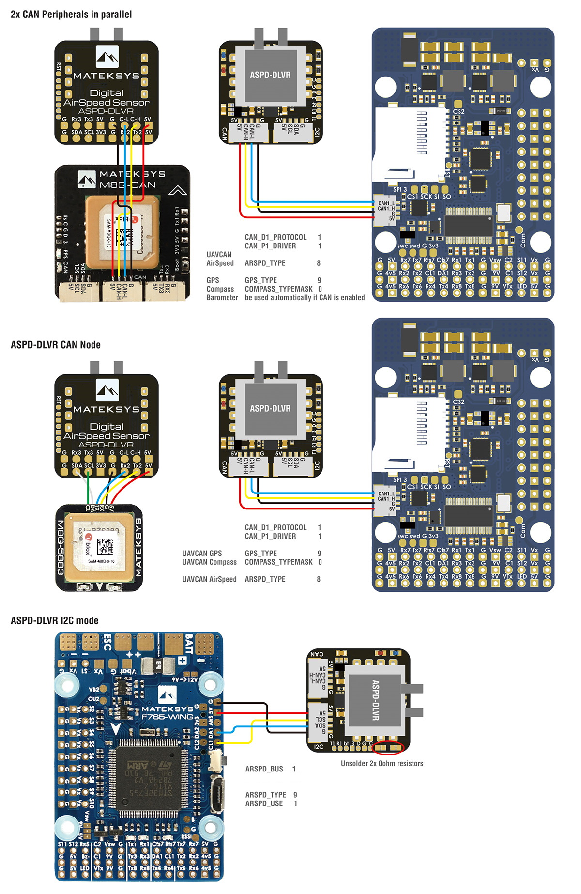

.. _common-matek-uavcan-dlvr:

====================================
Matek UAVCAN DLVR-10 Airspeed Sensor
====================================

The Matek ASPD-DLVR is a DLVR-10 sensor with a CAN/UAVCAN or I2C interface. The DLVR airspeed sensors are the highest precision, lowest temperature drift sensors currently supported in ArduPilot. It can also be used to attach a GPS and/or Compass and present them to the autopilot as UAVCAN peripherals.

Features
========

- ArduPilot AP_Periph F303 CAN node
- DLVR-L10D Airspeed Sensor
- CAN bootloader LED, Blue
    - Fast blinking,  No communication between CAN node and Flight Controllers
    - Slow blinking, Communicating between CAN node and Flight Controllers
- 3.3V Power LED, Red

Interfaces:

- CAN JST-GH connector,  UAVCAN Protocol
- I2C JST-GH connector,  for interfacing DLVR-L10D in I2C mode (I2C address 0x28)
- Solder pads for UART1, Firmware update for non-CAN systems
- Solder pads for UART2, Optional for external GPS
- Solder pads for UART3, Future expansion for MSP Protocol
- Solder pads for I2C and CAN,for optional Compass and CAN daisy-chaining

Specifications:

- Input voltage range: 4~6V
- Power consumption: 60mA
- Operating Temperatures: -20°C to 85°C
- Pressure Range:  2500Pa (± 10 inH2O)
- Burst Pressure: 75kPa
- Speed Range: ±250 km/h
- Size: 22mmx22mmx12.5mm
- Weight: 4g

Connector Pinouts
=================

CAN Port (additional CAN devices can be daisy-chained from this device using the solder pads on the back, see diagrams below)

========== =============== =================
Pin        Signal Name     Voltage/Tolerance
========== =============== =================
1           VCC             5V
2           CAN_H           CAN bus
3           CAN_L           CAN bus
4           GND             --
========== =============== =================

I2C Port to Autopilot for use in place of CAN (enabled by unsoldering two zero ohm resistors, see diagram below.)

.. note:: Solder pad I2C bus on rear is for attaching an external compass when this port is NOT enabled, and it will be presented to the AutoPilot as a UAVCAN compass.

========== =============== =================
Pin        Signal Name     Voltage/Tolerance
========== =============== =================
1           VCC             5V
2           I2C SDA         3.3V/5V
3           I2C SCL         3.3V/5V
4           GND             --
========== =============== =================

UART3 (Future MSP Port)

========== =============== =================
Pin        Signal Name     Voltage/Tolerance
========== =============== =================
1           VCC             5V
2           TX (data out)   3.3V/5V
3           RX (Data in)    3.3V/5V
4           GND             --
========== =============== =================

UART2 (via solder pads on rear)
===============================

Can be used to attach a GPS and present it to the autopilot as a UAVCAN device

UART1 (via solder pads on rear)
===============================

For future firmware upgrades in systems not using CAN/UAVCAN

Wiring Diagrams
===============

Setup
=====

UAVCAN Mode
-----------
Verify the following parameters are set on your autopilot via your ground station.

- :ref:`CAN_P1_DRIVER<CAN_P1_DRIVER>` = 1 (assuming its on the first CAN bus of the autopilot)
- :ref:`ARSPD_TYPE<ARSPD_TYPE>` = 8 (UAVCAN)

if optional GPS is connected to UART2, then set

- :ref:`GPS_TYPE<GPS_TYPE>` = 9 (UAVCAN) or if it will be the secondary GPS, set instead
- :ref:`GPS_TYPE2<GPS_TYPE2>` = 9 (UAVCAN)

- Reboot

Make sure the UAVCAN compass driver is not disabled if an optional external Compass is connected to the rear I2C pads:. (:ref:`COMPASS_TYPEMASK<COMPASS_TYPEMASK>` bit 9 should not be set). 

I2C Mode
--------

- :ref:`ARSPD_TYPE<ARSPD_TYPE>` = 9 (DLVR-10)
- :ref:`ARSPD_USE<ARSPD_USE>` = 1 to enable using the sensor on autopilots external I2C bus

.. note:: if your autopilot has more than one I2C bus or presents its internal bus externally, may need to set :ref:`ARSPD_BUS<ARSPD_BUS>` for the one you connect to on the autopilot.

Firmware Update
---------------

Firmware may be updated in the future to include the option of MSP connectivity. See `here <http://www.mateksys.com/?portfolio=aspd-dlvr#tab-id-4>`_  for instructions for using the firmware update UART1 pads, or if using UAVCAN, see instructions :ref:`here <common-mp-slcan>`

Where to Buy
------------

- `Matek <http://www.mateksys.com/?portfolio=aspd-dlvr#tab-id-1>`_