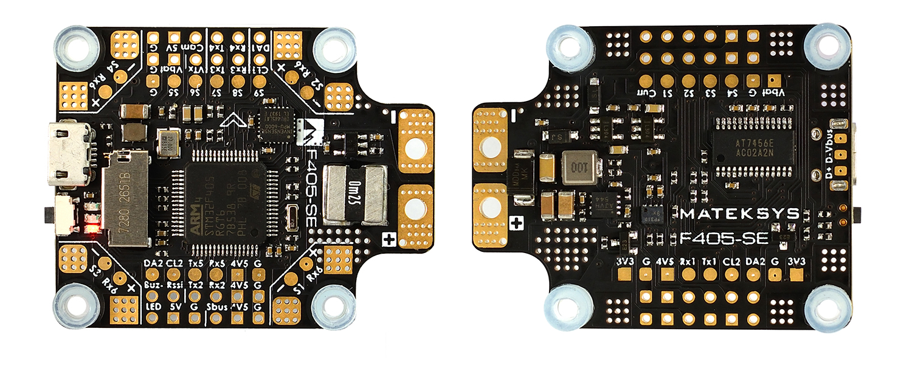
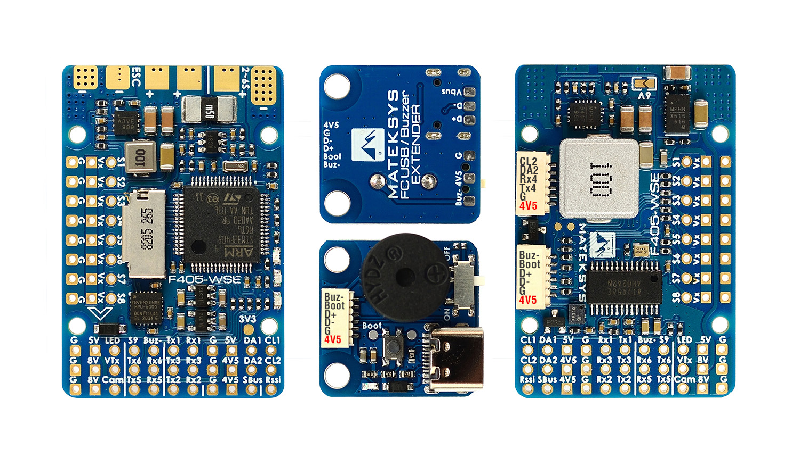

.. _common-matekf405-se:

====================
Mateksys F405-SE/WSE
====================

the above images and some content courtesy of `mateksys.com <http://www.mateksys.com/>`__

.. note::

	Due to flash memory limitations, this board does not include all ArduPilot features.
        See :ref:`Firmware Limitations <common-limited_firmware>` for details.

These boards use the MatekF405-Wing firmware `here <https://firmware.ardupilot.org>`_

Specifications
==============
-  **Processor**

   -  STM32F405RGT6 ARM (168MHz)

-  **Sensors**

   -  InvenSense MPU6000 IMU (accel, gyro)
   -  DPS310 Barometer
   -  Voltage & 184A current sensor

-  **Power**

   -  6V ~ 36V DC input power
   -  5V, 2A BEC for FC & Peripherals (GPS/Compass/etc.)
   -  BEC Vx 5A for servos, 5V/ 6V option (WSE 0nly)
   -  BEC 8V 1.5A for VTX and camera (WSE 0nly)

-  **Interfaces**

   -  VCP & 6x UARTS
   -  10x PWM outputs, (LED output used as PWM10)
   -  1x RC input PWM/PPM, SBUS
   -  2x I2C port for external compass and airspeed sensor
   -  USB port
   -  Built-in OSD
   -  3x ADC (Vbat, Current, RSSI)
   -  Micro SD slot

-  **Size and Dimensions**

   - SE:
       - 46mm x 36mm (30.5mm spaced square mounting holes)
       - 10g

   - WSE:
       - 44mm x 29mm x 10mm (25mm x25mm mounting, 2mm holes)
       - 20g with bottom plate and remoter USB/buzzer board

These boards use the MatekF405-Wing firmware `here <https://firmware.ardupilot.org>`__.

See mateksys.com for SE `detailed specifications <http://www.mateksys.com/?portfolio=f405-se#tab-id-2>`__ and `wiring diagrams <http://www.mateksys.com/?portfolio=f405-se#tab-id-4>`__ and WSE `detailed specifications <http://www.mateksys.com/?portfolio=f405-wse#tab-id-2>`__ and `wiring diagrams <http://www.mateksys.com/?portfolio=f405-wse#tab-id-4>`__
   
Default UART order
==================

- SERIAL0 = console = USB
- SERIAL1 = Telemetry1 = USART1
- SERIAL2 = empty
- SERIAL3 = GPS1 = USART3
- SERIAL4 = GPS2 = UART4
- SERIAL5 = USER = UART5
- SERIAL6 = USER = USART6 (RX only; for ESC telemetry, use SERIAL6_PROTOCOL=16)
- SERIAL7 = USER = USART2 (only if BRD_ALT_CONFIG =1)

Serial protocols can be adjusted to personal preferences.

Dshot capability
================

All motor/servo outputs are Dshot and PWM capable. However, mixing Dshot and normal PWM operation for outputs is restricted into groups, ie. enabling Dshot for an output in a group requires that ALL outputs in that group be configured and used as Dshot, rather than PWM outputs. The output groups that must be the same (PWM rate or Dshot, when configured as a normal servo/motor output) are: 1/2, 3/4, 5/6, 7/8, 9 , and 10.

Outputs
=======

The first 8 servo/motor outputs are marked on the board: M1,M2,S3-S8 . S9 is a solder pad on the board, and S10 is connected to the pin marked LED in ArduPilot's definition. Using S10 allows the easy grouping for odd numbers of motors with a common DShot or PWM frequency without sacrificing the use of an output for servo use due to rate issues (see above Dshot discussion).

RC Input
========

The SBUS pin can be used for all ArduPilot supported receiver protocols. However, there is an alternate board configuration selectable by setting the :ref:`BRD_ALT_CONFIG<BRD_ALT_CONFIG>` to "1". In this case, the UART2 RX input (marked RX2 on the board) is used for the receiver input and is mapped to SERIAL7. This is to provide support for FPort in firmware 4.1 and later, since it requires a true UART. 

.. note:: In the alternate configuration, SBUS would need an external inverter before connection directly to RX2, but it can be still attached to the SBUS pin on the board since that is connected to an on-board inverter which is then connected to RX2. (and FPort will require an external bidirectional inverter circuit, like SPort requires, See  :ref:`FPort<common-FPort-receivers>` section.

Battery Monitor Configuration
=============================
These settings are set as defaults when the firmware is loaded, except  :ref:`BATT_AMP_PERVLT<BATT_AMP_PERVLT>` which needs to be changed from 31.7 to 55.9 . However, if they are ever lost, you can manually set the parameters:

Enable Battery monitor.

:ref:`BATT_MONITOR<BATT_MONITOR>` =4

Then reboot.

:ref:`BATT_VOLT_PIN<BATT_VOLT_PIN>` 10

:ref:`BATT_CURR_PIN<BATT_CURR_PIN>` 11

:ref:`BATT_VOLT_MULT<BATT_VOLT_MULT>` 11.0

:ref:`BATT_AMP_PERVLT<BATT_AMP_PERVLT>` 55.9

Where to Buy
============

- see this list of `Mateksys Distributors <http://www.mateksys.com/?page_id=1212>`__

Connecting a GPS/Compass module
===============================

This board does not include a GPS or compass so an :ref:`external GPS/compass <common-positioning-landing-page>` should be connected for autonomous modes to function. Compass is not required for normal Plane mode operation, but is for typical Copter, QuadPlane, and Rover operation.

.. note:: A battery must be plugged in for power to be provided to the 5V pins supplying the GPS/compass modules.
