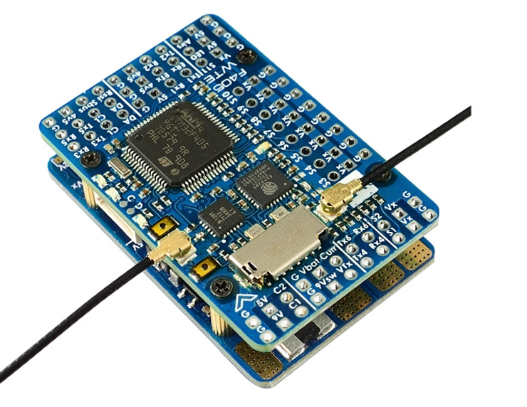
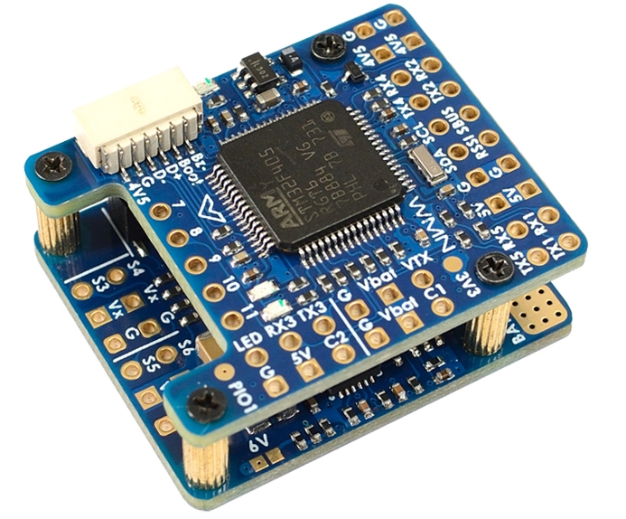
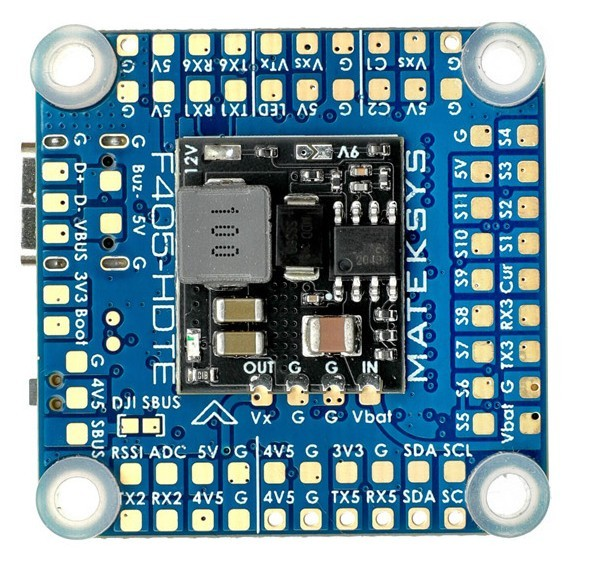
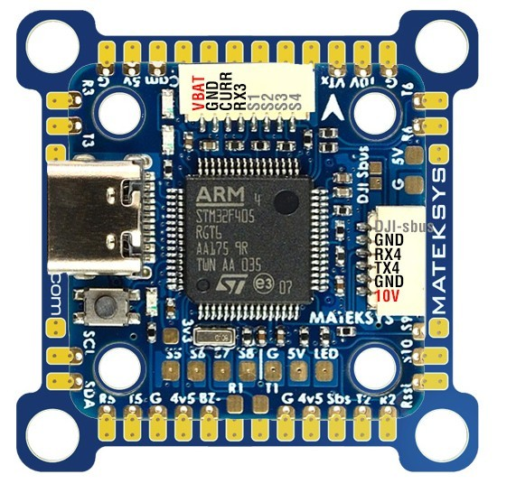

.. _common-matekf405-te:

====================
Matek F405 TE Family
====================

This family consists of:

- Matek F405-WTE

- Matek F405-WMN

     
- Matek F405-HDTE

- Matek F405-miniTE

the above images and some content courtesy of `mateksys.com <http://www.mateksys.com/>`__

.. note: some members of this family have SD cards, some only flash for log storage. On SD equipped boards, be sure to set :ref:`LOG_BACKEND_TYPE<LOG_BACKEND_TYPE>` = 1.

Specifications
==============

-  **Processor**

   -  STM32F405RGT6  ARM
   -  OSD: AT7456E 
   -  16MB Flash for data logging, WTE has microSD card reader instead of flash chip
   -  ESP8285 (WTE only) for ELRS or ESP WIFI Telemetry

-  **Sensors**

   -  ICM42688-P
   -  SPL06-001 barometer
   -  Voltage sensor (30V max, 60V max for -HDTE)
   -  Current Sensor (220A -WTE, 132A -WMN, input pin -miniTE/HDTE)

-  **Power Input**

   -  6V ~ 30V DC input power (9v - 60V for -HDTE)

-  **BECs**
 
+-------+--------------+----------------+--------------------+
|Board  | Typical Use  |   Voltage      |  Current(cont/peak)|
+=======+==============+================+====================+
|WTE    | Peripherals  |   5V           |  2A/3A             |
+       +--------------+----------------+--------------------+
|       | Servos       | 5V,6V, or 7.2V |  8A/10A            |
|       +--------------+----------------+--------------------+
|       | VTX/CAM      |  9V or 12V     |  2A/3A             |
+-------+--------------+----------------+--------------------+
|WMN    | Peripherals  |   5V           |  1.5A/1.5A         |
+       +--------------+----------------+--------------------+
|       | Servos       | 5V or 6V       |  5A/5A             |
+-------+--------------+----------------+--------------------+
|HDTE   | Peripherals  |   5V           |  1.5A/1.5A         |
+       +--------------+----------------+--------------------+
|       | Servos/VTX   | 9V, 12V, or 16V| 1-2A depending     |
|       |              |                | on input           |
+-------+--------------+----------------+--------------------+
|miniTE | Peripherals  |   5V           |  1.7A/1.7A         |
+       +--------------+----------------+--------------------+
|       | VTX          | 10V            |  1.4A/1.4A         |
+-------+--------------+----------------+--------------------+

-  **Interfaces**

+--------+--------+------+-----+------+-----+-------+--------+
|Board   |  UARTS | PWM  | I2C |Buzzer| ADC |SD Card|USB     |
+========+========+======+=====+======+=====+=======+========+
| WTE    |   6    |  12  |  1  |  Yes |  4  | Yes   | Remote |
+--------+--------+------+-----+------+-----+-------+--------+
| WMN    |   5    |  12  |  1  |  Yes |  3  | No    | Remote |
+--------+--------+------+-----+------+-----+-------+--------+
| HDTE   |   6    |  12  |  1  |  Yes |  4  | Yes   | Yes    |
+--------+--------+------+-----+------+-----+-------+--------+
| miniTE |   6    |  12  |  1  |  Yes |  3  | Yes   | Yes    |
+--------+--------+------+-----+------+-----+-------+--------+

   -  1x RC input PWM/PPM, SBUS
   -  Dual Switchable Camera inputs on WTE and WMN, switched GPIO pin on HDTE and miniTE
   -  Switchable VTX supply on WTE, miniTE, and HDTE; switched GPIO pin on WMN

ESP ELRS Receiver or ESP WIFI Telemetry
=======================================

The Matek F405-WTE includes an ESP8285 processor that can be flashed to provide either ELRS RC/Telem Receiver onboard, or to provide ESP WIFI Telemetry. See the `setup and flashing instructions <https://www.mateksys.com/?portfolio=f405-wte#tab-id-5>`__ provided on the Mateksys website.

Camera and Supply Switch
========================

Switching between the two camera inputs, C1 (default on) or C2, and between on (default) and off of Vsw (jumper selectable supply) on some boards, can be implemented using the Relay function of ArduPilot and assigning the relays to an ``RCx_OPTION`` switch on the transmitter.

.. note:: some boards implement one or the other of the camera switch and video power supply switch,instead of both, but those boards bring the controlling GPIO pin out to a pad for use externally.

Set the ``RELAYx_PIN`` to "81" for on/off of Vsw, and to "82" to control the camera switching.
Then select an RC channel for control (Chx) and set its ``RCx_OPTION`` to the appropriate Relay (1-4) that you had set its pin parameter above.

For example, use Channel 10 to control the camera switch using Relay 2:

- :ref:`RELAY2_PIN<RELAY2_PIN>` = "82"
- :ref:`RC10_OPTION<RC10_OPTION>` = "34" (Relay2 Control)

.. note:: setting Relay on/high assigned for Vsw will turn off that supply. Likewise, setting on/high for the Relay assigned for camera, will switch from Camera 1 to Camera 2.
   
Default UART order
==================

- SERIAL0 = console = USB
- SERIAL1 = Telemetry1 = USART1 (has DMA)
- SERIAL2 = Telemetry2 = USART3
- SERIAL3 = GPS1 = UART5
- SERIAL4 = GPS2 = UART4
- SERIAL5 = USER = USART6 (has DMA on TX only)(not available on WMN)
- SERIAL6 = USER = USART2 (TX only unless :ref:`BRD_ALT_CONFIG<BRD_ALT_CONFIG>` = 1, then RX available also) and has DMA

Serial port protocols (Telem, GPS, etc.) can be adjusted to personal preferences.

RC Input
========

The RX2 pin, which by default is mapped to a timer input, can be used for all ArduPilot supported receiver protocols, except CRSF/ELRS and SRXL2 which require a true UART connection. However, FPort, when connected in this manner, will only provide RC without telemetry. 

To allow CRSF and embedded telemetry available in Fport, CRSF, and SRXL2 receivers, the RX2 pin can also be configured to be used as true UART RX pin for use with bi-directional systems by setting the :ref:`BRD_ALT_CONFIG<BRD_ALT_CONFIG>` to “1” so it becomes the SERIAL6 port's RX input pin.

With this option, :ref:`SERIAL6_PROTOCOL<SERIAL6_PROTOCOL>` must be set to "23", and:

- PPM is not supported.

- SBUS/DSM/SRXL connects to the RX2 pin, but SBUS requires that the :ref:`SERIAL6_OPTIONS<SERIAL6_OPTIONS>` be set to "3".

- FPort requires connection to TX2 and :ref:`SERIAL6_OPTIONS<SERIAL6_OPTIONS>` be set to "7".

- CRSF also requires a TX2 connection, in addition to Rx6, and automatically provides telemetry. Set :ref:`SERIAL6_OPTIONS<SERIAL6_OPTIONS>` to "0".

- SRXL2 requires a connection to TX2 and automatically provides telemetry.  Set :ref:`SERIAL6_OPTIONS<SERIAL6_OPTIONS>` to "4".

Any UART can be used for RC system connections in ArduPilot also, and is compatible with all protocols except PPM. See :ref:`common-rc-systems` for details.

Dshot capability
================

All motor/servo outputs are Dshot(except outputs 9/10/11) and PWM capable. However, mixing Dshot and normal PWM operation for outputs is restricted into groups, ie. enabling Dshot for an output in a group requires that ALL outputs in that group be configured and used as Dshot, rather than PWM outputs. The output groups that must be the same (PWM rate or Dshot, when configured as a normal servo/motor output) are: 1/2, 3/4, 5/6/7/8, 9/10, 11, and 12 (LED).

Where to Buy
============

- see this list of `Mateksys Distributors <http://www.mateksys.com/?page_id=1212>`__

Battery Monitor Settings
========================

These should already be set by default. However, if lost or changed:

Enable Battery monitor with these parameter settings :

:ref:`BATT_MONITOR<BATT_MONITOR>` 4

Then reboot.

:ref:`BATT_VOLT_PIN<BATT_VOLT_PIN>` 14

:ref:`BATT_CURR_PIN<BATT_CURR_PIN>` 15

:ref:`BATT_VOLT_MULT<BATT_VOLT_MULT>` 21.0

:ref:`BATT_AMP_PERVLT<BATT_AMP_PERVLT>` 66.7

.. note:: The -WMN uses a different current sensor and the default value for :ref:`BATT_AMP_PERVLT<BATT_AMP_PERVLT>` should be changed to 40.

.. note:: this autopilot uses a high precision current sensor which is sensitive to ESC switching noise. Be sure to use the bypass capacitor provided. In some cases, the ESCs themselves will need additional 200-330uF low ESR capacitors on their power inputs, if they do not incorporate them already. See `Matek FAQs <http://www.mateksys.com/?p=5712#tab-id-12>`__ for more information.

Firmware
========

Firmware for these boards can be found `here <https://firmware.ardupilot.org>`_ in  sub-folders labeled
"MatekF405-TE".
[copywiki destination="plane,copter,rover,blimp"]
