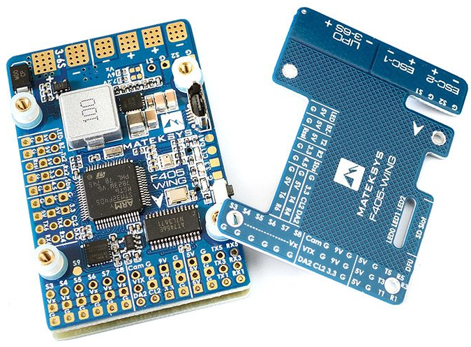
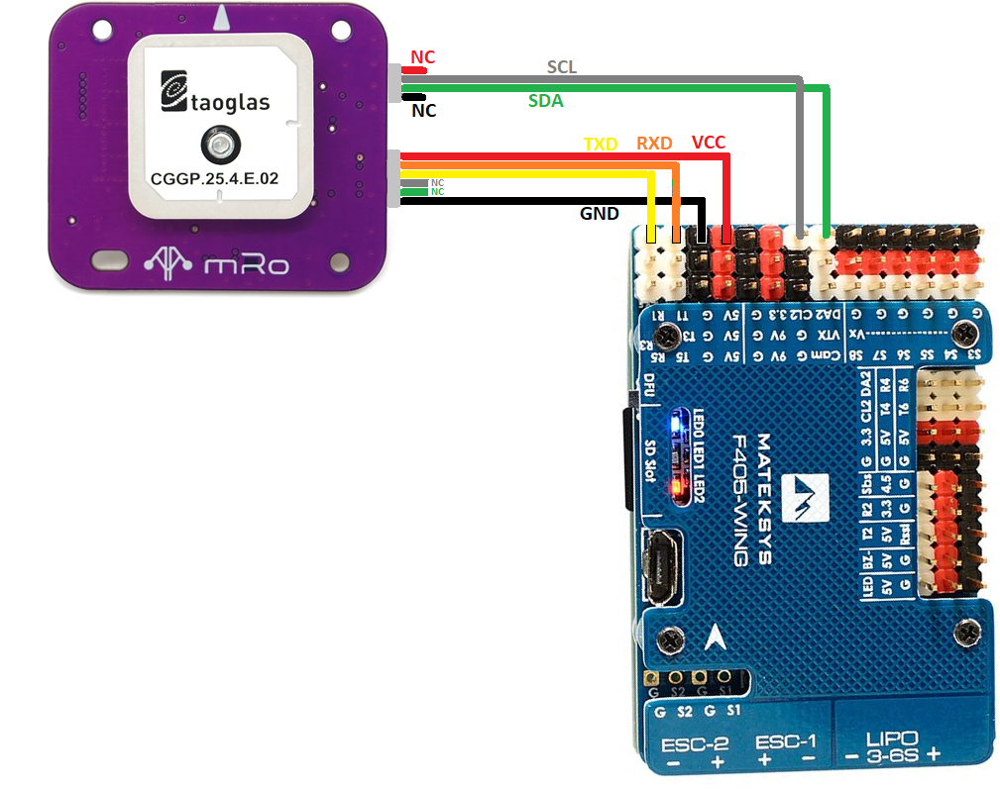

.. _common-matekf405-wing:

==================
Mateksys F405-Wing
==================

*above image and some content courtesy of `mateksys.com <http://www.mateksys.com/?portfolio=f405-wing>`__*

.. note::

   Support for this board is included in Copter-3.6 (and higher).

Specifications
==============

-  **Processor**

   -  STM32F405RGT6 ARM (168MHz)

-  **Sensors**

   -  InvenSense MPU6000 IMU (accel, gyro)
   -  BMP280 barometer
   -  Voltage & current sensor

-  **Power**

   -  9V ~ 30V DC input power

-  **Interfaces**

   -  6x UARTS
   -  9x PWM outputs (2 for motors, 7 for servos)
   -  1x RC input PWM/PPM, SBUS
   -  I2C port for external compass and airspeed sensor
   -  USB port
   -  Built-in OSD

-  **Size and Dimensions**

   - 56mm x 36mm x 15mm
   - 25g

See mateksys.com for more `detailed specifications <http://www.mateksys.com/?portfolio=f405-wing#tab-id-2>`__ and `wiring diagrams <http://www.mateksys.com/?portfolio=f405-wing#tab-id-3>`__.
   
Where to Buy
============

- see this list of `Mateksys Distributors <http://www.mateksys.com/?page_id=1212>`__

Connecting a GPS/Compass module
===============================

This board does not include a GPS or compass so an :ref:`external GPS/compass <common-positioning-landing-page>` should be connected as shown below in order for autonomous modes to function.

A battery must be plugged in for power to be provided to the 5V pins supplying the GPS/compass modules.
