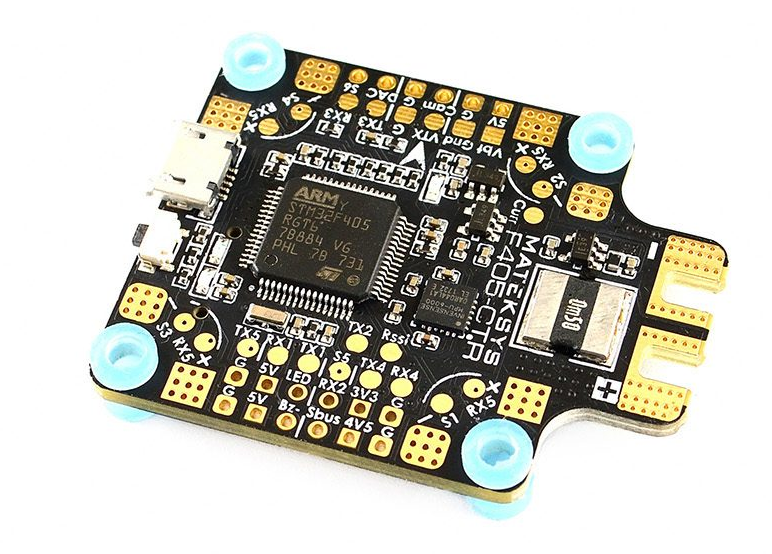
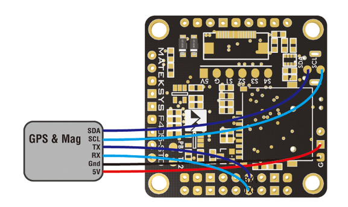
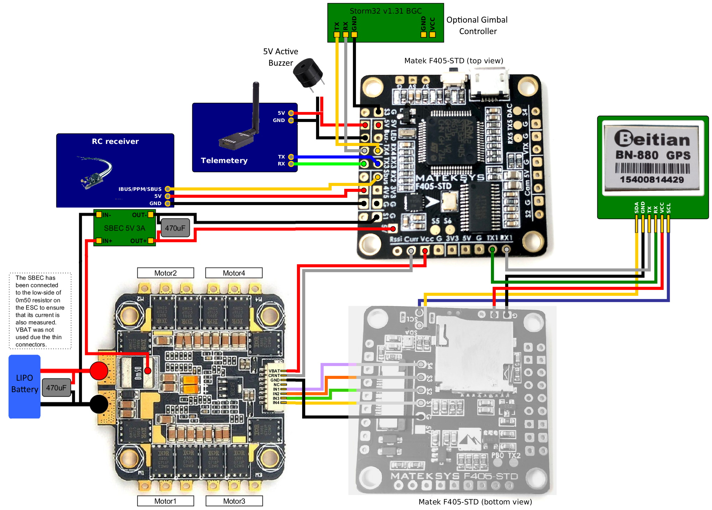

.. _common-matekf405:

==============================
Mateksys F405-STD and variants
==============================

.. image:: ../../../images/matekf405-std.png
    :target: ../_images/matekf405-std.png
    :width: 450px
    

the above images and some content courtesy of `mateksys.com <http://www.mateksys.com/?portfolio=f405-std>`__

.. note::

	Due to flash memory limitations, this board does not include all ArduPilot features.
        See :ref:`Firmware Limitations <common-limited_firmware>` for details.

Specifications
==============

-  **Processor**

   -  STM32F405RGT6 ARM (168MHz)

-  **Sensors**

   -  ICM20602 IMU on STD version, MPU6000 on CTR version
   -  BMP280 barometer (STD and CTR)
   -  184A Voltage & current sensor on CTR version

-  **Interfaces**

   -  5x UARTS
   -  6x PWM outputs
   -  1x RC input PWM/PPM, SBUS
   -  I2C port for external compass and airspeed sensor (STD, CTR and AIO)
   -  USB port
   -  Built-in OSD
   -  MicroSD slot

-  **Size and Dimensions**

   - 36x36mm PCB with 30.5mm mounting holes
   - STD: 7g
   - CTR: 10g

See mateksys.com for more `detailed specifications <http://www.mateksys.com/?portfolio=f405-std#tab-id-2>`__ and `wiring diagrams <http://www.mateksys.com/?portfolio=f405-std#tab-id-3>`__.
   
Variants
========

In addition to STD and CTR versions, there are older variants called -AIO and -OSD that have been declared end-of-life by mateksys.  Both use the ICM20602 IMU, like the STD version. Neither have an onboard barometer. While the -AIO has I2C pads exposed, the -OSD version does not.

.. note::

  For the -STD version please use the MatekF405-STD type firmware. For the -CTR version with MPU6000 please use the MatekF405 type firmware. For the :ref:`MatekF405-Wing <common-matekf405-wing>` which has an essentially different board layout please use the dedicated firmware. Please note that ArduPilot does not support -AIO and -OSD versions per default as additional hardware and / or software adjustments are required. 

Default UART order
==================

- SERIAL0 = console = USB
- SERIAL1 = Telemetry1 = USART3
- SERIAL2 = Telemetry2 = UART4
- SERIAL3 = GPS1 = USART1
- SERIAL4 = GPS2 = UART5
- SERIAL5 = User = USART2 (TX only unless :ref:`BRD_ALT_CONFIG<BRD_ALT_CONFIG>` = 1, then RX is available)

Serial protocols can be adjusted to personal preferences.

Receiver input
==============

RC input is configured on the SBUS pin, which has an inverter driving USART2 RX. It supports all RC protocols, however for FPort, :ref:`BRD_ALT_CONFIG<BRD_ALT_CONFIG>` should be set to 1 and configured as described in :ref:`FPort<common-FPort-receivers>` section, and directly use the UART2 pins instead of SBUS input.

Dshot capability
================

All motor/servo outputs are Dshot and PWM capable. However, mixing Dshot and normal PWM operation for outputs is restricted into groups, ie. enabling Dshot for an output in a group requires that ALL outputs in that group be configured and used as Dshot, rather than PWM outputs. The output groups that must be the same (PWM rate or Dshot, when configured as a normal servo/motor output) are: 1, 2/3/4, 5, and 6.

Where to Buy
============

- see this list of `Mateksys Distributors <http://www.mateksys.com/?page_id=1212>`__

Connecting a GPS/Compass module
===============================

This board does not include a GPS or compass so an :ref:`external GPS/compass <common-positioning-landing-page>` should be connected as shown below in order for autonomous modes to function.

A battery must be plugged in for power to be provided to the 5V pins supplying the GPS/compass modules. USB power is not provided to peripherals.

Wiring Diagram
==============

    
