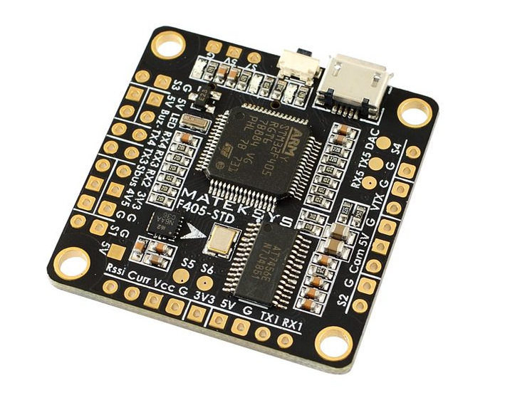
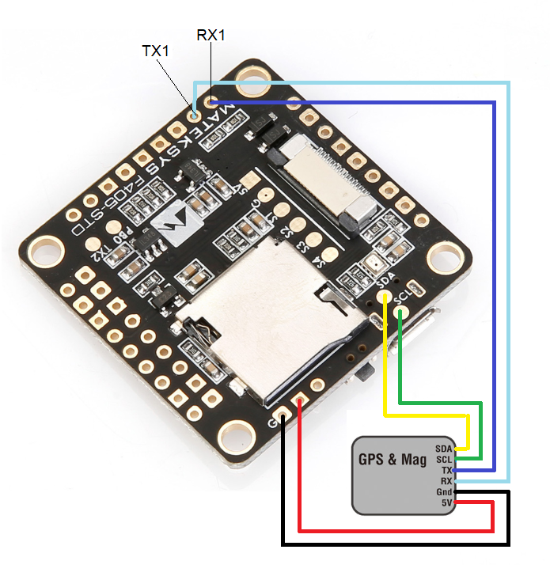

.. _common-matekf405:

==============================
Mateksys F405-STD and variants
==============================

    

the above images and some content courtesy of `mateksys.com <http://www.mateksys.com/?portfolio=f405-std>`__

.. note::

	Due to flash memory limitations, this board does not include all ArduPilot features.
        See :ref:`Firmware Limitations <common-limited_firmware>` for details.

.. warning:: These autopilots doe not have a barometer. An external barometer can be added, or operation with an alternate altitude sensor, such as GPS for outdoor use or rangefinder for indoor applications is supported (see :ref:`EK3_SRC1_POSZ<EK3_SRC1_POSZ>`), with the following caveats. In Plane, if GPS is lost, then the user should switch to MANUAL mode immediately to avoid a crash. In Copter, operation is allowed using GPS, but not recommended, due to the imprecision in altitude hold modes. Bear in mind if GPS fails and the vehicle is using it for altitude information, a crash can eventually result due to lack of accurate altitude information.See :ref:`common-gps-for-alt` for more information.

Specifications
==============

-  **Processor**

   -  STM32F405RGT6 ARM (168MHz)

-  **Sensors**

   -  ICM20602 IMU on STD version, MPU6000 on CTR version
   -  BMP280 barometer (STD and CTR)
   -  184A Voltage & current sensor on CTR version

-  **Interfaces**

   -  5x UARTS
   -  6x PWM outputs (7 on -STD)
   -  1x RC input PWM/PPM, SBUS
   -  I2C port for external compass and airspeed sensor (STD, CTR and AIO)
   -  USB port
   -  Built-in OSD
   -  MicroSD slot

-  **Size and Dimensions**

   - 36x36mm PCB with 30.5mm mounting holes
   - STD: 7g
   - CTR: 10g

See mateksys.com for more `detailed specifications <http://www.mateksys.com/?portfolio=f405-std#tab-id-2>`__ and `wiring diagrams <http://www.mateksys.com/?portfolio=f405-std#tab-id-3>`__.
   
Variants
========

In addition to STD and CTR versions, there are older variants called -AIO and -OSD that have been declared end-of-life by Mateksys.  Both use the ICM20602 IMU, like the STD version. Neither have an onboard barometer. While the -AIO has I2C pads exposed, the -OSD version does not.

.. note::

  For the -STD version please use the MatekF405-STD type firmware. For the -CTR version with MPU6000 please use the MatekF405 type firmware. For the :ref:`MatekF405-Wing <common-matekf405-wing>` which has an essentially different board layout please use the dedicated firmware. Please note that ArduPilot does not support -AIO and -OSD versions per default as additional hardware and / or software adjustments are required. 

The MatekF405-CTR has a firmware version supporting :ref:`bi-directional Dshot <bidir-dshot>` labeled "MatekF405-bdshot". Note this is only supported for outputs 1-4 in this version.

Default UART order
==================

- SERIAL0 = console = USB
- SERIAL1 = Telemetry1 = USART3
- SERIAL2 = Telemetry2 = UART4
- SERIAL3 = GPS1 = USART1
- SERIAL4 = GPS2 = UART5
- SERIAL5 = User = USART2 (TX only unless :ref:`BRD_ALT_CONFIG<BRD_ALT_CONFIG>` = 1, then RX is available)

Serial protocols can be adjusted to personal preferences.

RC Input
========

The SBUS pin, is passed by an inverter to R2 (UART2 RX), which by default is mapped to a timer input instead of the UART, and can be used for all ArduPilot supported receiver protocols, except CRSF/ELRS and SRXL2 which require a true UART connection. However, FPort, when connected in this manner, will only provide RC without telemetry. 

To allow CRSF and embedded telemetry available in Fport, CRSF, and SRXL2 receivers, the R2 pin can also be configured to be used as true UART2 RX pin for use with bi-directional systems by setting the :ref:`BRD_ALT_CONFIG<BRD_ALT_CONFIG>` to “1” so it becomes the SERIAL7 port's RX input pin.

With this option, :ref:`SERIAL7_PROTOCOL<SERIAL7_PROTOCOL>` must be set to "23", and:

- PPM is not supported.

- DSM/SRXL connects to the R2  pin, but SBUS would still be connected to SBUS.

- FPort requires connection to T2 and R2 via a bi-directional inverter. See :ref:`common-FPort-receivers`.

- CRSF also requires a T2 connection, in addition to R2, and automatically provides telemetry.

- SRXL2 requires a connection to T2 and automatically provides telemetry.  Set :ref:`SERIAL6_OPTIONS<SERIAL6_OPTIONS>` to "4".

Any UART can be used for RC system connections in ArduPilot also, and is compatible with all protocols except PPM (SBUS requires external inversion on other UARTs). See :ref:`common-rc-systems` for details..

Dshot capability
================

All motor/servo outputs are Dshot and PWM capable. However, mixing Dshot and normal PWM operation for outputs is restricted into groups, ie. enabling Dshot for an output in a group requires that ALL outputs in that group be configured and used as Dshot, rather than PWM outputs. The output groups that must be the same (PWM rate or Dshot, when configured as a normal servo/motor output) are: 1, 2/3/4, 5, 6, and 7 (-STD only).

Where to Buy
============

- see this list of `Mateksys Distributors <http://www.mateksys.com/?page_id=1212>`__

Connecting a GPS/Compass module
===============================

This board does not include a GPS or compass so an :ref:`external GPS/compass <common-positioning-landing-page>` should be connected as shown below in order for autonomous modes to function.

A battery must be plugged in for power to be provided to the 5V pins supplying the GPS/compass modules. USB power is not provided to peripherals.

Wiring Diagram
==============

    
[copywiki destination="plane,copter,rover,blimp"]
