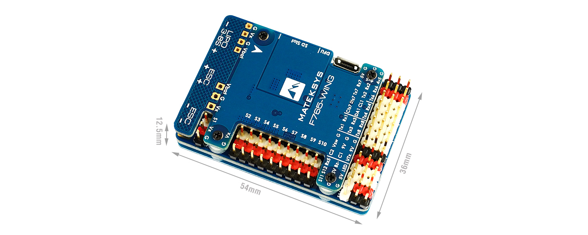

.. _common-matekf765-wing:

==================
Mateksys F765-Wing
==================

    

the above image and some content courtesy of `mateksys.com <http://www.mateksys.com/?portfolio=f765-wing>`__

.. note::

   Support for this board is available with ArduPilot 4.0 and higher

Specifications
==============

-  **Processor**

   -  STM32F765VIT6  ARM (216MHz)

-  **Sensors**

   -  InvenSense MPU6000 IMU (accel, gyro) & ICM20602
   -  BMP280 barometer (later models use DPS310)
   -  Voltage & 132A current sensor

-  **Power**

   -  9V ~ 36V DC input power
   -  5V 2A BEC for peripherals
   -  9/12V 2A BEC for video
   -  5/6/7.2V 8A BEC for servos

-  **Interfaces**

   -  7x UARTS
   -  12x PWM outputs
   -  1x RC input PWM/PPM, SBUS
   -  2x I2C ports for external compass, airspeed sensor, etc.
   -  SPI4 port
   -  USB port
   -  6 ADC
   -  Dual Switchable Camera inputs
   -  Built-in OSD

-  **Size and Dimensions**

   - 54mm x 36mm x 13mm
   - 26g

See mateksys.com for more `detailed specifications <http://www.mateksys.com/?portfolio=f765-wing#tab-id-2>`__ and `wiring diagrams <http://www.mateksys.com/?portfolio=f765-wing#tab-id-4>`__ (ArduPilot connections may vary slightly due to different UART usage).

Camera and Supply Switch
========================

Switching between the two camera inputs, C1 (default on) or C2, and between on (default) and off of Vsw (jumper selectable supply), can be implemented using the Relay function of ArduPilot and assigning the relays to an ``RCx_OPTION`` switch on the transmitter.

Set the ``RELAYx_PIN`` to "81" for on/off of Vsw, and to "82" to control the camera switching.
Then select an RC channel for control (Chx) and set its ``RCx_OPTION`` to the appropriate Relay (1-4) that you had set its pin parameter above.

For example, use Channel 10 to control the camera switch using Relay 2:

- :ref:`RELAY2_PIN<RELAY2_PIN>` = "82"
- :ref:`RC10_OPTION<RC10_OPTION>` = "34" (Relay2 Control)

.. note:: setting Relay on/high assigned for Vsw will turn off that supply. Likewise, setting on/high for the Relay assigned for camera, will switch from Camera 1 to Camera 2.
   
Default UART order
==================

- SERIAL0 = console = USB
- SERIAL1 = Telemetry1 = UART7 (support CTS and RTS signaling)
- SERIAL2 = Telemetry2 = USART1
- SERIAL3 = GPS1 = USART2
- SERIAL4 = GPS2 = USART3
- SERIAL5 = USER = UART8
- SERIAL6 = USER = UART4
- SERIAL7 = USER = UART6 (TX only unless :ref:`BRD_ALT_CONFIG<BRD_ALT_CONFIG>` = 1, then RX available also)
- SERIAL8 = USER = UART5 (RX only, for ESC telemetry)

Serial port protocols (Telem, GPS, etc.) can be adjusted to personal preferences.

RC Input
========

The Rx6 pin, which by default is mapped to a timer input, can be used for all ArduPilot supported receiver protocols, except CRSF/ELRS and SRXL2 which require a true UART connection. However, FPort, when connected in this manner, will only provide RC without telemetry. 

To allow CRSF and embedded telemetry available in Fport, CRSF, and SRXL2 receivers, the Rx6 pin can also be configured to be used as true UART RX pin for use with bi-directional systems by setting the :ref:`BRD_ALT_CONFIG<BRD_ALT_CONFIG>` to “1” so it becomes the SERIAL7 port's RX input pin.

With this option, :ref:`SERIAL7_PROTOCOL<SERIAL7_PROTOCOL>` must be set to "23", and:

- PPM is not supported.

- SBUS/DSM/SRXL connects to the Rx6 pin, but SBUS requires that the :ref:`SERIAL7_OPTIONS<SERIAL7_OPTIONS>` be set to "3".

- FPort requires connection to T6 and :ref:`SERIAL7_OPTIONS<SERIAL7_OPTIONS>` be set to "7".

- CRSF also requires a Tx6 connection, in addition to Rx6, and automatically provides telemetry. Set :ref:`SERIAL7_OPTIONS<SERIAL7_OPTIONS>` to "0".

- SRXL2 requires a connection to Tx6 and automatically provides telemetry.  Set :ref:`SERIAL7_OPTIONS<SERIAL7_OPTIONS>` to "4".

Any UART can be used for RC system connections in ArduPilot also, and is compatible with all protocols except PPM. See :ref:`common-rc-systems` for details.

Dshot capability
================

All motor/servo outputs PWM capable, and 1-6 are Dshot capable. However, mixing Dshot and normal PWM operation for outputs is restricted into groups, ie. enabling Dshot for an output in a group requires that ALL outputs in that group be configured and used as Dshot, rather than PWM outputs. The output groups that must be the same (PWM rate or Dshot, when configured as a normal servo/motor output) are: 1/2, 3/4, 5/6, 7/8/9/10, 11/12, and 13(LED).

Where to Buy
============

- see this list of `Mateksys Distributors <http://www.mateksys.com/?page_id=1212>`__

Connecting a GPS/Compass module
===============================

This board does not include a GPS or compass so an :ref:`external GPS/compass <common-positioning-landing-page>` should be connected in order for autonomous modes to function.

If the GPS is attached to UART2 TX/RX and powered from the adjacent 4.5V pins, it will be powered when connected via USB, as would the RX if powered from the adjacent 4.5V pins to UART6.

A battery must be plugged in for power to be provided to the pins marked 5V on the board.

Battery Monitor Configuration
=============================
These settings are set as defaults when the firmware is loaded. However, if they are ever lost, you can manually set the parameters:

Enable Battery monitor.

:ref:`BATT_MONITOR<BATT_MONITOR>` =4

Then reboot.

:ref:`BATT_VOLT_PIN<BATT_VOLT_PIN>` 12

:ref:`BATT_CURR_PIN<BATT_CURR_PIN>` 13

:ref:`BATT_VOLT_MULT<BATT_VOLT_MULT>` 11.0

:ref:`BATT_AMP_PERVLT<BATT_AMP_PERVLT>` 40 

.. note:: this autopilot uses a high precision current sensor which is sensitive to ESC switching noise. Be sure to use the bypass capacitor provided. In some cases, the ESCs themselves will need additional 200-330uF low ESR capacitors on their power inputs, if they do not incorporate them already. See `Matek FAQs <http://www.mateksys.com/?p=5712#tab-id-12>`__ for more information.

Alternate Configurations
========================

- set :ref:`BRD_ALT_CONFIG<BRD_ALT_CONFIG>` to "1" to enable RX6 pin as true UART input (see RC Input section above)
- set :ref:`BRD_ALT_CONFIG<BRD_ALT_CONFIG>` to "2" to change RTS7 and CTS7 pins to GPIO 1 and 2, respectively.
- set :ref:`BRD_ALT_CONFIG<BRD_ALT_CONFIG>` to "3" to enable both of the above.

Firmware
========

Firmware for this board can be found `here <https://firmware.ardupilot.org>`_ in  sub-folders labeled
"MatekF765-Wing".

[copywiki destination="plane,copter,rover,blimp"]