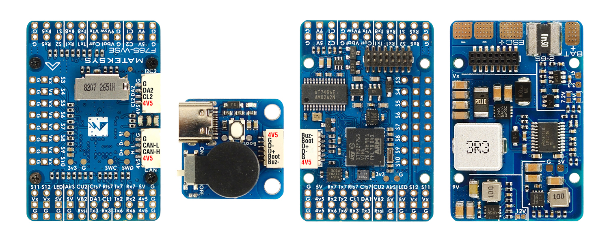

.. _common-matekf765-wse:

=================
Mateksys F765-WSE
=================

    

the above image and some content courtesy of `mateksys.com <http://www.mateksys.com/?portfolio=f765-wse>`__

.. note::

   Support for this board is available with ArduPilot 4.1 and higher

Specifications
==============

-  **Processor**

   -  STM32F765VIH6  ARM (216MHz)

-  **Sensors**

   -  ICM-42688-P
   -  DPS310
   -  Voltage & 90A continuous, 220A peak current sensor

-  **Power**

   -  6.8V ~ 30V DC input power
   -  5V 2A BEC for peripherals
   -  9/12V 2A BEC for video
   -  5/6/7.2V 8A BEC for servos

-  **Interfaces**

   -  6.5x UARTS
   -  12x PWM outputs
   -  1x RC input PWM/PPM, SBUS
   -  2x I2C ports for external compass, airspeed sensor, etc.
   -  CAN port
   -  USB port
   -  6 ADC
   -  Dual Switchable Camera inputs
   -  Built-in OSD (AT7456E)

-  **Size and Dimensions**

   - 44mm x 29mm x 14.5mm
   - 22g

See mateksys.com for more `detailed specifications <http://www.mateksys.com/?portfolio=f765-wse#tab-id-2>`__ and `wiring diagrams <http://www.mateksys.com/?portfolio=f765-wse#tab-id-4>`__ (ArduPilot connections may vary slightly due to different UART useage).

ArduPilot Firmware: MatekF7656-SE

Camera and Supply Switch
========================

Switching between the two camera inputs, C1 (default on) or C2, and between on (default) and off of Vsw (5/9V selectable supply), can be implemented using the Relay function of ArduPilot and assigning the relays to an ``RCx_OPTION`` switch on the transmitter.

Set the ``RELAYx_PIN`` to "81" for on/off of Vsw, and to "82" to control the camera switching.
Then select an RC channel for control (Chx) and set its ``RCx_OPTION`` to the appropriate Relay (1-4) that you had set its pin parameter above.

For example, use Channel 10 to control the camera switch using Relay 2:

- :ref:`RELAY_PIN2<RELAY_PIN2>` = "82"
- :ref:`RC10_OPTION<RC10_OPTION>` = "34" (Relay2 Control)
   
Default UART order
==================

- SERIAL0 = console = USB
- SERIAL1 = Telemetry1 = UART7 (support CTS and RTS signaling)
- SERIAL2 = Telemetry2 = USART1
- SERIAL3 = GPS1 = USART2
- SERIAL4 = GPS2 = USART3
- SERIAL5 = USER = UART8
- SERIAL7 = USER = UART6 (TX only unless :ref:`BRD_ALT_CONFIG<BRD_ALT_CONFIG>` = 1, then RX available also)
- SERIAL8 = USER = UART5 (RX only, for ESC telemetry)

RC input is configured on the R6 (UART6_RX) pin. It supports all RC protocols, however for FPort the receiver should be connected to T6 and SERIAL7 configured as described in :ref:`FPort<common-FPort-receivers>` section.

Serial port protocols (Telem, GPS, etc.) can be adjusted to personal preferences.

Dshot capability
================

All motor/servo outputs are Dshot and PWM capable. However, mixing Dshot and normal PWM operation for outputs is restricted into groups, ie. enabling Dshot for an output in a group requires that ALL outputs in that group be configured and used as Dshot, rather than PWM outputs. The output groups that must be the same (PWM rate or Dshot, when configured as a normal servo/motor output) are: 1/2, 3/4, 5/6,  or 7/8/9/10. Outputs 11 and 12 are not Dshot capable.

Where to Buy
============

- see this list of `Mateksys Distributors <http://www.mateksys.com/?page_id=1212>`__

Connecting a GPS/Compass module
===============================

This board does not include a GPS or compass so an :ref:`external GPS/compass <common-positioning-landing-page>` should be connected in order for autonomous modes to function.

If the GPS is attached to UART2 TX/RX and powered from the adjacent 4.5V pins, it will be powered when connected via USB, as would the RX if powered from the adjacent 4.5V pins to UART6.

A battery must be plugged in for power to be provided to the pins marked 5V on the board.

Battery Monitor Configuration
=============================
These settings are set as defaults when the firmware is loaded. However, if they are ever lost, you can manually set the parameters:

Enable Battery monitor.

:ref:`BATT_MONITOR<BATT_MONITOR>` =4

Then reboot.

:ref:`BATT_VOLT_PIN<BATT_VOLT_PIN>` 12

:ref:`BATT_CURR_PIN<BATT_CURR_PIN>` 13

:ref:`BATT_VOLT_MULT<BATT_VOLT_MULT>` 21.0

:ref:`BATT_AMP_PERVLT<BATT_AMP_PERVLT>` 66.7 
