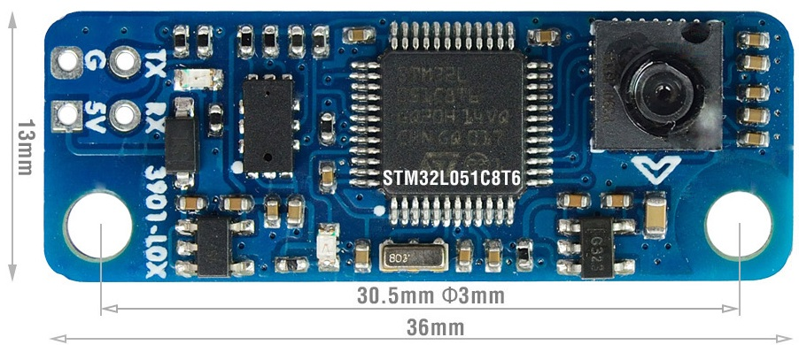
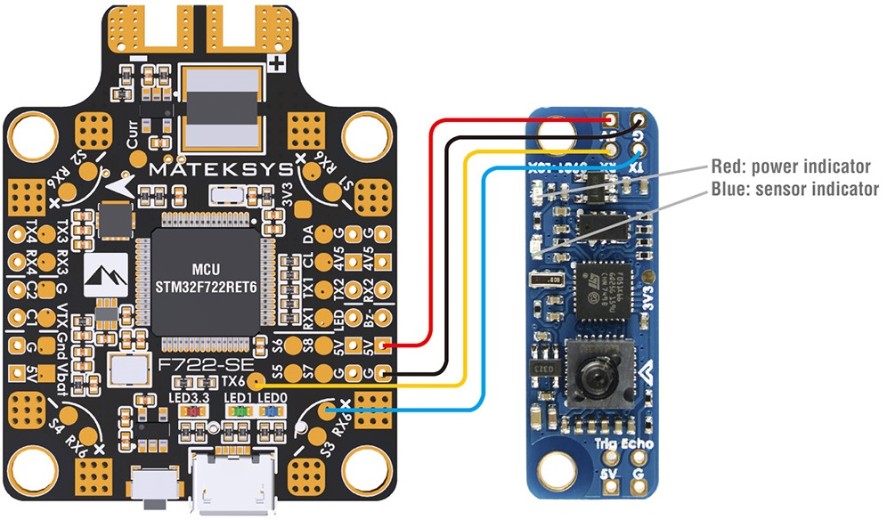
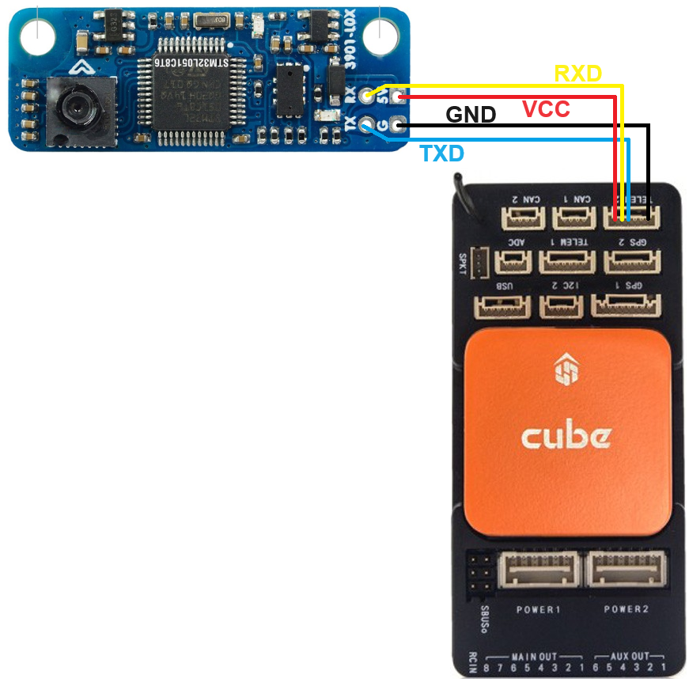

.. _common-mateksys-optflow-3901L0X:

==============================
MatekSys Optical Flow 3901-L0X
==============================

[copywiki destination="copter,plane,rover"]

The `MatekSys optical flow 3901-L0X sensor <http://www.mateksys.com/?portfolio=3901-l0x>`__ is a lightweight optical flow sensor including a short range lidar which uses the MSP protocol to communicate with the autopilot.  This can be used to improve horizontal position control especially in GPS denied environments.

.. warning::

   The lidar included with the sensor is very short range especially outdoors.  We strongly recommend using a :ref:`longer range lidar instead <common-rangefinder-landingpage>`.

Where to Buy
------------

The sensor is available from `Matekesys resellers <http://www.mateksys.com/?page_id=1212>`__

Connection to Autopilot
-----------------------

- The flow sensor should be mounted on the underside of the copter with the camera lens pointing downwards.  The small arrow near the camera lens should be pointing forwards
- Connect the sensor to one of the autopilot's serial ports (e.g. Serial2 / Telem2)
- Set :ref:`FLOW_TYPE <FLOW_TYPE>` = 7 (MSP)
- Set :ref:`FLOW_FXSCALER <FLOW_FXSCALER>` = -800
- Set :ref:`FLOW_FYSCALER <FLOW_FYSCALER>` = -800
- Set :ref:`SERIAL2_PROTOCOL <SERIAL2_PROTOCOL>` = 32 (MSP) (assuming sensor is connected to Serial2)
- Set :ref:`SERIAL2_BAUD <SERIAL2_BAUD>` = 115 (115200 bps) (assuming sensor is connected to Serial2)

To use the onboard lidar (not recommended):

- Set :ref:`RNGFND1_TYPE <RNGFND1_TYPE>` = 32 (MSP)
- Set :ref:`RNGFND1_MAX_CM <RNGFND1_MAX_CM>` = 120 to set range finder's maximum range to 1.2m

Additional Notes
-----------------

- As with all optical flow sensors, a range finder is required to use the sensor for autonomous modes including :ref:`Loiter <loiter-mode>` and :ref:`RTL <rtl-mode>`
- :ref:`FlowHold <flowhold-mode>` does not require the use of a rangefinder but performance is generally worse than Loiter mode and is not recommended
- Performance can be improved by setting the :ref:`sensors position parameters <common-sensor-offset-compensation>`.  For example if the sensor is mounted 2cm forward and 5cm below the frame's center of rotation set :ref:`FLOW_POS_X <FLOW_POS_X>` to 0.02 and :ref:`FLOW_POS_Z <FLOW_POS_Z>` to 0.05.

Testing and Setup
-----------------

See :ref:`common-optical-flow-sensor-setup`
