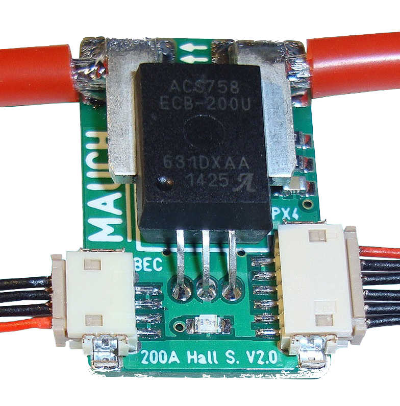
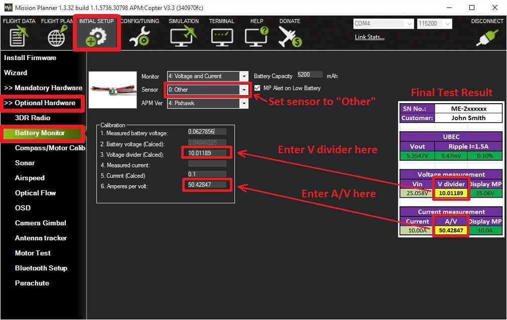

.. _common-mauch-power-modules:

===================
MAUCH Power Monitor
===================

This page explains how to set up the
`MAUCH <https://www.mauch-electronic.com/#webs-bin-563c137b7add4cb229080f55>`__
power monitors HS-050-xx\* (50A), HS-100-xx (100A) and HS-200-xx\* (200A)
to measure battery voltage and current consumption.  For information on purchasing, please see the `MAUCH Electronics <https://www.mauch-electronic.com/apps/webstore/>`__ website.

(\*xx is the indicator for: LV = Vow Voltage 2-6S, maximum 28V HV = High
Voltage 4-14S, maximum 60V).

.. tip::

   These monitors use a
   `hall-effect <https://en.wikipedia.org/wiki/Hall_effect>`__ current
   sensor. These are much more accurate across the whole current range than
   sensors using a shunt resistor, consume very little power, and are
   unaffected by operating temperature.

Overview
========

`MAUCH <https://www.mauch-electronic.com/#webs-bin-563c137b7add4cb229080f55>`__
has a number of PMs, which are compatible with Pixhawk, APM, Pixhawk
lite, AUAV-X2, DroTek und CUAV Pixhack. The sensors boards are capable
of delivering 100A continuous current for HS-100-V2 and 200A for the
HS-200-V2 (without any time limit). The maximum burst current is
1200A@25'C and 800A@85'C for 1 second.

   MAUCH Power Monitor

**Sensor Board:**

-  Current sensor is a “true hall sensor” up to 50A (HS-050-LV/HV),100A
   (HS-100-LV/HV) or 200A (HS-200- LV/HV)
-  Continuous current 200A for HS-200-xx and 100A for HS-050-xx /
   HS-100-xx
-  Over current: 1200A@25'C or 900A@85'C (all sensors)
-  Ultra-low noise power supply (LP2985-4.0) for current sensor and
   offset shifting circuit.
-  Microchip MCP601 operational amplifier for offset shifting.
-  LiPo voltage measurement with 1% resistor divider in factor 9:1 (LV)
   and 18:1 (HV)
-  Supply voltage to Pixhawk / APM = 5.35V/3A (with attached LV- or
   HV-BEC)
-  Bright LED as power on indicator (blue LED for 200A / green LED for
   100A / yellow for 50A)
-  2x10cm / AWG12 cable soldered to current sensor as standard size (Up
   to AWG8 possible).

**Low Voltage: 2-6S BEC**

-  Input 2-6S LiPo / max. 28V
-  Output 5.35V / 3A -> +/- 0.05V –> Ripple 10mV (0.2%) at 1.5A output
   current.
-  Input wrong polarity protection, as well as Panasonic FM 220uF/35V
   input capacitor to prevent burn out.
-  10cm 4 pole silicone cable to sensor board with DF-13 connector.
-  47mm x 18mm x 11mm / 8g with cables and shrinking tube.

**High Voltage: 4-14S HYB-BEC**

-  Input: 4S-14S LiPo / max, 60VOutput: 5.3V / 3A -> +/- 0.05V -> Ripple
   80uV (0.00008V) at 1.5A output current.
-  Panasonic FM input capacitors to prevent burn out.
-  10cm 4 pole silicone cable to sensor board with DF-13 connector.
-  53mm x 21mm x 14mm / 20g with cables and shrinking tube.

There is more information about hall current sensors and these PMs in
this blog post: `Safety First: 100A & 200A Hall Sensor with BEC for Pixhawk / APM <https://diydrones.com/forum/topics/safety-first-100a-200a-hall-sensor-mit-bec-for-pixhawk-apm>`__.

Connecting the PM to a autopilot board
======================================

.. figure:: ../../../images/MauchPowerModuleWiring.jpg
   :target: ../_images/MauchPowerModuleWiring.jpg

   MAUCH Power Module, BEC, PixhawkWiring

Setup through Mission Planner
=============================

:ref:`Power Monitor Configuration in Mission Planner <common-power-module-configuration-in-mission-planner>`
explains in more detail how to configure a Power Module and get low
battery alerts from Mission Planner.

The MAUCH PM's are not available in the Sensor selection list (at time
of writing) so you will need to select **Other** and perform a manual
calibration. Because the PM uses hall sensors you can ignore the
recommendation to calibrate the sensor at >3Amps.

Each sensor board comes with an final test result, which indicates the
calibration values for voltage and current measurement.

-  On the *Mission Planner*\ ’s **INITIAL SETUP \| Optional Hardware \|
   Battery Monitor** screen set the **Sensor** to **Other**.
-  Enter the voltage divider from the final test result and press
   **TAB** or click out of the field. Then the *calculated battery
   voltage* should be within a few millivolt of the actual battery
   voltage.
-  Enter the **Amperes per volt** from the final test result (A/V) and
   press **TAB** or click out of the field.

   MissionPlanner: Battery Monitor Configuration for MAUCH Power Monitor
