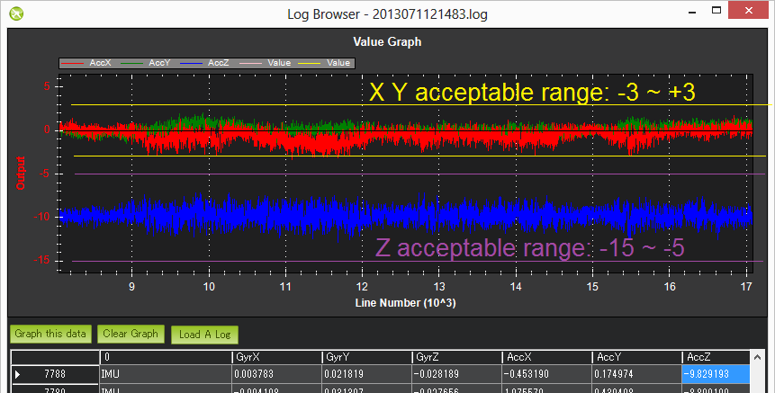

.. _common-measuring-vibration:

===================
Measuring Vibration
===================

This article explains how to measure vibration levels and confirm they
are acceptable.

[copywiki destination="copter,plane,rover,planner"]

Overview
========

Flight controller accelerometers are sensitive to vibration. As
accelerometer data is used to estimate vehicle position (along with
barometer and GPS readings), excessive vibration can lead to poor
performance in modes that rely on accurate position calculation.
Vibration affects all vehicle types, but is most critical for the Copter
(particularly in AltHold, Loiter, RTL, Guided, Position and AUTO flight
modes).

These instructions explain how to measure the vibration levels. If you
find they are out-of-tolerance then follow the advice found on the First
Time Set-up sections :ref:`Vibration Damping <common-vibration-damping>`.

For more advanced vibration analysis, see :ref:`Batch Sampling <common-imu-batchsampling>`.

Copter-3.3/Plane 3.4 (and later versions)
=========================================

.. note::

   These changes are present starting in Copter-3.3 and Plane 3.4.
   The changes are not present in Rover at time of writing (Rover
   2.5).

-  Perform a regular flight (i.e. not just a gentle hover) of at least a
   few minutes and :ref:`download the dataflash logs <common-downloading-and-analyzing-data-logs-in-mission-planner_downloading_logs_via_mavlink>`.
-  Using the Mission Planner or other GCS graph the VIBE message's
   VibeX, VibeY and VibeZ values.  These show the standard deviation of
   the primary accelerometer's output in m/s/s.  The image below, taken
   from a 3DR IRIS, shows normal levels which are below 15m/s/s but
   occasionally peak to 30m/s/s.  Maximum acceptable values appear to be
   below 60m/s/s (see second picture below).
-  Graph the Clip0, Clip1 and Clip2 values which increase each time one
   of the accelerometers reaches it's maximum limit (16G).  Ideally
   these should be zero for the whole flight but low numbers (<100) are
   likely ok especially if they occur during hard landings.  A regularly
   increasing number through the log indicates a serious vibration
   problem that :ref:`should be fixed <common-vibration-damping>`.

   .. image:: ../../../images/mp_vibe_dataflash_msg.png
       :target: ../_images/mp_vibe_dataflash_msg.png

This is an example of a vehicle that had position estimate problems due
to high vibrations.

.. image:: ../../../images/mp_measuring_vibration_bad_vibes.png
    :target: ../_images/mp_measuring_vibration_bad_vibes.png

The algorithm for calculating the vibration levels can be seen in the
`AP_InertialSensor.cpp's calc_vibration_and_clipping() <https://github.com/ArduPilot/ardupilot/blob/master/libraries/AP_InertialSensor/AP_InertialSensor.cpp#L1435>`__
method but in short it involves calculating the standard deviation of
the accelerometer readings like this:

-  capture the raw x, y and z accelerometer values from the primary IMU
-  high-pass filter the raw values at 5hz to remove the vehicle's
   movement and create a "accel_vibe_floor" for x,y and z axis.
-  calculate the difference between the latest accel values and the
   accel_vibe_floor.
-  square the above differences, filter at 2hz and then calculate the
   square root (for x, y and z).  These final three values are what
   appear in the VIBE msg's VibeX, Y and Z fields.

Earlier firmware versions
=========================

-  Connect your Pixhawk/Flight controller to the Mission Planner
-  Go to the **CONFIG/TUNING \| Standard Params** screen and set the Log
   bitmask to Default+IMU.  This will enable the capture of the
   accelerometer data to the dataflash logs.
-  Press the **Write Params** button

   .. image:: ../../../images/mp_vibration_enable_dataflash_imu.png
       :target: ../_images/mp_vibration_enable_dataflash_imu.png
   
-  Fly your copter in Stabilize mode and try to maintain a level hover
   (it doesn't need to be perfectly stable or level)
-  Disconnect the Lipo, reconnect your Pixhawk to the mission planner
-  :ref:`Download the dataflash logs and <common-downloading-and-analyzing-data-logs-in-mission-planner_downloading_logs_via_mavlink>`
   after the download has completed, use the Mission Planner's "Review a
   Log" buttong to open the latest file in the log directory (it's last
   digit will be the Log number you downloaded so in the example above
   we downloaded Log #1 so the filename will end in 1.log)
-  When the Log Browser appears, scroll down until you find any IMU
   message.  Click on the row's AccX and push **Graph this data** Left
   button.  Repeat for the AccY and AccZ columns to produce a graph like
   below.

   |DiagnosingWithLogs_Vibes|

-  Check the scale on the left and ensure that your vibration levels for
   the AccX and AccY are between -3 and +3.  For AccZ the acceptable
   range is -15 to -5.  If it is very close or over these limits you
   should refer back to the :ref:`Vibration Damping <common-vibration-damping>` page for possible solutions.
-  After all the above is complete, go to the Mission Planner's standard
   parameters page (you may need to press the **Connect** button again)
   and set the Log Bitmask back to "Default".  This is important because
   especially on the APM logging requires significant CPU resources and
   it's a waste to log these if they're not really needed.

