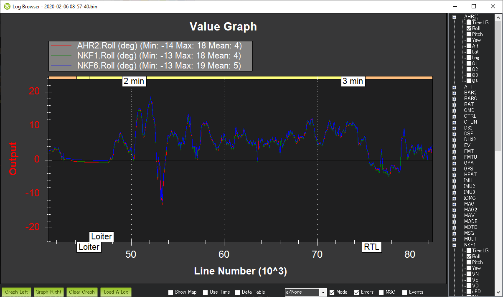

.. _common-measuring-vibration:

===================
Measuring Vibration
===================

[copywiki destination="copter,plane,rover,dev,planner"]

Autopilots have accelerometers that are sensitive to vibrations.
These accelerometer values are combined with barometer and
GPS data to estimate the vehicle's position. With excessive
vibrations, the estimate can be thrown off and lead to very bad
performance in modes that rely on accurate positioning (e.g. on Copter:
AltHold, Loiter, RTL, Guided, Position and Auto flight modes).

These instructions explain how to measure the vibration levels. If you
find they are out-of-tolerance then follow the advice found on the :ref:`Vibration Damping <common-vibration-damping>` page.

Real-Time view in Ground Station
--------------------------------

Ground Stations can display a real-time view of vibration and clipping.  If using the Mission Planner click on "Vibe" on the HUD to display the current vibration levels.

   .. image:: ../../../images/vibration-realtime-mp.png
       :target: ../_images/vibration-realtime-mp.png
       :width: 450px

Vibration levels below 30m/s/s are normally acceptable.  Levels above 30m/s/s *may* have problems and levels above 60m/s/s nearly always have problems with position or altitude hold.

Vibe Dataflash Log message
--------------------------

Check the recorded Vibe levels are mostly below 30m/s/s

-  Perform a regular flight (i.e. not just a gentle hover) of at least a
   few minutes and :ref:`download the dataflash logs <common-downloading-and-analyzing-data-logs-in-mission-planner_downloading_logs_via_mavlink>`.
-  Using the Mission Planner or other ground station graph the VIBE message's
   VibeX, VibeY and VibeZ values.  These show the standard deviation of
   the primary accelerometer's output in m/s/s.  The image below, taken
   from a 3DR IRIS, shows normal levels which are below 15m/s/s but
   occasionally peak to 30m/s/s.  Maximum acceptable values appear to be
   below 30m/s/s (see second picture below).
-  Graph the Clip0, Clip1 and Clip2 values which increase each time one
   of the accelerometers reaches its maximum limit (16G).  Ideally
   these should be zero for the whole flight but low numbers (<100) are
   likely ok especially if they occur during hard landings.  A regularly
   increasing number through the log indicates a serious vibration
   problem that :ref:`should be fixed <common-vibration-damping>`.

   .. image:: ../../../images/mp_vibe_dataflash_msg.png
       :target: ../_images/mp_vibe_dataflash_msg.png
       :width: 450px

This is an example of a vehicle that had position estimate problems due
to high vibrations.

.. image:: ../../../images/mp_measuring_vibration_bad_vibes.png
    :target: ../_images/mp_measuring_vibration_bad_vibes.png
    :width: 450px

The algorithm for calculating the vibration levels can be seen in the
`AP_InertialSensor.cpp's calc_vibration_and_clipping() <https://github.com/ArduPilot/ardupilot/blob/master/libraries/AP_InertialSensor/AP_InertialSensor.cpp#L1609>`__
method but in short it involves calculating the standard deviation of
the accelerometer readings like this:

-  Capture the raw x, y and z accelerometer values from the primary IMU
-  High-pass filter the raw values at 5hz to remove the vehicle's
   movement and create a "accel_vibe_floor" for x,y and z axis.
-  Calculate the difference between the latest accel values and the
   accel_vibe_floor.
-  Square the above differences, filter at 2hz and then calculate the
   square root (for x, y and z).  These final three values are what
   appear in the VIBE msg's VibeX, Y and Z fields.

Looking for "The Leans"
-----------------------

**The Leans** occurs when the vehicle's attitude estimate becomes incorrect causing it to lean significantly even though the pilot is commanding level flight.  The cause of the problem is often accelerometer aliasing which can be confirmed by comparing the Roll and Pitch attitude estimates from each of the estimation systems (i.e. each AHRSs or EKFs).  The attitude estimates should be within a few degrees of each other

- Download the dataflash log and open in the ground station's log viewer
- Compare the AHRS2.Roll, NKF1[0].Roll and NKF1[1].Roll

The image below shows a typical log in which the attitudes match well

Advanced Analysis with FFT
--------------------------

Refer to the :ref:`Measuring Vibration with IMU Batch Sampler <common-imu-batchsampling>` page for instructions on how to collect large amounts of IMU data and perform an FFT analysis to determine the frequencies with the most vibration.

IMU Dataflash Log message
-------------------------

For very old versions of ArduPilot that do not include the Vibe message the IMU values can be checked directly

-  Ensure the :ref:`LOG_BITMASK <LOG_BITMASK>` parameter is set to include IMU data so accelerometer values are recorded to the dataflash logs
-  Fly your copter in Stabilize mode and try to maintain a level hover (it doesn't need to be perfectly stable or level)
-  :ref:`Download the dataflash logs and <common-downloading-and-analyzing-data-logs-in-mission-planner_downloading_logs_via_mavlink>`
   after the download has completed, use the Mission Planner's "Review a
   Log" button to open the latest file in the log directory (it's last
   digit will be the Log number you downloaded so in the example above
   we downloaded Log #1 so the filename will end in 1.log)
-  When the Log Browser appears, scroll down until you find any IMU
   message.  Click on the row's AccX and push **Graph this data** Left
   button.  Repeat for the AccY and AccZ columns to produce a graph like
   below.

   |DiagnosingWithLogs_Vibes|

-  Check the scale on the left and ensure that your vibration levels for
   the AccX and AccY are between -3 and +3.  For AccZ the acceptable
   range is -15 to -5.  If it is very close or over these limits you
   should refer back to the :ref:`Vibration Damping <common-vibration-damping>` page for possible solutions.
-  After all the above is complete, go to the Mission Planner's standard
   parameters page (you may need to press the **Connect** button again)
   and set the Log Bitmask back to "Default".  This is important because
   especially on the APM logging requires significant CPU resources and
   it's a waste to log these if they're not really needed.

.. |DiagnosingWithLogs_Vibes| image:: ../../../images/DiagnosingWithLogs_Vibes.png
    :target: ../_images/DiagnosingWithLogs_Vibes.png

