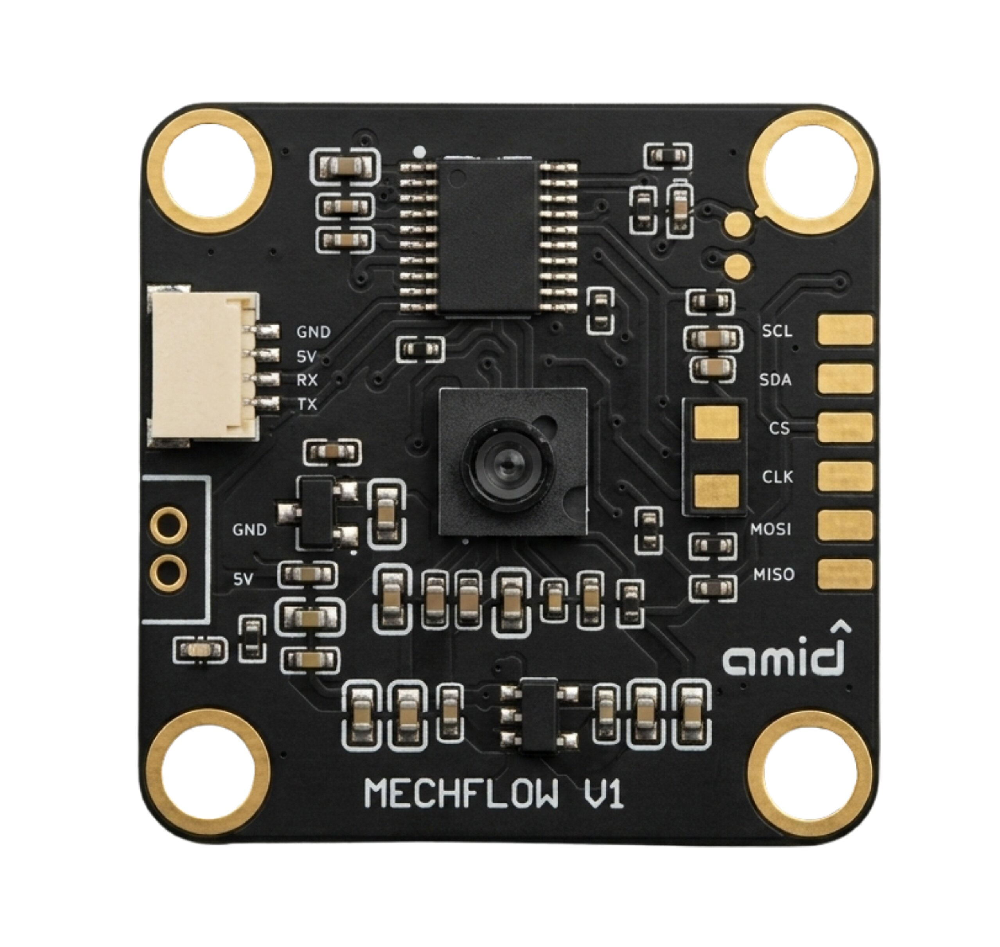
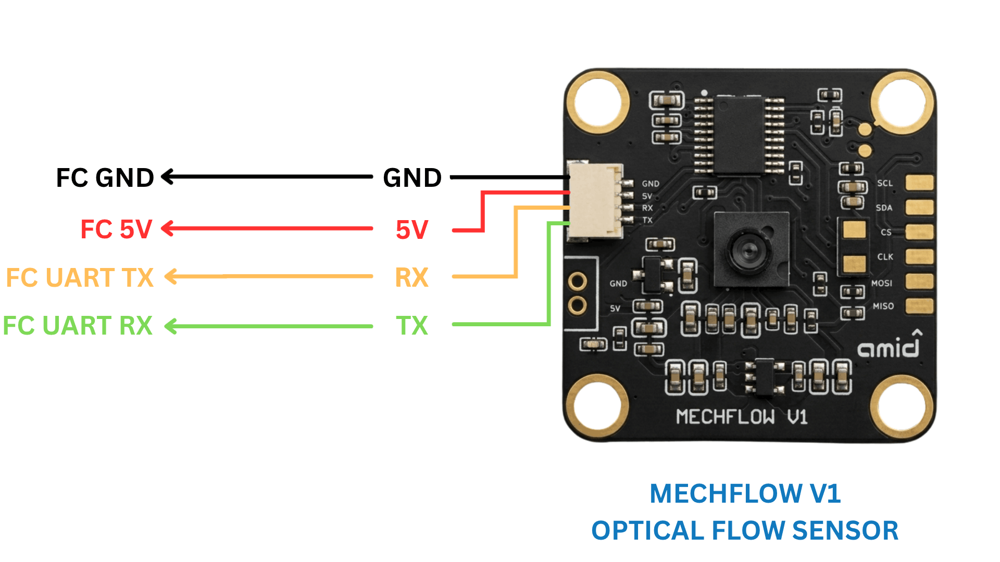
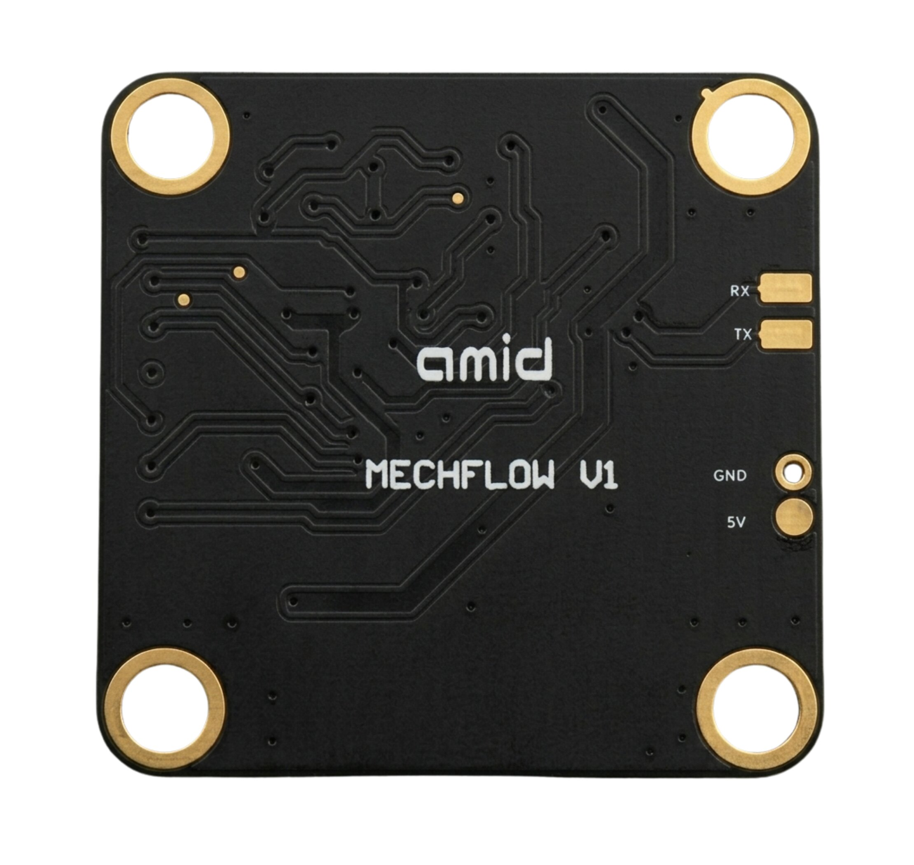

.. _common-mechflow-v1:

===============================================
MechFlow V1 Optical Flow and Rangefinder Sensor
===============================================

[copywiki destination="copter,plane,rover"]

MechFlow V1 is a combined optical-flow and laser time-of-flight (ToF) rangefinder module built around a PixArt PMW3901 optical flow sensor and an ST VL53L1X ToF rangefinder, output over a single UART using the MSP v2 protocol. This can be used to improve horizontal position and altitude control especially in GPS denied or indoor environments.

Where to Buy
============

The sensor is available from `The Mechintel Store <https://mechintel.store/products/mechintel-dual-optical-flow-dtof-lidar-sensor-module-for-drones-uart-i2c>`__.

Connection to Autopilot
========================

- The flow sensor should be mounted on the underside of the vehicle with the camera lens pointing downwards
- MechFlow V1 exposes four signals: GND, 5V, RX and TX, available both on a 4-pin JST-SH 1.0mm connector (pin 1 to pin 4: GND, 5V, RX, TX) and on solder pads, so it can be wired to any autopilot's UART port either with a JST-SH cable/adapter matching the autopilot's connector, or by soldering directly to the pads.  The ``GND``/``5V`` and auxiliary SPI pads are on the top (front) of the board with the lens; the ``TX``/``RX`` UART pads are on the bottom (back)
- Connect module ``GND``/``5V`` to the autopilot's peripheral power rail, module ``TX`` to a spare serial port's ``RX`` pin, and (optionally) module ``RX`` to that same serial port's ``TX`` pin
- Only ``TX`` is required for normal operation.  ``RX`` is reserved for a future configuration/passthrough mode and has no effect with current firmware, but can be wired now so it's ready if that feature is added later
- Supply voltage is 5V, drawn from the autopilot's peripheral power rail.  Do not exceed the rated voltage

   TX/RX solder pads, underside of board

Parameters
==========

For the following we will assume the sensor is connected to Serial2 of the autopilot.  Any serial port can be used, however.

- Set :ref:`SERIAL2_PROTOCOL <SERIAL2_PROTOCOL>` = 32 (MSP)
- Set :ref:`SERIAL2_BAUD <SERIAL2_BAUD>` = 115 (115200 bps)
- Set :ref:`FLOW_TYPE <FLOW_TYPE>` = 7 (MSP)
- Set :ref:`FLOW_FXSCALER <FLOW_FXSCALER>` = -800
- Set :ref:`FLOW_FYSCALER <FLOW_FYSCALER>` = -800
- Set :ref:`RNGFND1_TYPE <RNGFND1_TYPE>` = 32 (MSP)
- Set :ref:`RNGFND1_MIN <RNGFND1_MIN>` = 0.04
- Set :ref:`RNGFND1_MAX <RNGFND1_MAX>` = 4 to set the range finder's maximum range to 4m
- Reboot the autopilot after changing ``RNGFND1_TYPE``

Once the sensor is active you should be able to observe the optical flow and range sensor data on Mission Planner's "Status" page. The "opt_qua" and "rangefinder1" fields should show non-zero values.

Indoor vs. Outdoor Use
=======================

The ToF rangefinder delivers its full rated range and accuracy indoors and in shade. Direct sunlight is a known physical limitation of laser time-of-flight sensors in general, not specific to this unit: ambient infrared from the sun overwhelms the sensor's return signal, cutting usable range to well under 1m and making readings unreliable. The optical flow sensor is comparatively more light-tolerant and continues to function outdoors given adequate surface texture. Outdoors it works at very short range, primarily used as a landing/take-off sensor since it is very accurate at short range outdoors. For outdoor altitude hold in direct sunlight, keep the sensor's downward view shaded (fly at dusk/dawn, under cover, or in overcast conditions), or use a barometer-based estimate as the flight controller's primary outdoor altitude source.

Additional Notes
=================

- As with all optical flow sensors, a range finder is required to use the sensor for autonomous modes including :ref:`Loiter <loiter-mode>` and :ref:`RTL <rtl-mode>`.  MechFlow V1's onboard VL53L1X rangefinder, configured via ``RNGFND1_TYPE`` above, satisfies this requirement on its own indoors, in shade, or at short range outdoors — see `Indoor vs. Outdoor Use`_.  For outdoor altitude hold in direct sunlight, a separate rangefinder rated for outdoor/sunlight use is recommended as the primary rangefinder; MechFlow V1 remains useful in that setup at short range, e.g. as a landing/take-off sensor
- :ref:`FlowHold <flowhold-mode>` does not require the use of a rangefinder but performance is generally worse than Loiter mode and is not recommended
- Performance can be improved by setting the :ref:`sensor's position parameters <common-sensor-offset-compensation>`. For example if the sensor is mounted 2cm forward and 5cm below the frame's center of rotation set :ref:`FLOW_POS_X <FLOW_POS_X>` to 0.02 and :ref:`FLOW_POS_Z <FLOW_POS_Z>` to 0.05
- The onboard VL53L1X completes a new rangefinder measurement roughly every 55ms, while MSP telemetry is output at a fixed 100Hz; the rangefinder value is therefore repeated across several telemetry frames between updates rather than refreshed on every frame

Testing and Setup
==================

See :ref:`common-optical-flow-sensor-setup`
