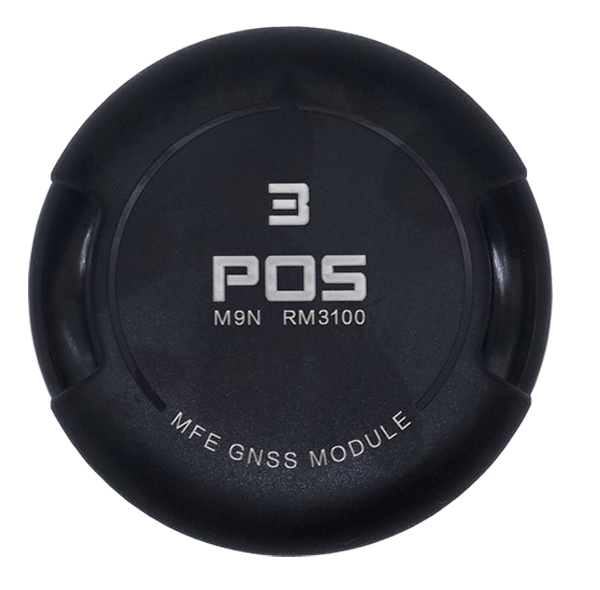

.. _common-mfe-pos3:

=============================
MFE POS3 DroneCAN GPS/Compass
=============================

MFE POS3 GPS is a DroneCAN GPS/Compass available from `MakeFlyEasy <http://www.makeflyeasy.com>`__

Key Features
============

- Positioning accuracy 	1.5m (with SBAS)
- Update frequency 	25hz(Max)
- Cold start 	24S
- Hot start 	2S
- Tracking sensitivity 	-167dBm
- Magnetic Compass Accuracy 	±0.1 degrees
- Magnetic compass resolution 	22nT/LSB 
- Input voltage                 4.7~5.2V
- Operating temperature         -10~70℃
- Size                          60*60*17mm
- Weight                        54g(no cable）

Where to buy
============

`MakeFlyEasy <http://www.makeflyeasy.com/index.php/mfe-pos3-cps/>`__.

Pinout
======

Connector pin assignments
=========================

CAN1 ports
---------------
.. raw:: html

   <table border="1" class="docutils">
   <tbody>
   <tr>
   <th>PIN</th>
   <th>SIGNAL</th>
   <th>VOLT</th>
   </tr>
   <tr>
   <td>1</td>
   <td>VCC</td>
   <td>+5V</td>
   </tr>
   <tr>
   <td>2</td>
   <td>CAN_H</td>
   <td>+12V</td>
   </tr>
   <tr>
   <td>3</td>
   <td>CAN_L</td>
   <td>+12V</td>
   </tr>
   <tr>
   <td>4</td>
   <td>GND</td>
   <td>GND</td>
   </tr>
   </tbody>
   </table>

Setup
=====
See :ref:`common-canbus-setup-advanced` and :ref:`common-uavcan-setup-advanced` for more information.

Set the following parameters in all parameter tables of Mission planner and restart after writing (example shows connection to first CAN port on autopilot):

- :ref:`CAN_P1_DRIVER<CAN_P1_DRIVER>`     set to 1.
- :ref:`CAN_D1_PROTOCOL<CAN_D1_PROTOCOL>` set to 1.
- :ref:`GPS1_TYPE<GPS1_TYPE>`               set to 9.
