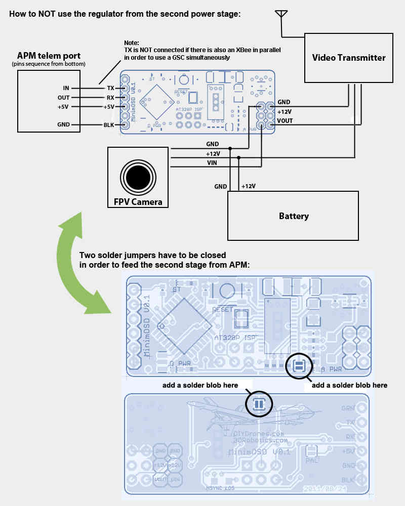
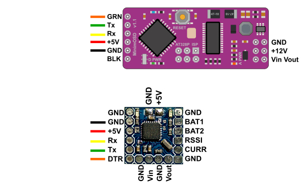

.. _common-minim-osd-quick-installation-guide:

==================================
Minim OSD Quick Installation Guide
==================================

`MinimOSD <https://code.google.com/p/arducam-osd/wiki/minimosd>`__
"On-Screen Display" is a small circuit board that pulls telemetry data
from your APM or Pixhawk flight controller and over-lays it on your
:ref:`First Person View <common-fpv-first-person-view>` monitor.

This article provides brief instructions for how to connect the board.
For more detailed instructions please refer to the `MinimOSD Project wiki <https://code.google.com/p/arducam-osd/wiki/minimosd>`__.

.. note::

   The Minim OSD was designed and programmed by Sandro Benigno and
   Jani Hirvinen. It is `available from jDrones here <http://store.jdrones.com/jD_MiniOSD_V12_p/jdminiosd12.htm>`__.

Overview
========

To connect to Pixhawk, use this `DF13 6-pin cable <http://www.unmannedtechshop.co.uk/df13-6-position-connector-30cm/>`__
to connect to the TELEM2 port. To connect to APM 2.5 and 2.6, use a
5-pin splitter cable that allows the telemetry port to be connected to
both a :ref:`SiK Radio <common-sik-telemetry-radio>` and the MinimOSD.

.. image:: ../../../images/MinimOSD_Pixhawk.jpg
    :target: ../_images/MinimOSD_Pixhawk.jpg

Basic wiring Diagram
====================

The orignal MinimOSD's power setup provides two stages to avoid noises
coming from servos attached to your ArduPilot boards. Those noises could
introduce some glitches on video signal. The independent analog powering
from a dedicated battery will heat the board considerably, but the video
is the most clean as possible from MAX7456.

Maybe you don't need to use the two stages. The way those noises would
impact on the video signal will vary depending on a chain of aspects
like servo's brand, model, cables length, etc. So, try yourself and see
if it's important for your setup.

Here is the basic diagram which uses two stages approach of MinimOSD
board: 

.. image:: ../../../images/DiagramaMinimOSD.jpg
    :target: ../_images/DiagramaMinimOSD.jpg

Optional setup for critical cooling conditions
==============================================

(Hardware V0.1 and 1.0 only)

The second stage regulator from the MinimOSD boards earlier than V1.1
gets too hot on 12V video setups. If your frame has not a good air flow
for cooling the OSD board you may want to feed the OSD entirely from
APM. Probably it will add some noises from servos, but you'll be more
safe by this way:

Firmware available for MinimOSD
===============================

After some time with a stalled development of the firmware for the MinimOSD boards due to 
reaching the limit of the code size, a new developer (https://github.com/night-ghost) picked 
up the project and through some clever development effort managed to bring it back to life.

The new project is located at https://github.com/night-ghost/minimosd-extra and has an 
active discussion at `this RCGroups forum thread <http://www.rcgroups.com/forums/showthread.php?t=2591835>`__.

Some of the differences from the old traditional firmware are:

* MAX7456 renew doing in VSYNC to get rid of "snow" on screen but on interrupt instead of SPI polling
* 4 screens instead of 2
* Individual control of sign icon visibility of each panel per screen
* voltage, current & RSSI can be measured on external pins (which can be found on some MinimOSD boards)
* TLOG player in configurator - now settings can be checked without working plane/copter!
* Small panels can be placed in unused areas of big panels
* RADAR (like in MiniNAZAosd) and ILS in Horizon, can be enabled individually
* Horizon angles can be adjusted via configurator, independently for PAL and NTSC
* PAL/NTSC detected dynamically which allows using different cameras
* Screen offsets via configurator
* New format of GPS coordinates - in one line
* Any RC channel can be translated to output pin (e.g. for cameras switch)
* Font uploader included in the main firmware and much more usable
* Plane & copter joined and even can be changed on the fly (e.g. for VTOL)
* Configuration of some "hot" parameters from RC

Pre-compiled binaries and HEX files are in the Released folder with the CT GUI.

If you are willing to compile your version from the GitHub repo, the following mini guide is quite useful.

To compile on Windows:

#. Download the latest Arduino Version (currently 1.6.8)
#. Download the version of MinimOSD-Extra-DV you like, via git or zip (Github lets you click on a 
   commit and view its files, so downloading that zip gives you the version you want)
#. If using git clone, also do a git submodule init and git submodule update. 
   If downloading the zip from Github, you also need SingleSerial because 
   Github does not include submodules into the download zip, so you will need to: https://github.com/night-ghost/SingleSerial
#. Copy all the libraries from MiniumOSD to the Arduino libraries folder 
   (+ SingleSerial if you downloaded the zip for it)
#. If not using UAVTalk or MultiWii disable them in **Config.h**:
   
   .. code-block:: cpp
   
       //#define USE_UAVTALK 1
       //#define USE_MWII 1
       
#. Sketch -> Export Compiled Binary (it will save the hex file in the MinimOSD folder of the source, one file with the bootloader and one without)

The developer also provides a convenient ready to use package that includes all the required files in their latest version here:
`OSD latest <https://github.com/night-ghost/minimosd-extra/blob/c3d21869a06f4917b2841cf2405f59b0aab668bc/osd_latest.zip?raw=true>`__.

Lately a new style of Board, the "Micro MinimOSD w/ KV Team mod", has appeared on sale at various locations.
This board is only 15mm x 15mm and functionally does the same as the described MinimOSD but adds some 
changes by the KV Team, such as 4 external analog input pins (2 of which can be output or digital inputs). 
All functions referred on this firmware related to additional pins are for this board.

