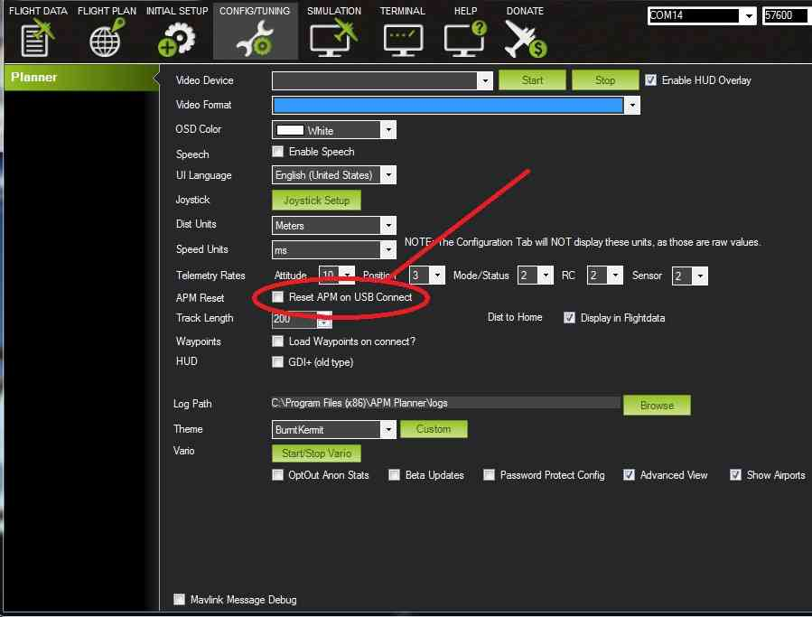
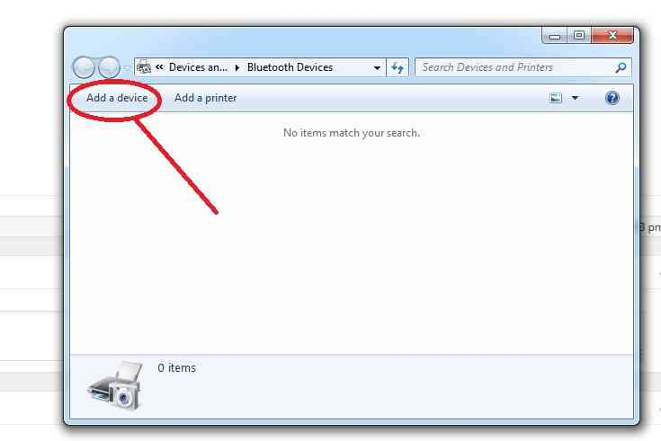
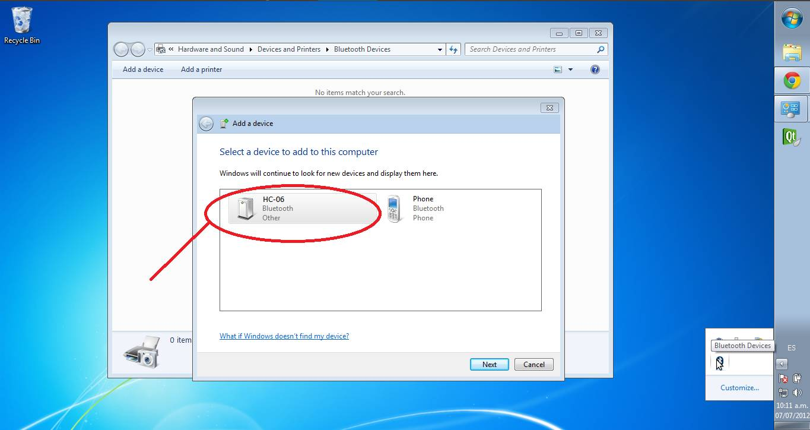

.. _common-mission-planner-bluetooth-connectivity:

=========================
Bluetooth Telemetry radio
=========================

A `Bluetooth Data Link <http://store.jdrones.com/Bluetooth_telemetry_modem_p/tlmbt01.htm>`__ can
be used to connect your Pixhawk (or other controller) to your Bluetooth enabled PC or
Android Ground station at distances up to 50m.

.. image:: ../../../images/Bluetooth.jpg
    :target: ../_images/Bluetooth.jpg
    :width: 450px

Connecting to the Autopilot
===================================

The Bluetooth data link comes with both a DF13 6 pin and 6-to-5 pin
connector which make it easy to connect to the Pixhawk Telem1 or
APM2.x's Telem ports.  Note that for the Pixhawk, although Telem1 is the
recommendation, Telem2 or even Serial 4/5 will work.

.. image:: ../../../images/telemetry_bluetooth_datalink_pixhawk_and_apm2.jpg
    :target: ../_images/telemetry_bluetooth_datalink_pixhawk_and_apm2.jpg

Once you have connected the Bluetooth data link you can power up the
board.  It is OK to use USB connected power while using the Bluetooth
module connected to the APM or PixHawk as the USB connection can supply
enough power BUT YOU MUST USE A WALL WART with Micro or Mini USB).

Bluetooth data link's LEDs:

-  Red LED blinks at 1hz : device is working, not connected
-  Red LED blinks at 0.5z : pairing
-  Red LED solid : connected

Quick Start connecting with Mission Planner
===========================================

If you are familiar with Bluetooth, search for Bluetooth Device HC-05 or
6 (some may have Linvor as well) , Pair with device (code 1234 or 0000)
check it's properties and look at the services tab. Make sure SPP com
port box is checked (only there if your Bluetooth device is active) Look
in Device Manager (Windows) and make sure there is a Com Port for the
Bluetooth and in the com port properties set the baud rate to 57600
(note the Com Port number).

.. note::

   For use with Mission Planner on the Configure/Tuning tab make sure
   and UNCHECK the box **Reset on USB Connect**:

The default Baud Rate for the Bluetooth Module is 57600 (most other
modules are 9600) Be sure when you connect it is at 57600 and for the
new Com Port you saw in Device Manager.

When you power up the PixHawk or APM with the Bluetooth the module will
flash at 1hz the red LED when not connected. When Paring it will flash
at .5 Hz and when connected it will be steady on.

And you're done! You can now use your Bluetooth telemetry for up to about
50m range. (your range may vary depending on back ground noise and
conditions in your area)

If you have problems connecting or you don't know Bluetooth very well or
you want to change the default Baud Rate or Device Name, read on for the
step by step process.

.. _common-mission-planner-bluetooth-connectivity_detailed_connecting_with_mission_planner:

Detailed connecting with Mission Planner
========================================

.. image:: ../../../images/Mini_Bluetooth_Dongle.jpg
    :target: ../_images/Mini_Bluetooth_Dongle.jpg

Many PCs and Laptops have bluetooth adapters built in but if not then
you can use a generic USB Bluetooth dongle (pic above) or use an
additional Bluetooth data link
connected via an `FTDI Cable <http://store.jdrones.com/cable_ftdi_6pin_5v_p/cblftdi5v6p.htm>`__.

After first making sure your Pixhawk/APM2 is powered on, and your PC's
bluetooth dongle is plugged in and installed, click on the Windows task
bar's little up triangle (aka "show hidden icons") which should be on
the bottom right of the screen.

.. image:: ../../../images/windows_task_bar_show_hidden_icons.jpg
    :target: ../_images/windows_task_bar_show_hidden_icons.jpg

The "hidden icons box" should appear. Right-mouse-button-click on the
BlueTooth icon and select "show Bluetooth devices"

.. image:: ../../../images/BT.jpg
    :target: ../_images/BT.jpg

.. image:: ../../../images/BT-1.jpg
    :target: ../_images/BT-1.jpg

Windows should bring up the devices box. Any devices you may already
have connected by Bluetooth will be in this box. If you have not
connected any BT devices before this box will be empty. Select "Add a
device".

Windows will search for BT devices for you. If you have any BT devices
turned on they will show up here (like perhaps your cell phone) ignore
any other devices and select the HC-05 or HC-06 (or Linvor) .

Select Paring using device code.

.. image:: ../../../images/pairing.jpg
    :target: ../_images/pairing.jpg

Enter the device code (1234 or 0000) this is the default code.

Once paired right click the device and select "properties" The check box
for Comm Port SPP should be checked (also note the com port number).

In device manager select Com Ports

Choose the comm port you noted in the above step.

Right click and select "properties"

Change baud rate to 57600

Once again start Mission Planner and go to the Configure/Tuning tab and
make sure you UNCHECK the box "Reset on USB connect"

Your Bluetooth device should now be ready and you can connect to the
proper port at the proper baud rate of 57600 (red LED steady on and not
flashing)

Connecting From your Android ground station
===========================================

These instructions will show you how to connect to your vehicle from
AndroPilot or DroidPlanner 2 running on  NExus 7 tablet using the
Bluetooth module.

Open the Android device's settings application and turn Bluetooth
connectivity ON (usually by sliding a slider to the right).  In the same
settings screen click on "Bluetooth" which should cause a list of
AVAILABLE DEVICES to appear

Power the vehicle and the "HC-06" device should appear.  Click on it and
enter "1234" or "0000" as the PIN to pair with the device, then select
OK.

The device will appear under "PAIRED DEVICES"

If using DroidPlanner:

-  open the Droid Planner settings, and select Telemetry Connection
   Type, Bluetooth.
-  In the main DroidPlanner interface, select Connect, and select the
   paired Bluetooth device.

If using AndroPilot:

-  a "bluetooth" button should appear on the screen, click it

When live data appears on the screen, you’re ready to start mission
planning.

How to Change Baud Rate, Device Name and Device PIN
===================================================

You will need a FTDI to USB cable to change any of the configurations of
the device (not supplied) It is not necessary to change anything in
order for your BT device to function properly it will function quite
well as supplied. This is for reference and your convenience only!

To change the above you need a "Terminal" emulator program. You can not
use "Putty" (a popular serial port tool)  because it will not accept
"line" commands. The Bluetooth Modules read the input at a rate of once
per second therefore you must use an emulator that will allow you to
input an entire line before hitting "send". You can use the Arduino IDE
to send commands to the com port if you are familiar with that. I use 
"Advanced Serial Port Terminal" but any terminal emulator that allows
you to type in a line of text before hitting send will work just a good.

Change the baud rate
--------------------

The index  after the command AT+BAUD corresponds to the following baud
rate:

1----1200bps

2----2400bps

3----4800bps

4----9600bps

5----19200bps

6----38400bps

7----57600bps

8----115200bps

There are additional baud rates. Warning! do not set these baud rates
unless you have a special fast UART chip. If you don't know do not use
these rates they are beyond the standard PC UART speed and once set you
will loose communication with the device and the only way to contact the
device after that will be with a high speed UART.  (these are for
reference only)

9----230400bps

A----460800bps

B----921600bps

C----1382400bps

The change of Baud rate takes effect immediately after the command is
sent. So if you want to keep configuring the Bluetooth module, you need
to set the Baud rate of your terminal program to the new Baud rate the
Bluetooth is using. To test it, send AT again, you should receive 'OK'

Change the Device Name
----------------------

This example show you how to change the name of the Bluetooth module to
ArduPilot: In the terminal program, send the command (case sensitive):

::

    AT+NAMEArduPilot

The Bluetooth should reply:

::

    OKsetname

Change the Device PIN
---------------------

The following example shows how to change the pairing code to 5566 In
the terminal program, send the command (case sensitive):

::

    AT+PIN5566

The Bluetooth should reply:

::

    OKsetPIN

Troubleshooting
===============

You can test the device by making a loopback from TX to RX.

.. image:: ../../../images/bluetooth-loopback.jpg
    :target: ../_images/bluetooth-loopback.jpg

Open your terminal program select the correct comm port and in terminal
type anything you like. If you see the test displayed then your device
is working properly. If you do not see the text you typed and you have
selected the correct comm port and your device is paired and connected
(red LED solid on not flashing) then you may have a problem with your
device.

Specs
=====

Dimensions : 1.4” x 0.6” x 0.17”

Weight 9.6 g (0.3 oz)

Operation voltage: 3.6 to 6 V

I/O level: 3.3 V

Typical -80dBm sensitivity

Up to +4dBm RF transmit power

UART interface with programmable baud rate

Default baud rate: 57600

Supported baud rates: 1200, 2400, 4800, 9600, 19200,38400, 57600,
115200, 230400, 460800

Pairing code: 1234 or 0000

Auto-connect to the last device on power as default

Permit pairing device to connect as default

Integrated antenna

Range: 50 m
