.. _common-mission-planner-gps-based-antenna-tracking:

==========================================
Mission Planner GPS-based Antenna Tracking
==========================================

This article explains how to build a GPS-based :ref:`Antenna Tracker <common-antenna-tracking>` that uses the :ref:`Mission Planner <planner:install-mission-planner>` GCS to provide
directional/tracking information for a servo-driven directional antenna.

.. note::

   This approach requires that the GCS is running on a PC that has
   access to GPS information. See :ref:`Antenna Tracking <common-antenna-tracking>` for other options.

Overview
========

An *Antenna Tracker* is a system that tracks the location of a vehicle
and uses this information to aim a directional antenna.

The tracker described in this article uses the Mission Planner to
determine the direction to aim the tracker using the position of the GCS
and the current position information from the vehicle. The tracker
requires that your vehicle is providing GPS telemetry, and you will also
need a Servo Controller card in order to drive the servos from Mission
Planner.

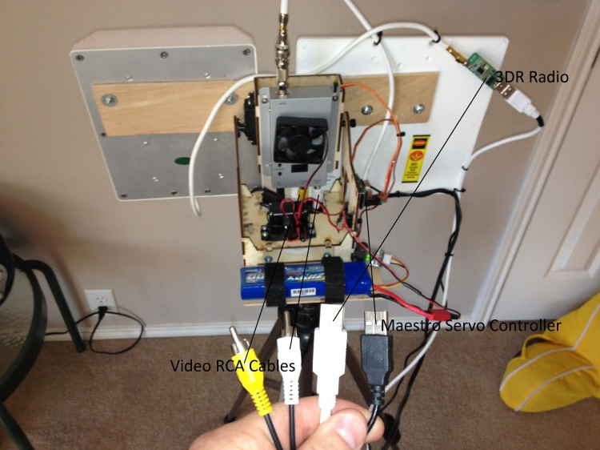

Parts
=====

This is a list of the main components needed to build this tracking
system (it is not all inclusive with things like screws, glue etc.)

-  Body frame, custom built or off the shelf
-  Antenna(s)
-  Two servos
-  Servo controller card, like the
   `Maestro <https://www.pololu.com/product/1350>`__
-  Tripod (or other mounting device)
-  Battery
-  :ref:`Telemetry Radios <common-telemetry-landingpage>`
-  (Optional, recommended:) BEC, cooling fan, battery low voltage
   device.

The function of the parts is described in the following sub-sections:

Body
----

You will need a body that can support the tremendous weight of your
antennas. 4 lbs is a "tremendous" amount of weight to throw around
depending on what torque and what materials your servos are sporting.
`This is the one I chose to use for this guide. <http://www.readymaderc.com/store/index.php?main_page=product_info&cPath=11_27&products_id=96>`__
It currently is holding two patch antennas each weighing about 12oz. You
can design your own body, but you should have a `CNC machine <https://en.wikipedia.org/wiki/Numerical_control>`__ as part of
the solution as any inaccuracies could make it not track correctly and
there goes your aircraft. All wood construction is fine for two antennas
while metal bodies could be used to make minimal structures or to
increase durability.

A special mention of gears needs to be addressed. The body I used has
gears. Gears do a couple of things that you might find useful. First
they can "convert" torque into distance (even change the angle the force
acts through) and second they can increase or decrease the speed of
rotation. Sometimes you can use them to make your body semi detachable
from the servo like the example one I gave above, which is very very
useful. You can also get by without having one at all.

When choosing a gear, keep in mind a few things. First, the further out
you go from the center of your servo to the center axis of rotation of
your AT the less torque will reach it. All servos have a rating like 10
kg-cm or 100 oz-in, that means that that particular servo has 10kg of
force when you measure that force at exactly 1 cm from the center of the
servo, likewise for 100 oz-in, 100 ounces of pressure measured at 1 inch
from the center of the servo shaft. So, the further out you go, say, 2
inches you drop the torque felt at that distance by half (because you
doubled the distance through which the force acts) which would be 5 kg
or 50 oz for our example.

The speed changes based on the diameter and number of teeth your gearing
has. A rule of thumb is the bigger the gear the slower it will turn and
the number of teeth it has is related to the size of the gear. So, a big
gear with 44 teeth meshing with a gear half its diameter and having 22
teeth with make the smaller gear rotate at twice the speed that the big
gear is rotating. You just converted torque into speed.

Antenna
-------

You need to decide which antennas you are going to use. Frequency is
**HUGE** on this. In fact, frequency selection is a guide in and of
itself. Some antennas claim usability in a range of frequencies but that
is NOT always legit. 915Mhz (aka 900Mhz) is very specific and your
antenna could be "tuned" by the factory to "best" receive at 912Mhz and
your screwed. Read READ READ the description on the antenna you are
looking at. For this guide I choose 1280Mhz (aka 1.2 or 1.3 Ghz) and
915Mhz patch antennas from `L-COM <http://www.l-com.com/home.aspx>`__.
You might be thinking "what about frequency hopping"? Your radio MIGHT
try to go outside the "effective" bandwidth (frequency spread your
antenna can use well) but if it does it notes the signal drop (aka
`RSSI <https://en.wikipedia.org/wiki/Received_signal_strength_indication>`__,
Recieved Signal Strength Indicator) and will compensate for it. Don't
worry about this, just make sure your antenna is within the correct
frequency range you will be using.

Servo
-----

You will need two servos. One for the tilting action and one for the pan
action. Tilt is the moving of the antennas only and the pan could move
the whole AT or just the antennas depending on how you have yours
designed. Servos are actually complicated little devices. I'll try to be
precise as you can use the internet to find more details on servos if
you wish. You want a servo that can do at least 110 oz-in of torque for
two patch antennas, I'd recommend at least the `karbonite materials <https://en.wikipedia.org/wiki/Karbonite_gears>`__ to ensure it
never strips out, but you can get by on the nylon versions.

For the tilt servo get a servo that does 90deg of rotation TOTAL.
Different manufacturers explain the total amount of rotation a servo can
do in different ways so you must really do your homework. 90deg rotation
total is a "standard" servo.

For the pan (this AT in particular, your requirements will vary) I'd
recommend at least 150+ oz-in of torque for two antennas and karbonite
or better, as in all metal gears. If you can get one, go digital (highly
recommend it) as the AT here is capable of small corrective actions and
an analogue servo will probably not be able to keep up like a digital
servo will. The reason for this overall beefiness is that when your
panning range is at the limit of travel your AT will rapidly spin itself
around 360deg in order to keep the antennas on target `(1:50 second mark
as an
example). <https://www.youtube.com/watch?feature=endscreen&v=_lxUd96-1tw&NR=1>`__
The faster it does this the less time you are out of communication with
your aircraft. You can not avoid this behavior if you use the APM
Mission Planner as the behavior is embedded in the software. Building an
AT that does not care about the pan range is very expensive to do as it
starts to involve what are known as slip rings. The military uses them
and they are very nice, but very expensive due to the quality of slip
ring involved. If you can do this then you avoid cable tangling issues
and possibly servo range selection gets easier. For this build the pan
action you want is a servo that can do 360deg of rotation. You really
don't need more than that.

Servo Control
-------------

You will need something to take the information from your computer
(again this build used the APM Mission Planner to drive the AT) and turn
those into a signal (numbers really) that your servo can use. The APM MP
has two options currently, one for
`Maestro <https://www.pololu.com/product/1350>`__ and one for
`ArduPilot <https://www.sparkfun.com/products/retired/8785>`__. The Maestro link
is to a SERVO CONTROLLER card and the ArduPilot is both a servo
controller and a stripped down autopilot (it is actually the original
APM being used as a servo controller card). To be more clear, in some
articles the ArduPilot is refered to as the ArduTracker. The Maestro can
run up to 6 servos with the input provided by the micro USB cable but
you will only use 2 of them plus the power pins. The ArduPilot version
uses one of the early versions of the APM called ArduPilot. It is
stripped down and cheap, you might have one from years ago, I don't know
much about it, but `this is a build <https://code.google.com/archive/p/happykillmore-gcs/wikis/Tracking.wiki>`__ that
HappyKilmore's GCS uses and
`they <https://www.diydrones.com/profiles/blogs/antenna-tracking-in?xg_source=activity>`__
did a write up on both of them. I used it a lot and you can't go wrong
reading it yourself either! No matter which controller type you use to
drive your servos you WILL need to download and install the firmware for
them. Maestro came preloaded and it looks like you need to find the
firmware for the ArduPilot card from their website or this website's
software library.

Getting the right numbers for your servo controller is vital, `use this as a guide <http://vps.oborne.me/gcs/Tracker.html>`__. Basically you
will find two numbers that bookend the total rotation your servo will do
which could be less than what it can do but not more, then you will find
the center of those bookends and then you will tell Maestro the "8-bit"
range that it should use as commands to send to the servos. It's way
critical to get these right, I lost hair doing it.

Battery
-------

Ok, servos run off of 4.8, 6 or sometimes 7.2V or more. Most of them
default to the RC standby voltage of "5V". This one is running off of
6V. This battery puts out 12.5V when charged fully. If you do not find a
way to step down the voltage from your battery to the CORRECT usable
voltage for your servo you will fry your servo. Your servo motor might
smoke or the little tiny tiny circuit board in it might smoke, either
way the reliability of it is gone and you should get a NEW SERVO. If you
don't and it fails in flight, you could lose connection because your AT
can not point properly! A BEC (Battery Eliminating Circuit) is what you
are looking for here. This project used `this one <https://hobbyking.com/en_us/turnigy-3a-ubec-w-noise-reduction.html?___store=en_us>`__.
If you do your homework, you can look up the idle and full load current
consumption of your chosen servos and pick a BEC that will handle that
load. If you fail to get a BEC that can handle the spontaneous most
highest ever load your servo could possibly generate then it will fry
and your power to point your AT will be gone, bye bye aircraft.

Battery low-voltage warning device
----------------------------------

You don't have to use this, but I would. It is cheap and could save not
only your battery but it will tell you when your AT is about to quit. It
is about as loud as a smoke detector going off! Buy a few of these and
use them, don't be cheap like that, seriously.

Video Rx and Tx
---------------

Rx and Tx is shorthand for Receiver and Transmitter respectively. It is
not in the scope of the AT build guide here to tell you about these but
instead it is just to tell you that whichever system you use make sure
it can fit to your AT. Your AT is going to get crowded and messy and
therefore it can bind on the smallest of things. Binding is bad, ok?

Tripod
------

You could come up with another thing to use, but that would be
tantamount to reinventing the wheel. The higher your AT is the further
it can spread its signal. Try to get one that does not have a lot of
protrusions like this one has. They will eventually entangle your wires.
Pay attention to which type of connector the tripod uses so you can
design your AT to link to it. Get one that is sturdy as a nice bit of
wind could knock it over and your aircraft goes link dead. Your AT
should weigh around 7 lbs max, probably less depending on what you use.

Picture gallery
===============

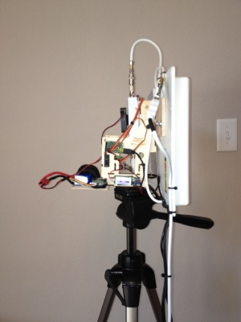

.. image:: ../../../images/mp_gps_antennatracker_03.jpg
    :target: ../_images/mp_gps_antennatracker_03.jpg

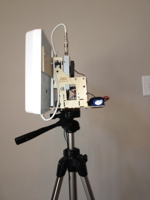

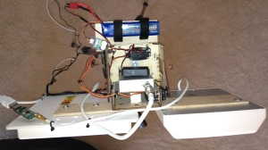

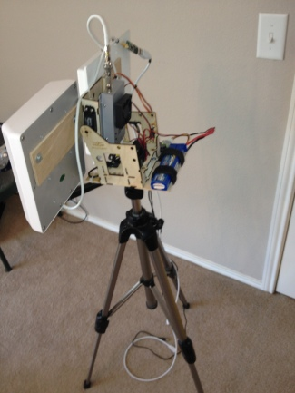

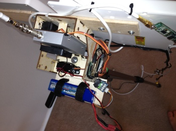

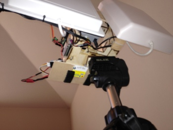

Connecting the parts
====================

**VELCRO AND ZIP-TIES, you can use them to a very large degree here!**

1) Connect your servo controller board to your laptop, micro USB to USB
for Maestro.

2) Servos connect to the servo controller board. For Maestro it will be
servo 0 pin set for pan and servo 1 pin set for tilt.

3) Connect your battery to your BEC which is set at 5V or 6V or whatever
your servos can handle (max it out). Connect the BEC to the servo
controller board. For Maestro the pin set on the outermost is for the
BATTERY power that will drive your servos (the USB cable powers the
board). DON'T REVERSE THE POLARITY, buy new stuff if you did.

4) Connect your battery (assuming Li-Po here) to the Low Voltage
detection device, pay attention to it.

5) Connect your antennas to your SiK Radio (NEVER TURN ON RADIOS WITHOUT
ANTENNA ATTACHED, buy new stuff if you did). Connect antenna to the
Video Rx.

6) You will need to splice off the power from the 12V side of the
battery connection to feed 12V of power to your Video Rx, get some
solder and a wet sponge, do a good job on the connection. Connect the
power to your Video Rx.

7) Connect your 3DR 900Mhz radio to the laptop (after you have antenna
connected).

8) Use a bunch of zip-ties to secure and bundle all the wires. This is
important. If you do a bad job here your AT will bind while its tracking
and down goes aircraft.

9) add VELCRO AND ZIP-TIES to hold everything together

10) Remember to set your end points manually in the Mission Planner for
the channels you will use to control pan and tilt, use a PWM value like
1100µs and 1900µs with a midpoint of 1500µs to start. Some 180 degree
servo's can take 600-2400µs but you can damage some servo's so start
conservatively.

Basic use
=========

1) When you get to the airfield you point your AT north, get as close as
you can with your eyeball.

2) Normal acceptable calibration for an AT is that you should be within
10deg of North when you point it.

3) This particular body is able to be lifted, which separates the gear
of the servo from the smaller gear of the body. This allows it to be
oriented very easily. If you don't have that feature, just pick the
thing up after it finishes booting (and therefore is pointing at the
default PWM number YOU ASSIGNED when programming the servo controller).

4) You want the tilt to default to the middle of the tilting servo's
travel range, so for a 90deg servo, make it default to 45deg. When you
actually USE the antenna for the first time pay attention to the
behavior of the tilting and manually adjust it via the sliding bars in
Mission Planner. If you're confident about where it should be you can
manually tweak the servo horn. Either method will work but if you use
the slider bar you will not overstress the servo when it tries to go
PAST it naturally allowed traveling range.

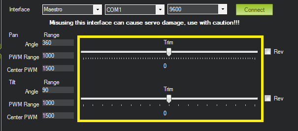

While in flight you can use the slider bars to fine tune the direction
the antenna tracker is pointing.

5) If the servos are going in the wrong direction. Try clicking the Rev
checkbox to reverse travel direction. You may need to check off Rev
before connecting to the servo controller.

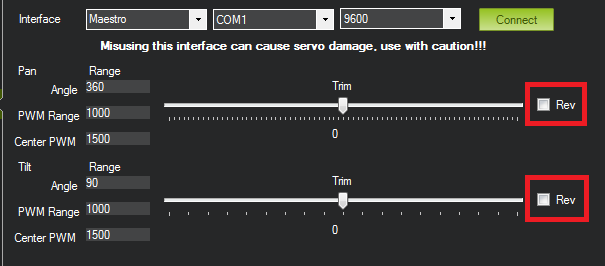

Advanced use
============

.. note::

   This section is an excerpt from a post by Scott Fuller. The
   original post is here: `The expensive but attention grabbing Antenna Tracker <https://diydrones.com/profiles/blogs/the-expensive-but-attention-grabbing-antenna-tracker>`__)

Usually the first thing I do is power up everything and get a solid GPS
lock on the APM. After that I'll set my plane in front of the antenna
tracker and zoom in REALLY tightly in Mission Planner under the Flight
Planner window. I'll then right click and say Tracker Home -> Set here.

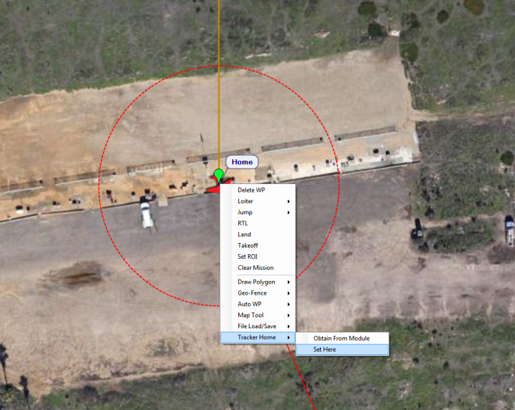

*Then I'll drag the antenna tracker pin right on top of home and drop
it. That should get me pretty close to where my antenna tracker is
placed.*

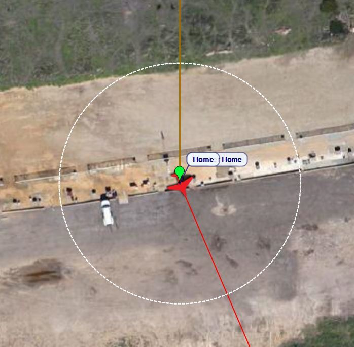

*After that I'll flip over to the Initial Setup tab under Antenna
Tracker and pull down the COM port for the Pololu servo controller and
go with 9600 baud. When that's set I hit connect. At that point the
tracker should go into motion.*

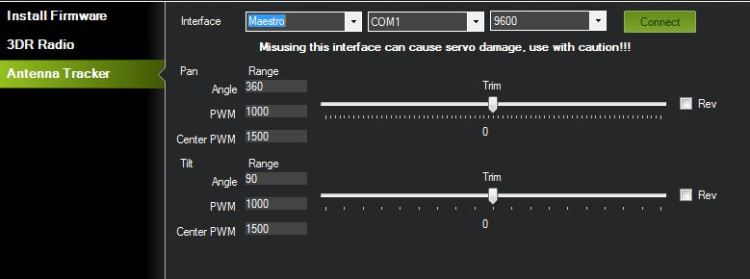

*You should be able to move the plane a few meters in front of the
antenna tracker should move with it. If you need to reverse the
direction it's pretty self explanatory. The sliders allow you to trim
where the antenna needs to be facing. When you start up the system will
think you're facing north. If you're facing East or West you have to aim
accordingly.*

*You can use Pololu Maestro Control Center to figure out your PWM
settings and how far your servos an travel. Usually the PWM setting is
(Large Number - Small Number) = PWM. In my case 2000 - 960 = 1040 for
pan and 1904 - 1456 = 448 for my tilt. That'll give me a 45 degree angle
for tilt and 360 for pan. You can get these numbers on the status tab in
Maestro CC. Be careful NOT to go beyond the recommended travel! On the
Servo City gear boxes you'll hear the POT start to click and the servo
will just spin. At that point you get to play the servo centering game.*

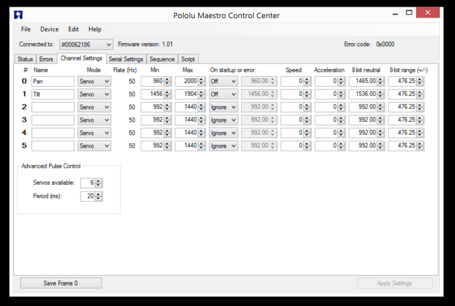

*One thing to note with the Pololu board is you may have to set it into
USB Dual Port under Serial Settings. This allows you to connect to the
COM port.*

Miscellaneous notes
===================

I have included pictures from all angles of my AT (version 2). A few
pointers here. Build your AT as light as you can. Get as beefy of servos
as you can afford and fit. You can make a wireless version of this AT if
you have telemetry radios like the :ref:`3DR or the Xbee <common-telemetry-landingpage>` kits. I don't know how to do that
but it is not going to be anymore complicated than what I have shown
here, just more expensive.

Testing is done in two ways, first you setup your AT outside and point
it north before you fire it up. Then walk around the AT with your plane
with everything linked up as if it was in flight. You need to get at
LEAST 60 feet away, try 100ft to make sure. Another way is to load a
previously recorded flight from the APM2 logs, set your home position
and watch your AT go at it as if it was there.

Test this thing out as best as you can, it is now a critical point of
failure for your entire system. I don't recommend attaching your RC
signal (typically your 2.4Ghz) radio that you use to manually control
your aircraft. Keep that one unmodified so you have a backup that you
can rely on.

Other bells and whistles might include weather vanes, barometers,
anemometers, beer can holders, cameras etc. go wild!
