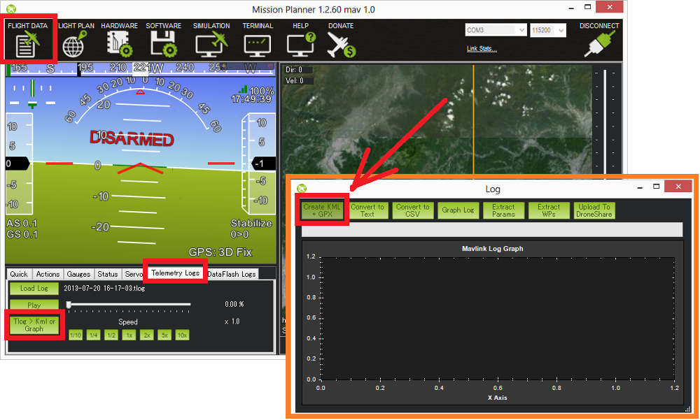

.. _common-mission-planner-telemetry-logs:

==============================
Mission Planner Telemetry Logs
==============================

Telemetry logs (also known as "tlogs") are recorded by the *Mission
Planner* (or other ground station) when you connect ArduPilot to your
computer via a :ref:`telemetry link <common-telemetry-landingpage>`. This
topic explains how to configure and access tlogs.

[copywiki destination="copter,plane,rover,planner"]

.. note::

   :ref:`Dataflash logs <common-downloading-and-analyzing-data-logs-in-mission-planner>`
   collect similar information to tlogs (see :ref:`Diagnosing problems using Logs <common-diagnosing-problems-using-logs>` for more information).

When and where tlogs are created
================================

Tlogs are recordings of the MAVLink telemetry messages sent between the
APM/PX and the groundstation and are automatically created the moment
you press the connect button on the mission planner.  Files of the
format YYYY-MM-DD hh-mm-ss.tlog appear in the "logs" subfolder in your
Mission Planner installation folder or to the location you select in the
Planner options [Config/Tuning] [Planner].

Besides the ".tlog" files, ".rlog" files are also created.  These
contain all the .tlog data plus additional debug output from the mission
planner.  but cannot be parsed or played back so they should be ignored.

.. _common-mission-planner-telemetry-logs_setting_the_datarate:

Setting the datarate
====================

The desired rate at which data is sent from the APM/PX to the ground
station can be controlled through the mission planner's Software >
Planner screen's Telemetry drop-downs.  Because all data sent over the
telemetry link is also recorded in the tlog, this also controls the rate
of data saved to the tlogs.

Note that especially on Copter, due to CPU resource limitations, the
actual rate of the data sent and saved may be lower than the rate
requested.

Playing back missions
=====================

If you are using wireless telemetry and have connected to to APM via the
Mission Planner, your flight data will automatically recorded.  You can
play back these logs by doing the following:

-  Open the mission planner's Flight Data screen
-  click on the Telemetry Logs tab
-  Press "Load Log" and find the flight's tlog file
-  Press "Play"

You can also jump to the point of interest in the log using the slider
and control the speed of the playback with the predefined Speed buttons.

While the log is replaying, the HUD will move and the vehicles location
on the map will update as it did during the flight.  Individual data
values can be seen through the Status tab and you can even display them
in a graph by clicking on the "Tuning" checkbox under the map and then
double clicking on the data legend to bring up a box from which you can
choose exactly which data fields are graphed as shown below.  This will
show the recorded data changing as the flight progresses.

.. image:: ../../../images/mptlog1.jpg
    :target: ../_images/mptlog1.jpg

.. _common-mission-planner-telemetry-logs_creating_3d_images_of_the_flight_path:

Creating 3d images of the flight path
=====================================

You can create KMZ files by doing this:

-  Open the mission planner's Flight Data screen
-  Click on the Telemetry Logs tab
-  Press the "Tlog > Kml or Graph" button
-  Press the "Create KML + GPX" button
-  select the flight tlog

A .kmz and .kml file will be created along side the original .tlog and
this can be opened in google earth to interactively view the 3d flight
path. You can open the kmz file in Google Earth to view the flight or
path. Just double click the file or drag it and drop into Google Earth.

.. image:: ../../../images/kmz_flight_path_google_earth.jpg
    :target: ../_images/kmz_flight_path_google_earth.jpg

The different flight modes used during the flight will appear as
different colored tracks.  You can change some details about how the
flight paths are displayed including their color and whether the paths
extend to the ground by doing this:

-  Find the log file’s name in the “Places” pane on the left.  It should
   appear in a “Temporary Places” folder.
-  Right click on an individual path and select “Properties” to open the
   Edit Path window.
-  The color can be changed on the “Style, Color” tab
-  The area below the path can be removed (added) on the “Altitude” tab
   by un-checking (checking) “Extend path to ground”

Extracting parameters and Waypoints
===================================

You can extract the parameters and waypoints from the tlog by following
the same steps as for creating the KML file except that at the last step
select "Extract Params" or "Extract WPs".

Extract Params will cause a .param file to be created along side the
tlog.  This file is tab separated and contains a full list of parameters
(in the same order as they appear in the eeprom) along with their values
during the flight.  This can be opened in excel or a text editor.

Extract WPs will create one or more .txt files containing any missions
uploaded to the flight controller.  These files can be opened in the Mission
Planner by switching to the Flight Plan screen, right-mouse-button
clicking on the map and selecting "File Load/Save", "Load WP File".

Graphing data from a flight
===========================

Data from the flight can be graphed by doing the following:

-  Open the mission planner's Flight Data screen
-  Click on the Telemetry Logs tab
-  Press the "Tlog > Kml or Graph" button
-  Press the "Graph Log" button
-  select the flight tlog

-  When the "Graph This" screen appears, use the left or right mouse
   button to click on the checkboxes beside the items you wish to
   graph.  Note that the items are grouped into categories like
   "RC_CHANNELS" and "RAW_IMU" although it's still often difficult to
   find exactly the item you wish to graph
-  If you use the left mouse button the scale for the item will appear
   on the left of the graph.  If you use the right mouse button it will
   appear on the right
-  Click the checkbox multiple times to cycle through all the possible
   colours
-  Change the zoom of the graph with your mouse's middle wheel, by
   select an area of the graph with the left mouse button held down or
   by right-mouse-button clicking on the graph and selecting "Set Scale
   To Default"

Video overview of tlogs
=======================

..  youtube:: 4IRRN5YMHJA
    :width: 100%
