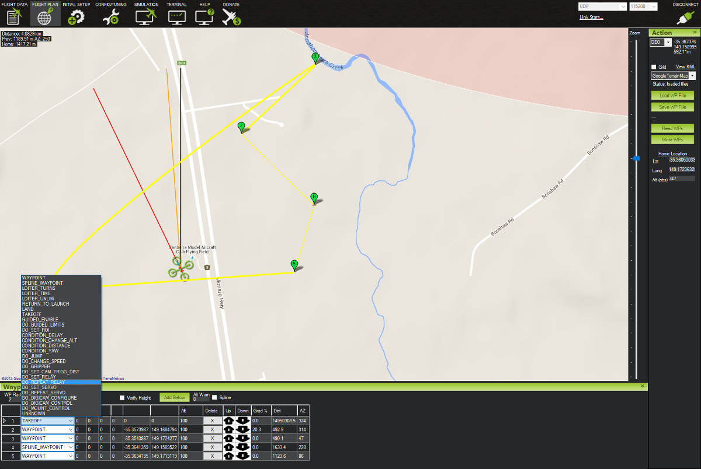

.. _common-mission-planning:

================
Mission Planning
================

This section contains articles about creating missions that will run when the vehicle switched to :ref:`AUTO <auto-mode>` mode.

.. note::

   The instructions focus on the :ref:`Mission Planner <planner:home>` but the main concepts apply to other :ref:`Ground Control Stations <common-choosing-a-ground-station>` as well

.. toctree::
    :maxdepth: 1
    
[site wiki="rover"]
    Learning a Mission <learning-a-mission>
[/site] 

    Planning a Mission with Waypoints and Events <common-planning-a-mission-with-waypoints-and-events>
[site wiki="copter"]
    mission-command-list
[/site]
    
    Mission Command List <common-mavlink-mission-command-messages-mav_cmd>
    Camera Control in Auto Missions <common-camera-control-and-auto-missions-in-mission-planner>
    Rally Points <common-rally-points>
    Geotagging Images with Mission Planner <common-geotagging-images-with-mission-planner>

[site wiki="plane"]
    Terrain Following <common-terrain-following>
[/site]

[site wiki="copter"]
    Terrain Following <terrain-following>
[/site]

    Rewind-on-resume <common-mission-rewind>

[copywiki destination="copter,plane,rover,planner"]

