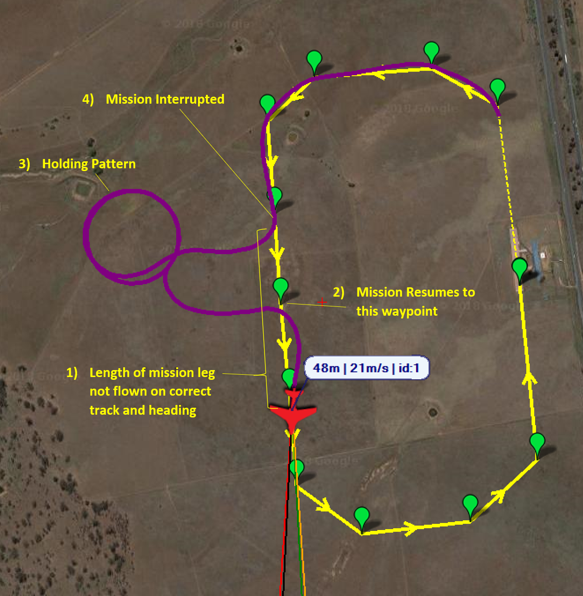
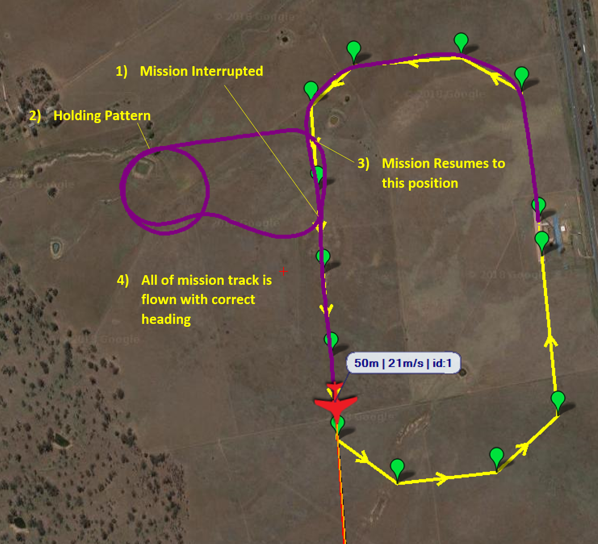

.. _common-mission-rewind:

[copywiki destination="copter,plane,rover,planner"]

========================
Mission Rewind on Resume
========================

This page explains what the mission rewind-on-resume feature is and how to use the feature.

.. note::

    This feature is available for Plane, Copter, and Rover from 4.1 onwards.

In certain applications or operating areas it can be common to interrupt a mission, for the purposes 
of deconfliction, by changing to another mode and manoeuvring the vehicle away from the planned mission 
path.  When ready to resume the mission, the normal behaviour of the vehicle is to fly/drive directly to 
the last 'active' waypoint that was loaded in the mission.  This behaviour is illustrated below:

As it can be seen, this leaves a significant portion of the planned mission that is either covered with 
incorrect track and heading or is not covered at all.  This becomes an issue for data gathering missions 
such as surveys, resulting in legs of the mission needing to be repeated.

The rewind-on-resume feature remedies this behaviour.  A rewind distance is defined by the operator.  When 
the mission is resumed the vehicle will return to the mission track at the desired distance behind the point 
that the mission was interrupted.  This gives the vehicle adequate time to achieve the desired track and 
heading before it achieves the position in which it was originally interrupted.  This behaviour can be seen 
below:

Configuration
=============

The rewind-on-resume feature is enabled by setting a DO_SET_RESUME_REPEAT_DIST mission item.  This can 
be done in one of two ways:

**1) Ground control station recognises the DO_SET_RESUME_DIST mission item**

- Add a DO_SET_RESUME_DIST mission item from the point in the mission that you wish to enable the feature.
- Set the first data column to be the distance in meters that you want the mission to be rewound to, on resume.

**2) Ground control station does not recognise the DO_SET_RESUME_DIST mission item**

- Add an UNKNOWN mission item from the point in the mission that you wish to enable the feature and set the MAVLink ID to 215.
- Set the first data column to be the distance in meters that you want the mission to be rewound to, on resume.

.. note::

    The MIS_RESTART parameter must be set to zero, to prevent the mission restarting, for this feature to work.

To check that the rewind distance has been correctly set in the mission, monitor the message output in the ground 
control station.  When the vehicle registers the command the following message will be displayed: "Resume repeat 
dist set to <DISTANCE> m".

Multiple DO_SET_RESUME_DIST commands can be set throughout the mission.  This provides the operator the ability to
vary the rewind distance or switch the feature on/off throughout the mission, where extreme care and accuracy is 
required to manoeuvre the vehicle on certain mission legs.

This feature can be switched off by setting a DO_SET_RESUME_DIST mission item with a distance of zero.

.. tip::
    When identifying the resume distance needed, a sensible value to try for most vehicles is twice the minimum turn
    radius.  The only exception is vehicles that can turn on the spot (multi-rotors and some rovers), in which a 
    sensible distance would be twice the WP_RADIUS.

How it works
============

Once enabled ArduPilot starts recording the waypoints that are successfully loaded as 'active'.  A history of up to 
seven waypoints are stored.  Upon a mission rewind-and-resume the mission history will be searched until either:

- A position in the mission track is found that satisfies the rewind distance requirement.
- The end of stored mission history is found, in which case the resume position will be the last waypoint stored in the history.

The vehicle will then resume to that location on the mission track and continue the mission as planned.

.. note::
    Height is accounted for in the resuming position.  If the vehicle is resuming to a location along the mission track 
    whereby the aircraft is changing altitude, the height of the resuming position will be linearly interpolated between 
    the two neighbouring waypoints.

.. note::
    To prevent the vehicle from storing an obscure history and resuming to an unexpected location, if the mission is 
    altered by using the set waypoint feature in a ground control station or a script, the history is reset.  This prevents 
    the vehicle from rewinding the mission back past the point that the history was reset.
    
.. note::
    This feature works with DO_JUMP commands and the jump count is not incremented whilst the vehicle is resuming the mission.

Limitations
===========

**1) Short mission legs:** If the mission has closely spaced waypoints and the requested rewind distance is greater than 
the distance covered by the last six waypoints that have been passed, then the vehicle will resume on the 'oldest' waypoint 
stored.

**2) Spline waypoints:**  This feature will work with spline waypoints.  However, the accuracy of the resume distance will 
be diminished as the distance calculation is based on a straight line between navigation command locations.

**3) Non-waypoint navigation commands:**  This feature works with non-waypoint navigations commands, for example LOITER_TURNS.  
However, the distance calculation does not account for the distance of the vehicle track in those commands.  Using the previous 
example, the distance calculation does not account for the distance flown in the loiter.
