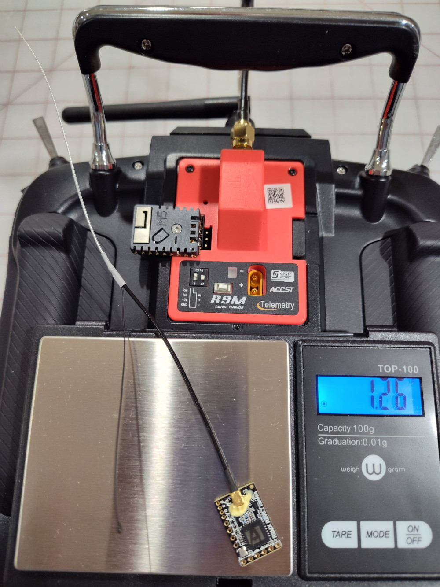

.. _common-mlrs-rc:
[copywiki destination="plane,copter,rover,blimp,sub"]
============
mLRS project
============

`mLRS firmware github page <https://github.com/olliw42/mLRS>`__

`mLRS documentation <https://github.com/olliw42/mLRS-docu/blob/master/README.md>`__

`"Off the shelf" systems from MatekSys <https://www.mateksys.com/?page_id=12174>`__

The mLRS project is open source firmware which implements a long range integrated RC and full MAVLink telemetry system which can run on a few off the shelf and DIY hardware platforms.  It supports 433 MHz, 868/915 MHz, and 2.4 GHz bands.  It is capable of reaching ranges of 7 to 87 km in LoRa modes, depending on the message rate, output power, and frequency band supported by the chosen hardware.  A MAVLink ground station (phone or PC) may be connected to the transmitter module via USB, serial, WiFi or Bluetooth depending on the hardware selected.

When the CRSF protocol is used for RC data on EdgeTX/OpenTX based radios, mLRS also translates some common MAVLink messages into telemetry sensors which can be used by the Yaapu Telemetry App as described `here <https://github.com/olliw42/mLRS-docu/blob/master/docs/CRSF.md>`__.

.. image:: ../../../images/mLRS-docu-setup-crsf-telemetry-yaapu-app-02.jpg

The receivers can output RC controls in either SBUS or CRSF(including link quality info) to the autopilot or use embedded MAVLink overrides via only the telemetry connection to the autopilot.

mLRS has been optimized for use with ArduPilot and includes specific support for MAVLink including flow control via RADIO_STATUS messages and optional injection of RC_CHANNELS_OVERRIDE messages allowing a single full duplex serial connection to the flight controller for both RC and MAVLink.

mLRS is rich in features including support for full diversity, 10 model configurations, and OLED display or LUA script for configuration.

You can install the mLRS firmware on one of the supported off the shelf hardware platforms which currently includes the `R9M Tx module <https://www.frsky-rc.com/product/r9m-2019/>`__, `R9MX Rx <https://www.frsky-rc.com/product/r9m-2019/>`__, and R9MM at 868/915 MHz and the `FRM303 Rx/Tx module <https://www.flysky-cn.com/frm303description>`__ at 2.4 GHz.

See the mLRS documentation for the `FrSky R9 <https://github.com/olliw42/mLRS-docu/blob/master/docs/FRSKY_R9.md>`__ or `Flysky FRM303 <https://github.com/olliw42/mLRS-docu/blob/master/docs/FLYSKY_FRM303.md>`__ for instructions on flashing the firmware.

Or, with some soldering skill, you can build one of the DIY board designs which are documented on the  `Github <https://github.com/olliw42/mLRS-hardware>`__ and the `mLRS documentation <https://github.com/olliw42/mLRS-docu/blob/master/README.md>`__

FrSky R9M Tx module with `M5Stamp pico <https://shop.m5stack.com/products/m5stamp-pico-diy-kit>`__ piggyback `Wireless Bridge <https://github.com/olliw42/mLRS-docu/blob/master/docs/WIRELESS_BRIDGE.md>`__ for Bluetooth or WiFi to GCS pictured with light weight dipole and R9MX receiver

To bind this module to a ground station like MAVProxy or Mission Planner you need to pair it to your machine. For Linux the easiest way is to use rfcomm, this is a Linux utility that allows you to bind a Bluetooth device to a serial port so you can connect to it like normal.

1. Connect the Bluetooth device to your laptop. The easiest way to do this is through your GUI, I am using the settings that are built in to GNOME. You need to put it in pairing mode then pair it, you will be prompted to enter a code, the code is ``1234``. This is the same for Windows.
2. You need to find the MAC address of your module, you can do this by using CLI tools but you can also find it in your GUI.
3. To bind the Bluetooth device to a serial port you can use a tool like rfcomm, this is a Linux tool (see the `man page <https://manpages.ubuntu.com/manpages/xenial/man1/rfcomm.1.html>`__). The usage is quite simple, you first need to run ``sudo rfcomm bind /dev/your_serial_port_of_choice XX:XX:XX:XX:XX:XX`` where the last argument is your MAC address. For my module the command looked like ``sudo rfcomm bind /dev/rfcomm24 04:25:04:12:0A:16``. This is not persistent between reboots, so after a reboot you should use ``sudo rfcomm release all`` which will unpair all, then you can re-pair with the previous command.
4. Connecting to the device is as easy as connecting to a normal serial device. For MAVProxy you can run ``mavproxy.py --master=/dev/rfcomm24`` and you are connected.

For Windows the pairing is the same as step 1 above, after pairing Windows will bind the module to a COM port automatically which you can use directly in your ground station.

