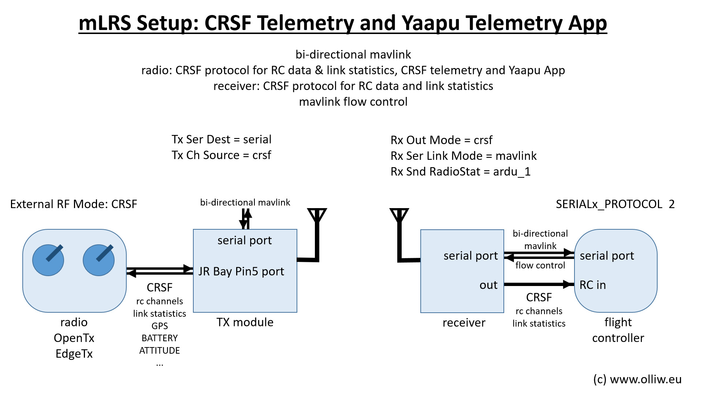
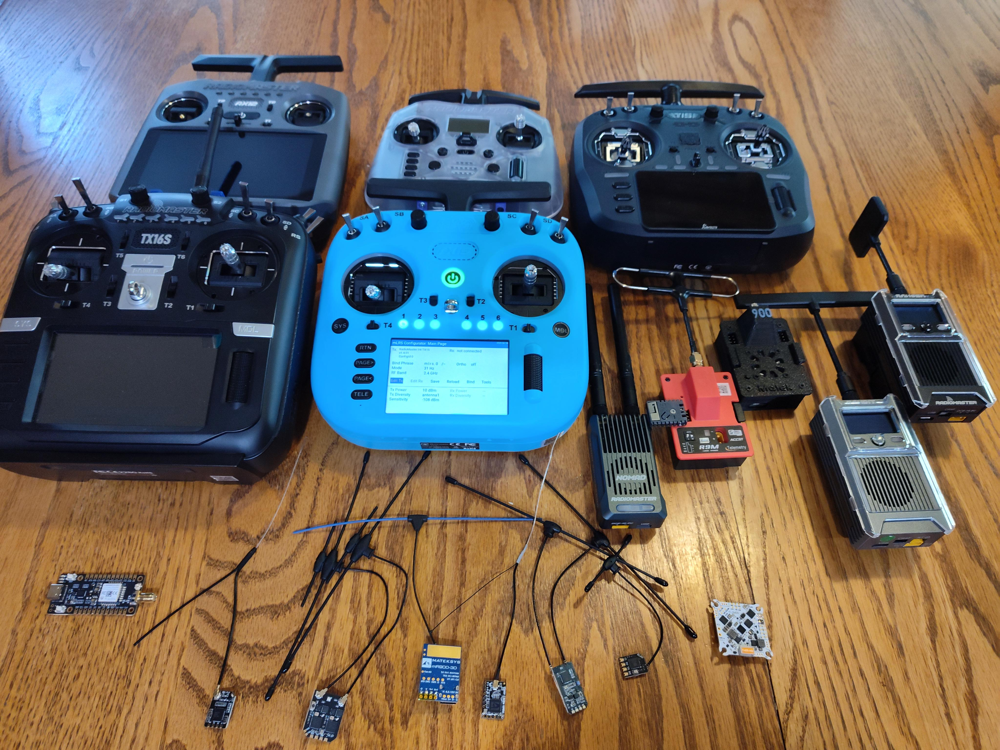

.. _common-mlrs-rc:
[copywiki destination="plane,copter,rover,blimp,sub"]
============
mLRS project
============

`mLRS firmware github page <https://github.com/olliw42/mLRS>`__

`mLRS documentation <https://github.com/olliw42/mLRS-docu/blob/master/README.md>`__

The mLRS project is open source firmware which provides long range traditional RC and a full MAVLink, MSP, or serial bi-directional telemetry connection using a single radio link.  The mLRS firmware can run on several off-the-shelf and DIY radio hardware platforms.  It supports 433 MHz, 868/915 MHz, and 2.4 GHz bands.  It is capable of reaching ranges of 7 to 87 km in LoRa modes, depending on the message rate, output power, and frequency band supported by the chosen hardware.  One user reported a range of 143 km on 433 MHz band.  A MAVLink ground station (phone, tablet or PC) may be connected to the mLRS Tx module via USB, serial, `WiFi <https://github.com/olliw42/mLRS-docu/blob/main/docs/WIRELESS_BRIDGE.md>`__, :ref:`Bluetooth SPP <common-mission-planner-bluetooth-connectivity>` or BLE depending on the hardware selected.

When the CRSF protocol is used for RC data on EdgeTX/OpenTX based radios, mLRS also translates some common MAVLink messages into telemetry sensors which can be used by the Yaapu Telemetry App as described `here <https://github.com/olliw42/mLRS-docu/blob/master/docs/CRSF.md>`__.

The mLRS receiver can output RC channels to the autopilot via either SBUS or CRSF (including link quality info).  Or it can be configured to use embedded injection of RC_CHANNELS_OVERRIDE or RADIO_RC_CHANNELS MAVLink messages via only the telemetry connection to the autopilot, reducing the number of serial ports and wires required.  DroneCAN, carrying both RC channels and full MAVLink, is also supported by some receivers.

mLRS has been optimized for use with ArduPilot and includes specific support for MAVLink.  This includes flow control and RSSI via RADIO_STATUS messages, flashing receivers via ArduPilot passthrough, and the use of MAVLink parameters for ground station management of mLRS radio configuration.

mLRS is rich in features; including support for full diversity, dual band, RC channel control of RF power, 10 model configurations, and radio configuration via OLED display, LUA script, CLI, or MAVLink Parameters.  See the `Project Status summary <https://github.com/olliw42/mLRS/blob/main/README.md#project-status>`__ for a more complete list of features.

Using the `mLRS Web Flasher App <https://olliw.eu/mlrsflasher>`__ is the easiest way to `install the mLRS firmware <https://github.com/olliw42/mLRS-docu/blob/main/docs/FLASHING.md>`__ on one of the many readily available off-the-shelf hardware platforms.

Off-the-shelf options include `MatekSys mLRS Tx modules and receivers <https://www.mateksys.com/?page_id=12174>`__, most `internal ELRS Tx modules <https://github.com/olliw42/mLRS-docu/blob/main/docs/ELRS_TX_MODULES.md#internal-tx-modules>`__ integrated into many modern EdgeTX RC radio handsets, a wide selection of the most popular `ELRS external Tx modules <https://github.com/olliw42/mLRS-docu/blob/main/docs/ELRS_TX_MODULES.md#external-tx-modules>`__, many `ELRS receivers <https://github.com/olliw42/mLRS-docu/blob/main/docs/ELRS_RECEIVERS.md>`__, generic integrated UART type ELRS receivers found in many all-in-one flight controllers, and some `FrSky R9 devices <https://github.com/olliw42/mLRS-docu/blob/main/docs/FRSKY_R9.md>`__.

Or, with some soldering skill, you can build one of the DIY board designs which are documented on the  `Github mLRS-hardware page <https://github.com/olliw42/mLRS-hardware>`__ and the `mLRS documentation <https://github.com/olliw42/mLRS-docu/blob/master/README.md>`__.

See the `mLRS documentation <https://github.com/olliw42/mLRS-docu/blob/main/README.md>`__ for details on supported hardware.

A sample collection of off-the-shelf Tx modules, receivers, and all-in-one flight controllers supported by mLRS, including some RC handsets with supported internal Tx modules
