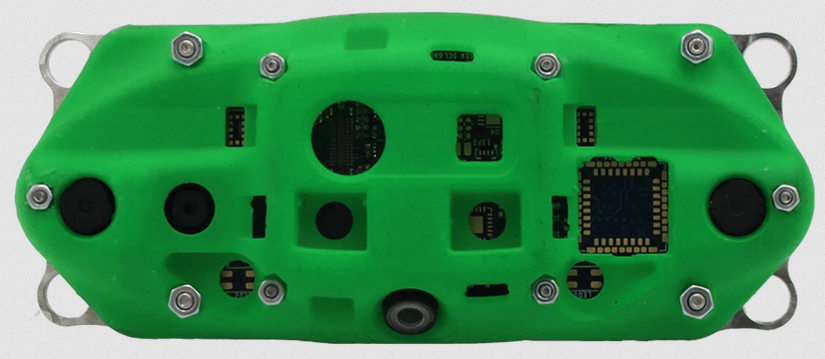
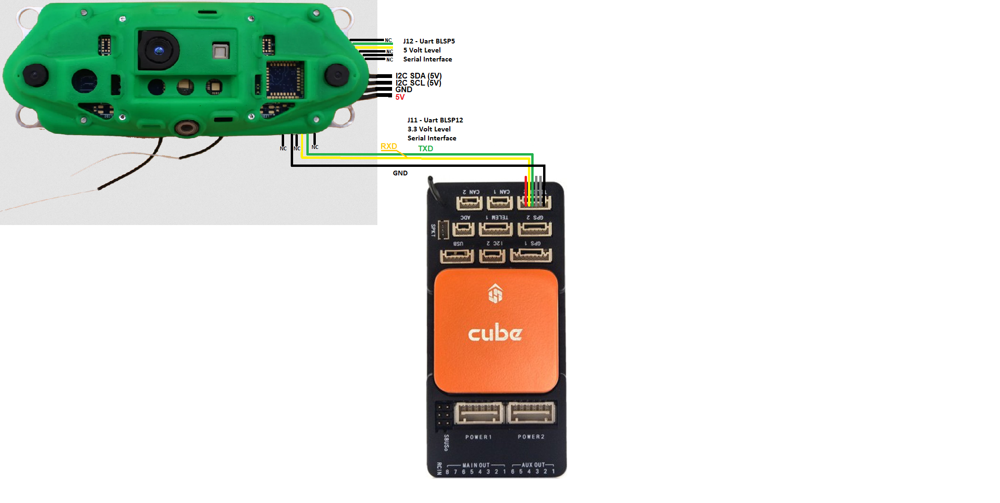

.. _common-modalai-voxl:

============
ModalAI VOXL
============

[copywiki destination="copter,rover,blimp"]

This article explains how to setup a `ModalAI VOXL-CAM <https://www.modalai.com/en-jp/pages/voxl-cam-perception-engine>`__ for use with ArduPilot as a substitude for a GPS allowing position control modes like Loiter, PosHold, RTL, Auto to work.

Other versions of the VOXL cameras should also work except for the VOXL2 which is not yet supported.

.. note::

    VOXL camera support is available in ArduPilot 4.3 (and higher).

What to Buy
-----------

- `VOXL CAM + TOF Dev Kit <https://www.modalai.com/products/voxl-cam?variant=39593458827315>`__
- `Flight Controller Telemetry Cable <https://www.modalai.com/collections/accessories/products/voxl-to-flight-controller-telemetry-cable>`__
- Optionally an 8GB or larger SD Card

Hardware Setup
--------------

- Connect the VOXL camera to the autopilot as shown above.  In these instructions the autopilot's Telem2 port is used.
- Mount the VOXL camera on the front of the vehicle oriented so that the wifi antennas extend from the bottom of the camera

VOXL Camera Configuration
-------------------------

`ModalAI's VOX-CAM setup instructions here <https://docs.modalai.com/voxl-cam-user-guide-core/>`__

The minimum steps to get the camera working include

- `Setup adb <https://docs.modalai.com/setup-adb/>`__ on an Ubuntu workstation
- Connect the camera to the Ubuntu workstation, start and adb shell and `run voxl-configure-vision-px4 <https://docs.modalai.com/voxl-vision-px4-installation/>`__ (Note: you may simply press <enter> when asked for an IP address)
- run "systemctl enable voxl-mavlink-server" to configure the mavlink server to start automatically
- Optionally `run "systemctl status voxl-vision-px4" <https://docs.modalai.com/voxl-cam-user-guide-core/#view-visual-inertial-odometry-data>`__ to check if VOXL is producing good position estimates

Autopilot Configuration
-----------------------

Connect to the autopilot with a ground station (i.e. Mission Planner) and check that the following parameters are set:

- :ref:`SERIAL2_PROTOCOL <SERIAL2_PROTOCOL>` = 2 (MAVLink2).  Note this assumes the camera is connected to the autopilot's "Telem2" port.
- :ref:`SERIAL2_BAUD <SERIAL2_BAUD>` = 921 (921600 baud)
- Optionally set :ref:`SERIAL2_OPTIONS <SERIAL2_OPTIONS>` = 1024 (Don't forward mavlink to/from) to disable the camera's odometry messages from being sent to the GCS
- Optionally set :ref:`SR2_EXTRA3 <SR2_EXTRA3>` = 0 to disable sending the SYSTEM_TIME message to the camera which has been known to cause the camera to lose its position estimate (e.g. quality falls to -1).  Note this assumes the camera is connected to the autopilot's second mavlink port (e.g. usually Telem2)
- :ref:`VISO_TYPE <VISO_TYPE>` = 3 (VOXL)
- Set :ref:`VISO_POS_X <VISO_POS_X>`, :ref:`VISO_POS_Y <VISO_POS_Y>`, :ref:`VISO_POS_Z <VISO_POS_Z>` to the camera's position on the drone relative to the center-of-gravity.  See :ref:`sensor position offset compensation <common-sensor-offset-compensation>` for more details
- Optionally increase :ref:`VISO_QUAL_MIN <VISO_QUAL_MIN>` to 10 (or higher) to only consume estimates from the camera when the quality is 10% (or higher)

If only the VOXL camera will be used for position estimation and heading (e.g. No GPS):

- :ref:`EK3_SRC1_POSXY <EK3_SRC1_POSXY>` = 6 (ExternalNav)
- :ref:`EK3_SRC1_VELXY <EK3_SRC1_VELXY>` = 6 (ExternalNav)
- :ref:`EK3_SRC1_POSZ <EK3_SRC1_POSZ>` = 6 (ExternalNav)
- :ref:`EK3_SRC1_VELZ <EK3_SRC1_VELZ>` = 6 (ExternalNav)
- :ref:`EK3_SRC1_YAW <EK3_SRC1_YAW>` = 6 (ExternalNav)

After the parameters are modified, reboot the autopilot.  Connect with the ground station and (if using Mission Planner) right-mouse-button-click on the map, select "Set Home Here", "Set EKF Origin Here" to tell ArduPilot where the vehicle is and it should instantly appear on the map.

For indoor/outdoor transitions (e.g. VOXL camera indoors, GPS+Compass outdoors):

- :ref:`EK3_SRC1_POSXY <EK3_SRC1_POSXY>` = 3 (GPS)
- :ref:`EK3_SRC1_VELXY <EK3_SRC1_VELXY>` = 3 (GPS)
- :ref:`EK3_SRC1_POSZ <EK3_SRC1_POSZ>` = 1 (Baro)
- :ref:`EK3_SRC1_VELZ <EK3_SRC1_VELZ>` = 0 (None)
- :ref:`EK3_SRC1_YAW <EK3_SRC1_YAW>` = 1 (Compass)
- :ref:`EK3_SRC2_POSXY <EK3_SRC2_POSXY>` = 6 (ExternalNav)
- :ref:`EK3_SRC2_VELXY <EK3_SRC2_VELXY>` = 6 (ExternalNav)
- :ref:`EK3_SRC2_POSZ <EK3_SRC2_POSZ>` = 6 (ExternalNav)
- :ref:`EK3_SRC2_VELZ <EK3_SRC2_VELZ>` = 6 (ExternalNav)
- :ref:`EK3_SRC2_YAW <EK3_SRC2_YAW>` = 6 (ExternalNav)
- :ref:`RC6_OPTION <RC6_OPTION>` = 90 (EKF Pos Source) to allow the pilot to use channel 6 to switch between Source1 (e.g. GPS+Compass) and Source2 (e.g. VOXL camera).  The switch's low position is Source1 (GPS+Compass), middle position is Source2 (e.g. VOXL), and high position is Source3 (e.g. None) which will lead to the EKF losing its position estimate and triggering an EKF failsafe.  To avoid pilot error triggering an EKF failsafe you may wish to copy EK3_SRC1_xxx or EK2_SRC2_xxx to EK3_SRC3_xx.
- :ref:`RC7_OPTION <RC7_OPTION>` = 80 (Viso Align) to allow the pilot to use channel 7 to re-align the camera's yaw with the AHRS/EKF yaw before flight.  Re-aligning yaw before takeoff is a good idea or loss of position control (aka "toilet bowling") may occur.

After the parameters are modified, reboot the autopilot.

More details on :ref:`GPS/Non-GPS Transitions can be found here <common-non-gps-to-gps>`

To use an optical flow and rangefinder for backup in case the VOXL fails, a Lua applet for `ExternalNav/Optical flow transitions is here <https://github.com/ArduPilot/ardupilot/blob/master/libraries/AP_Scripting/applets/ahrs-source-extnav-optflow.lua>`__

Videos
------

..  youtube:: CikqIRzXlRc
    :width: 100%
