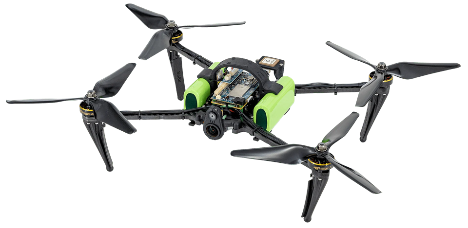

.. _common-modalai-voxl2:

==============
ModalAI VOXL 2
==============

[copywiki destination="copter,rover,blimp"]

This article explains how to setup a `ModalAI VOXL 2 <https://www.modalai.com/en-jp/products/voxl-2>`__ for use with ArduPilot allowing position control without a GPS in modes including Loiter, PosHold, RTL and Auto.

.. note::

    VOXL 2 support is available in ArduPilot 4.6 (and higher).

What to Buy
-----------

Any of the following products can run ArduPilot

- `VOXL 2 Flight Deck <https://www.modalai.com/products/voxl-2-flight-deck>`__
- `Starling 2 <https://www.modalai.com/products/starling-2>`__
- `Starling 2 Max <https://www.modalai.com/products/starling-2-max>`__

Hardware Setup
--------------

- Install ArduPilot as described `here <https://github.com/ArduPilot/ardupilot/tree/master/libraries/AP_HAL_QURT/ap_host/service>`__
- Pre-built binaries can be found here for `Copter <https://firmware.ardupilot.org/Copter/latest/QURT/>`__, `Plane <https://firmware.ardupilot.org/Plane/latest/QURT/>`__ and `Rover <https://firmware.ardupilot.org/Rover/latest/QURT/>`__
- To install copy files as follows

    - voxl-ardupilot.service to /etc/systemd/system/
    - voxl-ardupilot to /usr/bin/
    - build/QURT/ardupilot to /usr/bin/
    - build/QURT/bin/arducopter to /usr/lib/rfsa/adsp/ArduPilot.so
    - copy the right parameter file from `Tools/Frame_params/ModalAI/ <https://github.com/ArduPilot/ardupilot/tree/master/Tools/Frame_params/ModalAI>`__ to /data/APM/defaults.parm

- You can then use

    - systemctl enable voxl-ardupilot.service
    - systemctl start voxl-ardupilot

VOXL Camera Configuration
-------------------------

Details coming soon

Autopilot Configuration
-----------------------

Connect to the autopilot with a ground station (i.e. Mission Planner) and check that the following parameters are set

- :ref:`SERIAL2_PROTOCOL <SERIAL2_PROTOCOL>` = 2 (MAVLink2).  Note this assumes the camera is connected to the autopilot's "Telem2" port.
- :ref:`SERIAL2_BAUD <SERIAL2_BAUD>` = 921 (921600 baud)
- Optionally set :ref:`SERIAL2_OPTIONS <SERIAL2_OPTIONS>` = 1024 (Don't forward mavlink to/from) to disable the camera's odometry messages from being sent to the GCS
- Optionally set :ref:`SR2_EXTRA3 <SR2_EXTRA3>` = 0 to disable sending the SYSTEM_TIME message to the camera which has been known to cause the camera to lose its position estimate (e.g. quality falls to -1).  Note this assumes the camera is connected to the autopilot's second mavlink port (e.g. usually Telem2)
- :ref:`VISO_TYPE <VISO_TYPE>` = 3 (VOXL)
- Set :ref:`VISO_POS_X <VISO_POS_X>`, :ref:`VISO_POS_Y <VISO_POS_Y>`, :ref:`VISO_POS_Z <VISO_POS_Z>` to the camera's position on the drone relative to the center-of-gravity.  See :ref:`sensor position offset compensation <common-sensor-offset-compensation>` for more details
- Optionally increase :ref:`VISO_QUAL_MIN <VISO_QUAL_MIN>` to 10 (or higher) to only consume estimates from the camera when the quality is 10% (or higher)

If only the VOXL 2 camera will be used for position estimation and heading (e.g. No GPS):

- :ref:`EK3_SRC1_POSXY <EK3_SRC1_POSXY>` = 6 (ExternalNav)
- :ref:`EK3_SRC1_VELXY <EK3_SRC1_VELXY>` = 6 (ExternalNav)
- :ref:`EK3_SRC1_POSZ <EK3_SRC1_POSZ>` = 6 (ExternalNav)
- :ref:`EK3_SRC1_VELZ <EK3_SRC1_VELZ>` = 6 (ExternalNav)
- :ref:`EK3_SRC1_YAW <EK3_SRC1_YAW>` = 6 (ExternalNav)

After the parameters are modified, reboot the autopilot.  Connect with the ground station and (if using Mission Planner) right-mouse-button-click on the map, select "Set Home Here", "Set EKF Origin Here" to tell ArduPilot where the vehicle is and it should instantly appear on the map.

For indoor/outdoor transitions (e.g. VOXL camera indoors, GPS+Compass outdoors):

- :ref:`EK3_SRC1_POSXY <EK3_SRC1_POSXY>` = 3 (GPS)
- :ref:`EK3_SRC1_VELXY <EK3_SRC1_VELXY>` = 3 (GPS)
- :ref:`EK3_SRC1_POSZ <EK3_SRC1_POSZ>` = 1 (Baro)
- :ref:`EK3_SRC1_VELZ <EK3_SRC1_VELZ>` = 0 (None)
- :ref:`EK3_SRC1_YAW <EK3_SRC1_YAW>` = 1 (Compass)
- :ref:`EK3_SRC2_POSXY <EK3_SRC2_POSXY>` = 6 (ExternalNav)
- :ref:`EK3_SRC2_VELXY <EK3_SRC2_VELXY>` = 6 (ExternalNav)
- :ref:`EK3_SRC2_POSZ <EK3_SRC2_POSZ>` = 6 (ExternalNav)
- :ref:`EK3_SRC2_VELZ <EK3_SRC2_VELZ>` = 6 (ExternalNav)
- :ref:`EK3_SRC2_YAW <EK3_SRC2_YAW>` = 6 (ExternalNav)
- :ref:`RC6_OPTION <RC6_OPTION>` = 90 (EKF Pos Source) to allow the pilot to use channel 6 to switch between Source1 (e.g. GPS+Compass) and Source2 (e.g. VOXL camera).  The switch's low position is Source1 (GPS+Compass), middle position is Source2 (e.g. VOXL), and high position is Source3 (e.g. None) which will lead to the EKF losing its position estimate and triggering an EKF failsafe.  To avoid pilot error triggering an EKF failsafe you may wish to copy EK3_SRC1_xxx or EK2_SRC2_xxx to EK3_SRC3_xx.
- :ref:`RC7_OPTION <RC7_OPTION>` = 80 (Viso Align) to allow the pilot to use channel 7 to re-align the camera's yaw with the AHRS/EKF yaw before flight.  Re-aligning yaw before takeoff is a good idea or loss of position control (aka "toilet bowling") may occur.

After the parameters are modified, reboot the autopilot.

More details on :ref:`GPS/Non-GPS Transitions can be found here <common-non-gps-to-gps>`

To use an optical flow and rangefinder for backup in case the VOXL fails, a Lua applet for `ExternalNav/Optical flow transitions is here <https://github.com/ArduPilot/ardupilot/blob/master/libraries/AP_Scripting/applets/ahrs-source-extnav-optflow.lua>`__

Videos
------

..  youtube:: tsLEcEUyBYs
    :width: 100%
