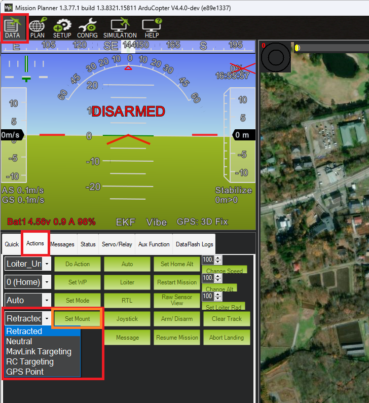
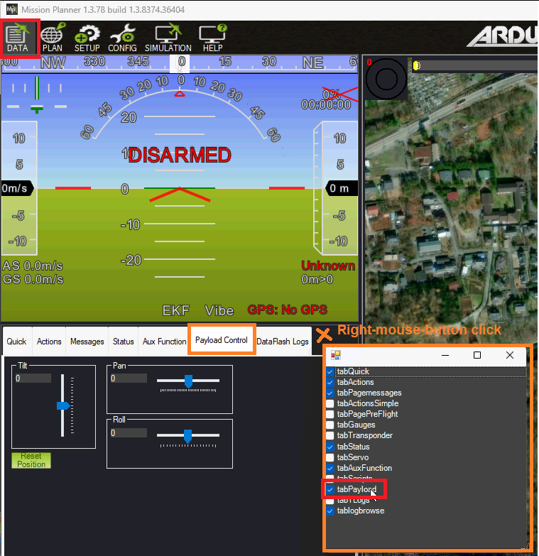
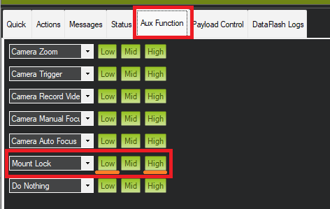
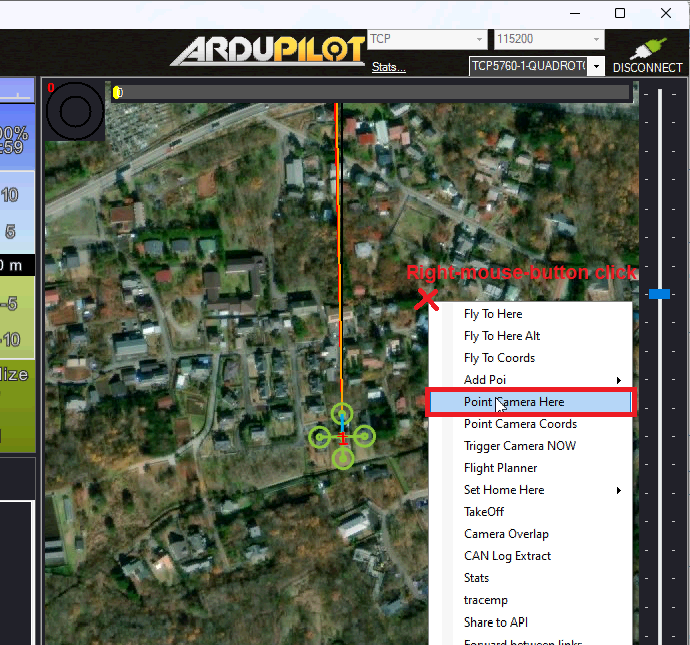

.. _common-mount-targeting:

=======================
Gimbal / Mount Controls
=======================

Camera gimbals (aka camera mounts) can be controlled in at least six different ways.  This page provides an overview of these controls and their setup.

The gimbal's "mode" defines how it is controlled.  Each ground station (GCS) is different but Mission Planner, for example, has a "Set Mount" button that allows changing the mode.  In many cases the user does not need to directly set the mode, instead this is done automatically as part of responding to a command from the user.

Below are the 6 supported modes.

0. Retract Mode: the gimbal will move to the roll, pitch and yaw angles held in the :ref:`MNT1_RETRACT_X<MNT1_RETRACT_X>`, :ref:`MNT1_RETRACT_Y<MNT1_RETRACT_Y>`, :ref:`MNT1_RETRACT_Z<MNT1_RETRACT_Z>` parameters respectively.  Some special gimbal specific behaviours:

    - :ref:`Gremsy gimbals <common-gremsy-pixyu-gimbal>` will immediately stop stabilising
    - :ref:`Servo gimbal <common-camera-gimbal>` will move to the specified angles and stop stabilising.  If a retract servo has been set (e.g. :ref:`SERVO10_FUNCTION <SERVO10_FUNCTION>` = 9 (Mount1Retract)) this servo will move to its minimum position
    - :ref:`Siyi gimbals <common-siyi-zr10-gimbal>` do not provide roll control so the roll angle (:ref:`MNT1_RETRACT_X<MNT1_RETRACT_X>`) is ignored

1. Neutral Mode: the gimbal will move to the roll, pitch and yaw angles held in the :ref:`MNT1_NEUTRAL_X<MNT1_NEUTRAL_X>`, :ref:`MNT1_NEUTRAL_Y<MNT1_NEUTRAL_Y>`, :ref:`MNT1_NEUTRAL_Z<MNT1_NEUTRAL_Z>` respectively

2. MAVLink Targeting: the gimbal will move according to real-time commands received from the ground stations, companion computers or other MAVLink command source, and/or Auto mode mission commands

3. RC Targeting: the pilot controls the gimbal in real-time using the RC transmitter

4. GPS Point: same as MAVLink targeting but the gimbal points at a specific location.  Users never need to actively set the gimbal to this mode

5. SysId Target: the gimbal points at another vehicle with the MAVLink system id specified.  Users never need to actively set the gimbal to this mode and there are no known GCSs that support setting the system id, but the parameter can be set by updating the value of `MNT1_SYSID_DFLT<MNT1_SYSID_DFLT>` directly.

6. Home Location: the gimbal points at home (normally its takeoff location)

The gimbal's default mode on startup can be set with the :ref:`MNT1_DEFLT_MODE<MNT1_DEFLT_MODE>` parameter.

.. note:: (firmware versions 4.5 and later)in all modes except RETRACT Mode, if the pilot moves any configured Roll/Pitch/Yaw RC targeting input (see below) greater than its ``RCx_DZ`` or 10uS if that param is less than 10uS) while in any non RC Targeting Mode, it will switch modes to RC_Targeting automatically.

Control with an RC transmitter (aka RC Targeting)
-------------------------------------------------

While the gimbal is in "RC Targeting" mode (see above for how to change modes), the pilot can control the gimbal's target roll, pitch and yaw angles using an RC transmitter channel for each axis. For example:

- set :ref:`RC6_OPTION <RC6_OPTION>` = 212 ("Mount1 Roll") to control the gimbal's roll angle with RC channel 6
- set :ref:`RC7_OPTION <RC7_OPTION>` = 213 ("Mount1 Pitch") to control the gimbal's pitch angle with RC channel 7
- set :ref:`RC8_OPTION <RC8_OPTION>` = 214 ("Mount1 Yaw") to control the gimbal's yaw angle with RC channel 8
- ensure the RCx_TRIM parameter for each RC input channel used is half way between RCx_MIN and RCx_MAX

By default the RC input specifies the **angle** but this can be changed to **rate** control by setting :ref:`MNT1_RC_RATE <MNT1_RC_RATE>` to the desired rotation rate in deg/sec.

By default the yaw control is in "follow" mode (aka "body frame") meaning that the gimbal's heading will rotate as the vehicle rotates.  The alternative is "lock" mode (aka "earth frame") meaning the gimbal's heading will stay locked onto a particular heading regardless of the vehicle's yaw.  The pilot can switch between these two modes with an auxiliary switch.

- set :ref:`RC9_OPTION <RC9_OPTION>` = 163 ("Mount Lock") to switch between "lock" and "follow" mode with RC channel 9

The pilot can retract the gimbal with the "Retract Mount1" auxiliary switch

- :ref:`RC10_OPTION <RC10_OPTION>` = 27 ("Retract Mount1") to change the gimbal to Retract mode

Control from a Ground Station or Companion Computer (aka MAVLink Targeting)
---------------------------------------------------------------------------

Ground stations can send MAVLink commands to control the gimbal.  While each GCS's interface is different below are the controls provided by Mission Planner.

The gimbal's angles can be controlled as follows

- Set the mode to "MAVLink Targeting" using the Data screen's Actions tab's bottom left drop-down and then push the "Set Mount" button (see image above)
- Use the Payload Control tab to adjust the gimbal's roll, pitch or yaw angles

- Use the Aux Function tab to switch the yaw between "follow" and "lock" modes

To point the gimbal at a particular location (e.g. lat, lon, alt), on the Data screen, right-mouse-button click on the map and select, "Point Camera Here" and enter an altitude above home

MAVLink mount commands can be sent from other sources, such as companion computers. See :ref:`mavlink-gimbal-mount` for a commands list and more information.

Cameras may also be controlled via MAVLink commands from a companion computer or other source.
See :ref:`dev:mavlink-camera` documentation.

Control during Auto mode missions
---------------------------------

Commands to control the gimbal are listed on the  :ref:`Camera Control in Auto Missions <common-camera-control-and-auto-missions-in-mission-planner>`, :ref:`Copter Mission Command List <mission-command-list>` and :ref:`Mission Commands <common-mavlink-mission-command-messages-mav_cmd>` pages
