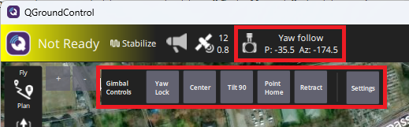
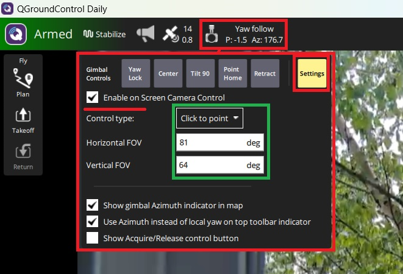
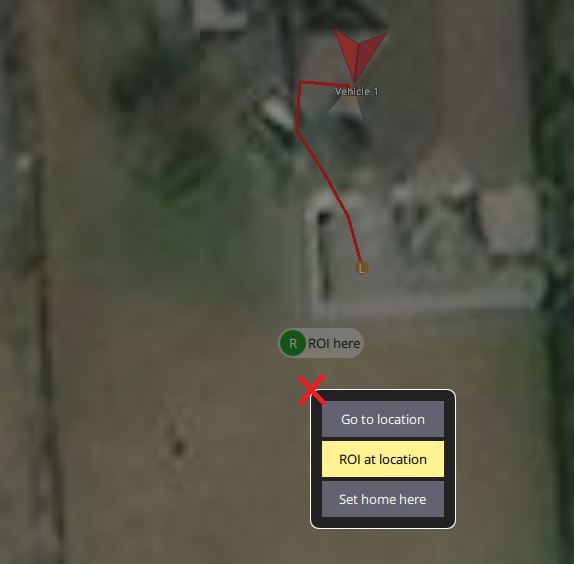

.. _common-mount-targeting:

=======================
Gimbal / Mount Controls
=======================
ArduPilot provides mechanisms to control the pointing direction (aka targeting) automatically for camera mounts (know hereafter as ``mounts``), as well as by pilot commands/controls. Mounts can be commanded point in at least six different ways (``targeting modes``) by ArduPilot.  This page provides an overview of these controls and their setup.

.. note:: ArduPilot supports up to two mounts. Each mount has parameters associated with it, e.g.  :ref:`MNT1_TYPE<MNT1_TYPE>`, :ref:`MNT2_TYPE<MNT2_TYPE>`, :ref:`MNT1_RC_RATE<MNT1_RC_RATE>`, :ref:`MNT2_RC_RATE<MNT2_RC_RATE>`, etc. For the remainder of the article, we will use MNT1 for examples of setups and parameters.

The mount's "targeting mode" defines how it is controlled.  Each ground station (GCS) is different but Mission Planner, for example, has a "Set Mount" button that allows changing the mode.  In many cases the user does not need to directly set the mode, instead this is done automatically as part of responding to a command from the user.

.. image:: ../../../images/mount-mp-set-mode.png
    :target: ../_images/mount-mp-set-mode.png
    :width: 450px

In order to enable the mount, a :ref:`MNT1_TYPE<MNT1_TYPE>` must be selected corresponding to the mount type. This will allow its mount parameters to be seen.

Targeting Modes
===============
Below are the 6 supported targeting modes.

0. **Retract Mode:** the mount will move to the roll, pitch and yaw angles held in the :ref:`MNT1_RETRACT_X<MNT1_RETRACT_X>`, :ref:`MNT1_RETRACT_Y<MNT1_RETRACT_Y>`, :ref:`MNT1_RETRACT_Z<MNT1_RETRACT_Z>` parameters respectively.  Some special mount specific behaviours:

    - :ref:`Gremsy mounts <common-gremsy-pixyu-gimbal>` will immediately stop stabilising
    - :ref:`Servo mount <common-camera-gimbal>` will move to the specified angles and stop stabilising. 
    - :ref:`Siyi mounts <common-siyi-zr10-gimbal>` do not provide roll control so the roll angle (:ref:`MNT1_RETRACT_X<MNT1_RETRACT_X>`) is ignored.

    - If a servo has been setup to mechanically deploy/retract the mount (``SERVOx_FUNCTION`` = 9 for MNT1, "15" for MNT2) it will be commanded to retract the mount. Changing to another mode will command the servo to deploy the mount.

1. **Neutral Mode:** the mount will move to the roll, pitch and yaw angles held in the :ref:`MNT1_NEUTRAL_X<MNT1_NEUTRAL_X>`, :ref:`MNT1_NEUTRAL_Y<MNT1_NEUTRAL_Y>`, :ref:`MNT1_NEUTRAL_Z<MNT1_NEUTRAL_Z>`, respectively.

2. **MAVLink Targeting:** the mount will move according to real-time commands received from the ground stations, companion computers or other MAVLink command source, and/or Auto mode mission commands. See :ref:`mav_cmd_do_gimbal_manager_pitchyaw`.

3. **RC Targeting:** the pilot controls the mount in real-time using the RC transmitter. See section below for more information.

4. **GPS Point:** same as MAVLink targeting but ArduPilot forces the mount to point at a specific location.  Users never need to actively set the mount to this mode. The user usually selects a point and altitude on the GCS map and selects a right click menu item to "Point the camera here".

5. **SysId Target:** the mount points at another vehicle with the MAVLink system id specified.  Users never need to actively set the mount to this mode and there are no known GCSs that support setting the system id, but the parameter can be set by updating the value of :ref:`MNT1_SYSID_DFLT<MNT1_SYSID_DFLT>` directly.

6. **Home Location:** the mount points at Home (normally its location when armed, unless changed by the user in the GCS)

The mount's default mode on startup can be set with the :ref:`MNT1_DEFLT_MODE<MNT1_DEFLT_MODE>` parameter.

.. note:: ArduPilot 4.5 (and higher) automatically switches the mount to RC Targeting Mode if the pilot moves any configured Roll/Pitch/Yaw RC targeting inputs (see below) by the larger of 10uS or ``RCx_DZ``.  The only exception is if the mounts is in RETRACT mode in which case the mount mode will not be automatically changed.

Mount Internal Axis Locks
=========================
The above modes concern how pitch, roll, and yaw axis *TARGETs* are sent to the mount. But many mounts have internal controls for how those targets for pitch, roll, and yaw are interpreted. Those positioning commands can be interpreted by the mount as being with respect to Earth frame reference or Body frame. Body frame are angle targets on each axis measured with respect to the mount itself, while Earth frame is interpreted to be with respect the horizon and compass heading.

For example, at 30 deg negative pitch target would be 30 deg down from the mount's zero point with respect to its mounting in Body frame, but 30 deg below the earth's horizon in Earth frame.

Most mounts have internal controls for each axis to determine how to interpret the targets. ArduPilot sets the mount's pitch and roll axis frame (if configurable) to Earth frame interpretations for all Mount types via its driver. The yaw axis is forced to Earth frame for the GPS Point, Home, and SysID modes, and can be forced from Body or Earth frame in RC Targeting mode using an ``RCx_OPTION`` switch setting of "163" (Mount Lock).

Control with an RC transmitter (aka RC Targeting)
=================================================
While the mount is in "RC Targeting" mode (see above for how to change modes), the pilot can control the mount's target roll, pitch and yaw angles using an RC transmitter channel for each axis. For example (RC channels shown are for example only, and can be any channel not otherwise used):

- set :ref:`RC6_OPTION <RC6_OPTION>` = 212 ("Mount1 Roll") to control the mount's roll angle with RC channel 6
- set :ref:`RC7_OPTION <RC7_OPTION>` = 213 ("Mount1 Pitch") to control the mount's pitch angle with RC channel 7
- set :ref:`RC8_OPTION <RC8_OPTION>` = 214 ("Mount1 Yaw") to control the mount's yaw angle with RC channel 8
- ensure the RCx_TRIM parameter for each RC input channel used is half way between RCx_MIN and RCx_MAX

.. note:: By default the RC input specifies the **angle** but this can be changed to **rate** control by setting :ref:`MNT1_RC_RATE <MNT1_RC_RATE>` to a **non-zero** desired rotation rate in deg/sec.

By default the yaw control is in "follow" mode (aka "body frame") meaning that the mount's heading will rotate as the vehicle rotates.  The alternative is "lock" mode (aka "earth frame") meaning the mount's heading will stay locked onto a particular heading regardless of the vehicle's yaw.  The pilot can switch between these two modes with an auxiliary switch:

- set :ref:`RC9_OPTION <RC9_OPTION>` = 163 ("Mount Lock") to switch between "lock", or yaw lock in earth-frame when switched to high, and "follow" mode or body frame yaw  with RC channel 9, for example.

.. note:: normally, the yaw lock will revert to "follow" mode on any targeting mode change. Then ``MNTx_OPTIONS`` bit 0, when set will allow the yaw lock mode to persist until changed by RC switch or MAVLink command.

The pilot can retract the mount with the "Retract Mount1" or "Retract Mount2" auxiliary switch (using RC 10 in the below example.)

- :ref:`RC10_OPTION <RC10_OPTION>` = 27 ("Retract Mount1") to change the mount to Retract mode
- :ref:`RC10_OPTION <RC10_OPTION>` = 113 ("Retract Mount2") to change the mount to Retract mode

Mission Planner Mount Controls
==============================
Mission Planner uses MAVLink commands to control the mount.  The mount's angles can be controlled as follows

- Set the mode to "MAVLink Targeting" using the Data screen's Actions tab's bottom left drop-down and then push the "Set Mount" button (see image above)
- Use the Payload Control tab to adjust the mount's roll, pitch or yaw angles

.. image:: ../../../images/mount-mp-payload-control.png
    :target: ../_images/mount-mp-payload-control.png
    :width: 450px

- Use the Aux Function tab to switch the yaw between "follow" and "lock" modes

.. image:: ../../../images/mount-mp-auxfn-mount-lock.png
    :target: ../_images/mount-mp-auxfn-mount-lock.png

To point the mount at a particular location (e.g. lat, lon, alt), on the Data screen, right-mouse-button click on the map and select, "Point Camera Here" and enter an altitude above home

.. image:: ../../../images/mount-mp-point-camera-here.png
    :target: ../_images/mount-mp-point-camera-here.png

QGC Mount Controls
==================
`QGC-4.4 (and higher) <https://github.com/mavlink/qgroundcontrol/releases>`__ supports controlling the mount from a Toolbar or by directly clicking on the real-time video.  The vehicle must be using ArduPilot 4.5 (or higher)

The mount control toolbar should appear at the top once a mount is detected.  Click on the toolbar to display the mount control buttons

- "Yaw Lock" / "Yaw Follow" controls whether the mount maintains an earth-frame yaw target (aka "lock") or moves with the vehicle's yaw (aka "follow")
- "Center" centers the mount (or more precisely moves it to the roll, pitch and yaw angles held in :ref:`MNT1_NEUTRAL_X<MNT1_NEUTRAL_X>`, :ref:`MNT1_NEUTRAL_Y<MNT1_NEUTRAL_Y>`, :ref:`MNT1_NEUTRAL_Z<MNT1_NEUTRAL_Z>`)
- "Tilt 90" points the mount directly downwards
- "Point Home" points the mount at the home location
- "Retract" retracts the mount (or more precisely moves it to the roll, pitch and yaw angles held in :ref:`MNT1_RETRACT_X<MNT1_RETRACT_X>`, :ref:`MNT1_RETRACT_Y<MNT1_RETRACT_Y>`, :ref:`MNT1_RETRACT_Z<MNT1_RETRACT_Z>`)

The mount may also be controlled by clicking on the real-time video screen

- Push the "Setting" button
- Check "Enable on Screen Camera Control" and set "Control type" to "Click to point"
- Enter the camera's Horizontal FOV and Vertical FOV
- Maximise the real-time video and click anywhere on the screen and the mount should move appropriately

To point the mount at a Location

- While the vehicle is flying, maximise the map
- Click anywhere on the map and select "ROI at location"
- To stop pointing at the location, click on the "ROI here" icon and select "Cancel ROI".  The mount will return to the mode held in the :ref:`MNT1_DEFLT_MODE<MNT1_DEFLT_MODE>` parameter

Companion Computer mount Controls
=================================
MAVLink mount commands can also be sent from other sources, such as companion computers. See :ref:`mavlink-gimbal-mount` for a commands list and more information.

Cameras may also be controlled via MAVLink commands from a companion computer or other source.
See :ref:`dev:mavlink-camera` documentation.

Control during Auto mode missions
=================================
Commands to control the mount are listed on the  :ref:`Camera Control in Auto Missions <common-camera-control-and-auto-missions-in-mission-planner>`, :ref:`Copter Mission Command List <mission-command-list>` and :ref:`Mission Commands <common-mavlink-mission-command-messages-mav_cmd>` pages

Other Mount Parameters
======================
- :ref:`MNT1_ROLL_MAX<MNT1_ROLL_MAX>` and :ref:`MNT1_ROLL_MIN<MNT1_ROLL_MIN>` control the mount's roll axis movement range in degrees
- :ref:`MNT1_ROLL_MAX<MNT1_pitch_MAX>` and :ref:`MNT1_pitch_MIN<MNT1_pitch_MIN>` control the mount's pitch axis movement range in degrees
- :ref:`MNT1_ROLL_MAX<MNT1_yaw_MAX>` and :ref:`MNT1_yaw_MIN<MNT1_yaw_MIN>` control the mount's yaw axis movement range in degrees
- :ref:`MNT1_OPTIONS<MNT1_OPTIONS>` bit 0 set will recover the yaw lock state of the previous mode. For example if the mount's yaw lock was body frame in RC Targeting mode and the mount mode switched to GPS Point (which forces earth frame yaw) and then switched back to RC Targeting, the yaw would be still earth frame unless this bit is set. Bit 1 set will force Neutral mode in RC failsafe to possibly re-center the camera in failsafe when user control has been lost.