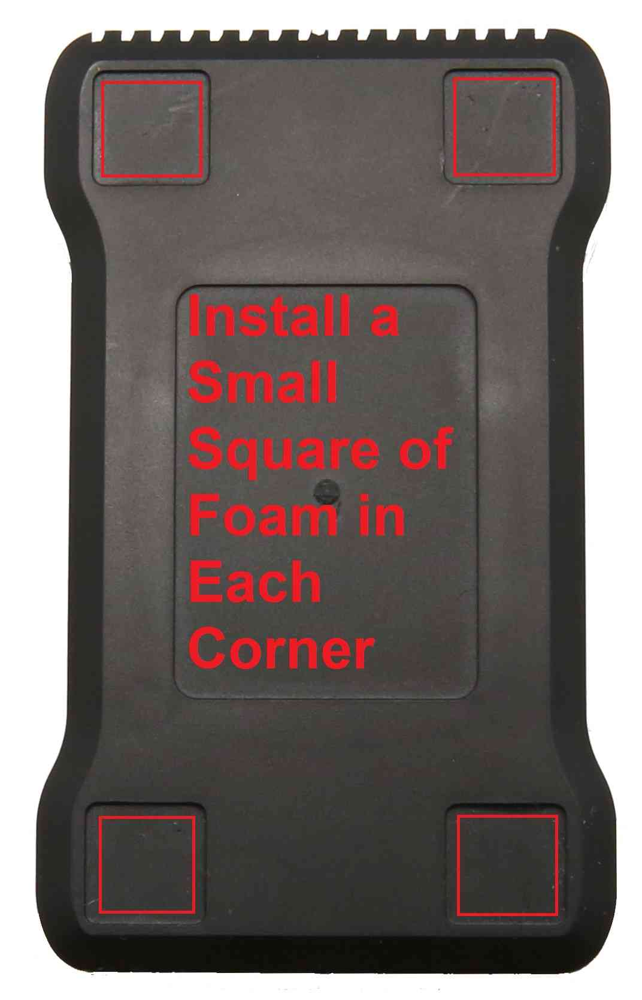

.. _common-mounting-the-flight-controller:

==============================
Mounting the Flight Controller
==============================

This article explains how to mount the flight controller in standard and
alternative orientations.

Standard orientation
====================

The :ref:`flight controller <common-autopilots>` (Pixhawk etc.) should be
housed within a case (which includes foam over the barometer) and should
be mounted with the white arrow pointing directly towards the front of
the vehicle.

It should be placed close to the center of gravity of the vehicle (both
horizontally and vertically).  Generally this means it should be placed
within a few centimeters of the middle of the vehicle and level with the
motors.  It is not critical that it is placed exactly at the middle but
closer is better (there are no recorded cases of problems caused by the
controller being far from the centre of gravity).

[site wiki="rover"]

[/site]

The board should be attached to the frame using 4 cubes of vibration
dampening foam approximately 3/4 inch square (3M foam can be purchased from `mRobotics <https://store.mrobotics.io/product-p/mro-pxfoams-mr.htm>`__).

.. tip::

   Vibration dampening foam is a simple and effective mechanism for
   vibration control. If :ref:`Measuring Vibration <common-measuring-vibration>` shows that it is not
   sufficient, alternative mechanisms are discussed in :ref:`Vibration Damping <common-vibration-damping>`.

Alternative orientations
========================

If the standard orientation of the Flight Controller is not convenient, it
can be mounted in over 30 other possible orientations.  The full list of
possible orientations can be seen and set through the Mission Planner
**Config/Tuning \| Advanced Params** screen, look for the
``Board Orientation (AHRS_ORIENTATION)`` parameter.

For Roll values, positive means roll right (i.e. "Roll90" means board is
rolled right 90 degrees so the white arrow still points forward but the
board is standing on it's right edge).

For Pitch values, positive numbers indicate pitch back (i.e. "Pitch90"
means the board's nose is pitched up 90 degrees so the arrow points
directly up)

For Yaw values, positive numbers indicate the nose of the board is
rotated clockwise (i.e. "Yaw90" means board is rotated so white arrow
points off to the right).

.. image:: ../../../images/MountingToFrame_MPBoardOrientation.png
    :target: ../_images/MountingToFrame_MPBoardOrientation.png
