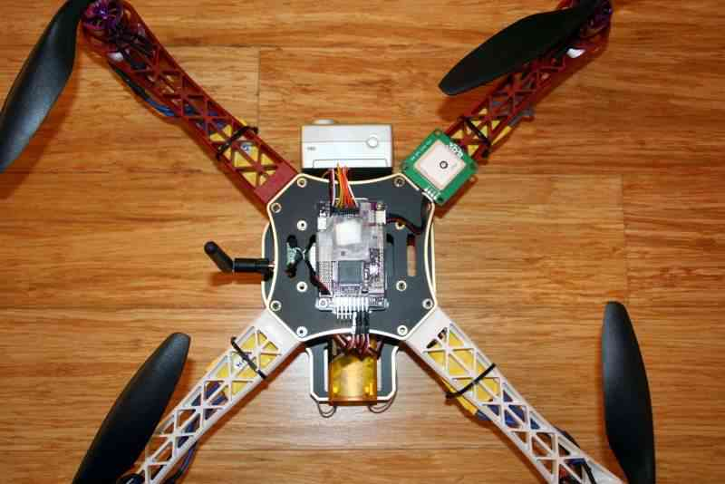
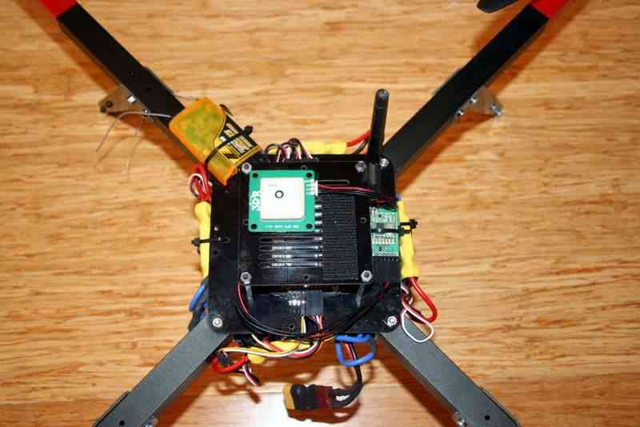

.. _common-mounting-the-gps-module:

===============================
Archived: GPS Module (External)
===============================

.. warning::

   **ARCHIVED ARTICLE**

   Almost everyone has moved to :ref:`GPS+compass module <copter:common-installing-3dr-ublox-gps-compass-module>`.

This page covers the mounting of GPS without an on-board compass. See
:ref:`this page <copter:common-installing-3dr-ublox-gps-compass-module>`
for the GPS+compass module.

Tips on mounting the GPS module
===============================

-  For modules without an on-board compass, the orientation does not
   matter as long as the square antenna side is facing up
-  The GPS should have a clear view of the sky and not be under spinning
   propellers
-  It should be mounted as far away as possible from radio transmission
   equipment (telemetry, video transmitters), motors, and ESCs.

Below are example mounting positions for a 3DR quad and Flamewheel

