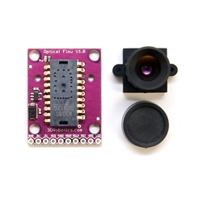
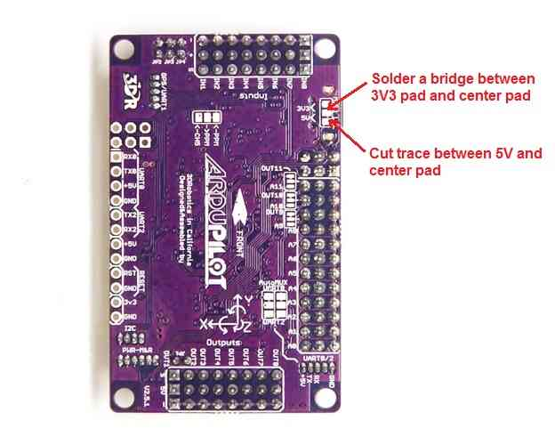
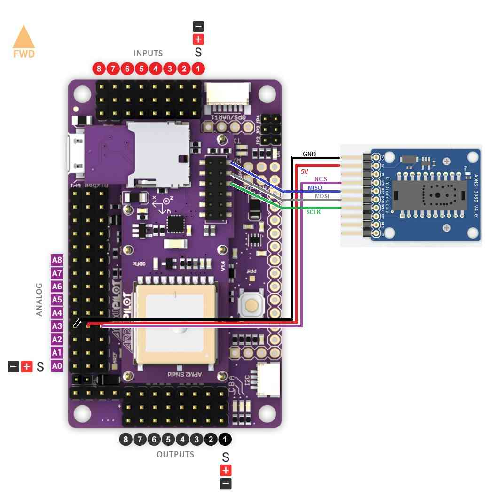
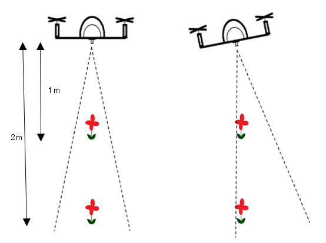

.. _common-mouse-based-optical-flow-sensor-adns3080:

==========================================
Mouse-based Optical Flow Sensor (ADNS3080)
==========================================

[copywiki destination="copter,plane"]

Copter-3.2.1 on APM2.x boards included limited support for the mouse sensor based `Optical Flow sensor <http://www.ebay.com/sch/i.html?_from=R40&_trksid=p2047675.m570.l1313.TR0.TRC0.H0.Xoptical+flow.TRS0&_nkw=optical+flow&_sacat=0>`__ using the OF_Loiter flight mode.

.. warning::

   This sensor is not supported in recent versions of the firmware.  
   Instead please use the :ref:`PX4Flow sensor <common-px4flow-overview>`.

.. image:: ../../../images/BR-0016-01-2T.jpg
    :target: ../_images/BR-0016-01-2T.jpg

Connecting the sensor to the APM2.5
===================================

-  Connect VCC, GND, MISO, MOSI, SCLK and NCS pins as shown in the diagram below
-  Default mounting is lens pointing down, pins forward

-  Cut and resolder the MISOLVL jumper on the back of the board to switch the MISO pin to work on 3.3v. This is critical to ensure the optical flow sensor does not interfere with the MPU6000.

Connecting the sensor to the APM2
=================================

-  Power, GND, NCS pins should be attached to A3
-  MISO, MOSI and SCLK pins should be directly soldered to the pins shown
-  Default mounting is lens pointing down, pins forward

Connecting the sensor to the APM1
=================================

-  Directly solder wires to the top of the Oilpan as shown below
-  Default mounting is lens pointing down, pins forward

Testing the sensor
==================

-  Upload the test sketch to the APM:

   -  If using an APM2, you can `download the hex file from here <http://download.ardupilot.org/downloads/wiki/advanced_user_tools/AP_OpticalFlow_test.hex>`__
      and then upload to your APM2 using the Mission Planner's **INITIAL SETUP \| Install Firmware \| Load custom firmware** link
   -  If using an APM1 you must open the
      `AP_OpticalFlow_test.pde <https://raw.githubusercontent.com/diydrones/ardupilot/860f4b260552297253a28b83a7f108302b84b97e/libraries/AP_OpticalFlow/examples/AP_OpticalFlow_test/AP_OpticalFlow_test.pde>`__\ sketch in the arduino IDE, compile and upload to your APM1

-  Connect to your APM with the Serial Monitor or AP Mission Planner Terminal
-  type 'c' to ensure that the sensor is responding to the APM
-  type 'm' and move the camera back and forth and check that x,y values
   change. If they do not change, modify the focus of the lens by turning it left or right.

Capturing an image from the sensor
==================================

In order to check that you have the lens properly focused you can capture an image directly from the sensor and display it using a simpler viewer written in Python.

.. image:: ../../../images/ADNS3080ImageGrabber.jpg
    :target: ../_images/ADNS3080ImageGrabber.jpg

#. Upload the AP_OpticalFlow_test.pde to the APM (see above)
#. Install Python 2.7 (or later version) from the `official python site <https://www.python.org/downloads/>`__\ 

   (For windows users, for compatibility with pyserial, you should
   install the `32bit version <https://www.python.org/ftp/python/2.7.2/python-2.7.2.msi>`__\ even
   if you are running 64bit windows)
#. Install `PySerial 2.5 <http://pyserial.sourceforge.net/>`__. The Windows package 
   `can be downloaded from here <http://pypi.python.org/packages/any/p/pyserial/pyserial-2.5.win32.exe>`__.
#. Start the Python IDLE editor
#. File, Open,
   .../arduino-0022/libraries/AP_OpticalFlow/examples/ADNS3080ImageGrabber/ADNS3080ImageGrabber.py
#. Run, Run Module - the Python Shell and then ADNS3080ImageGrabber
   applications should appear
#. On the ADNS3080ImageGrabber screen, change the default com port to
   the port connected to your APM and press Open
#. Push the Send button to start/stop grabbing images from the sensor (a
   new image should appear every 2 seconds)

Note 1: After capturing images, you will need to reset the sensor (i.e.
plug/unplug it) to restore it to the normal motion capture mode.

Note 2: you should see the the AP_OpticalFlow_ADNS3080's menu and any
errors appear in the Python Shell.

How it works
============

The mouse sensor returns the average movement (in the x and y
directions) of surface features that it sees. A single pixel move will
not cause the sensor to return "1". It will return a higher value around
5. This value is referred to as the **scaler** below. In the example
below, the value returned would be about 1.6 ( (-5+5+5) / 3)

**Sensor's x and y values can be converted to real distances based on
altitude**

In order to convert values from the sensor to real distances moved, we
need to take into account the altitude. This is necessary because as you
can see from the two pictures below, if we have two quads moving the
same distance, but one at a low altitude, the other at a higher
altitude, the lower quad will see surface features appear to move
further and this will result in a higher optical flow values

.. image:: ../../../images/AltitudesEffectOnSensorValues.png
    :target: ../_images/AltitudesEffectOnSensorValues.png

We compensate for vehicle roll and pitch changes

Change in the vehicle's roll and pitch will also cause changes in the x
and y values returned by the sensor. Unlike the lateral movement
calculations these are not dependent upon the distance of the visible
objects. In the picture below you can see that as the quad has rolled 10
degrees but both flowers have moved from the center of the camera's view
in the 1st pic to the edge of the view in the 2nd pic.

The expected change in sensor values can be calculated directly from the
change in roll and pitch given the formula below. We subtract these
expected changes from the real values returned by the sensor.

Once we have the x/y movements we can integrate these values over time
with the current yaw to arrive at an estimate of position.

Known issues
============

-  The sensor only works in well lit environments
-  A fixed-focus lens is used meaning it cannot focus on objects closer
   than 30cm (1 foot).
-  Rotating the sensor will confuse the sensor

Acknowledgements:
=================

#. `Marko Klein Berkenbusch's <http://diydrones.com/profile/MarkoKleineBerkenbusch>`__
   position hold with mouse sensor

#. research paper re `optical flow for position hold <http://www.araa.asn.au/acra/acra2007/papers/paper181final.pdf>`__
#. research paper re `optical flow for object avoidance <http://www.mecatronica.eesc.usp.br/wiki/upload/0/0a/2006_Thesis_Remote_Terrain_Navigation_for_Unmanned_Air_Vehicles.pdf>`__
