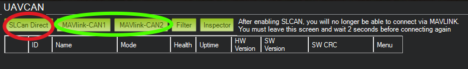
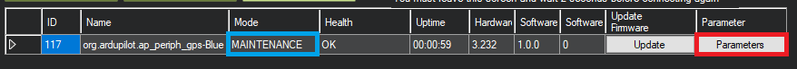
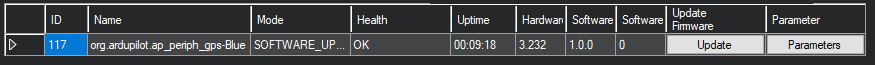
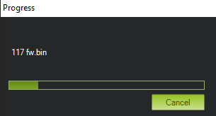
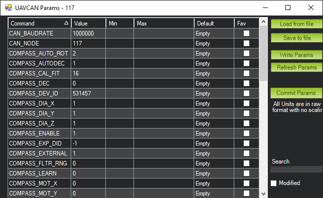
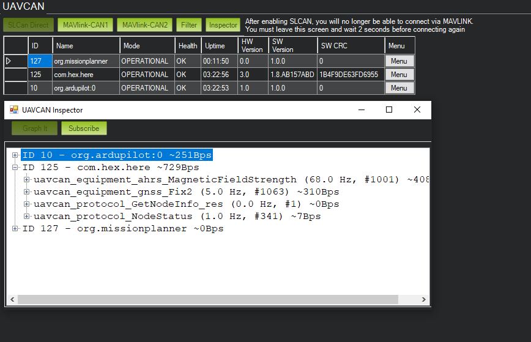

.. _common-mp-slcan:

=====================
Mission Planner SLCAN
=====================

SLCAN tool inside Mission Planner allows viewing, configuration and software updates of nodes
connected to the CANBUS port of the flight controller.

Before the autopilot can be connected to Mission Planner using SLCAN, parameters have to be configured. See :ref:`common-slcan-f4` or :ref:`common-slcan-f7h7` for setup information. If Mission Planner is in the disconnected state, make sure the SLCAN port is shown as the selected COM port in the drop down box in the upper right corner of Mission Planner.

In Mission Planner, navigate to Initial Setup->Optional Hardware->UAVCAN
click on the highlighted red button. 

The autopilot will connect to Mission Planner using SLCAN, the window will populate with
UAVCAN nodes connected.

.. image:: ../../../images/can-slcan-mpc.png

If the node has bootloader only installed, then firmware will need to be
uploaded. ``MAINTENANCE`` will be displayed. Click on update firmware. Firmware can be found `here <https://firmware.ardupilot.org/AP_Periph/>`__ and downloaded for the node.

A pop up will open. Select no and then find firmware for your node previously
downloaded and select it.

The Window will show Firmware being uploaded and a pop up will show status.

Once complete mode will change to ``OPERATIONAL``, press the ``Parameters`` button to access node settings. From here UAVCAN device parameters can be accessed or changed.

Clicking on ``Inspector`` will open a popup window to view messages on the CANBUS.

To return to normal Mission Planner operation, change to another tab, and re-connect. You may need to wait 2 seconds before re-connecting.
