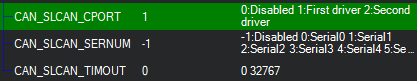
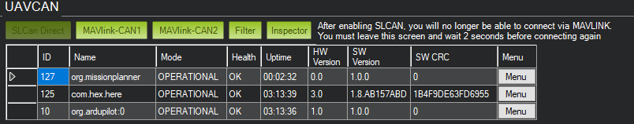

=====================
Mission Planner SLCAN
=====================

SLCAN tool inside Mission Planner allows viewing, configuration and software updates of nodes
connected to the CANBUS port of the flight controller.

Before the autopilot can be connected to Mission Planner using SLCAN, parameters have to be configured.
<page link>

Reboot flight controller.
Start Mission Planner, navigate to setup, optional hardware, UAVCAN.
click on the highlighted red button.

The autopilot will connect to Mission Planner using SLCAN, the window will populate with
nodes connected.

If the node has bootloader only installed then firmware will need to be
uploaded. Maintenance will be displayed.
Click on update firmware and select the correct file for the node connected.
These can be found `here. <https://firmware.ardupilot.org/AP_Periph/>`_

A pop up will open. Select no and choose firmware for your node previously
downloaded.

.. image:: ../../../images/can-slcan-mp-srch.png

The Window will show Firmware being uploaded and a pop up will show status.

.. image:: ../../../images/can-slcan-mp-upd.png

Once complete mode will change to **operational**,
press parameters button to access node settings. From here node address, baud rate and other parameters
are accessed.

Clicking on Inspector will open a popup window to view messages on the BUS.

To return to normal operation close down Mission Planner power down/reboot.
