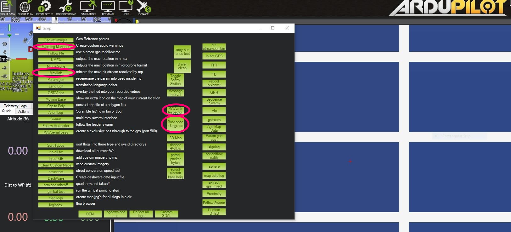
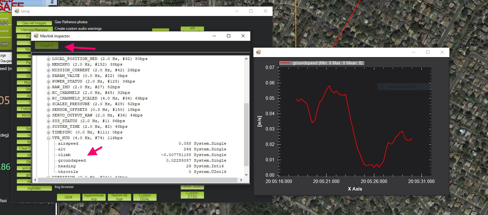
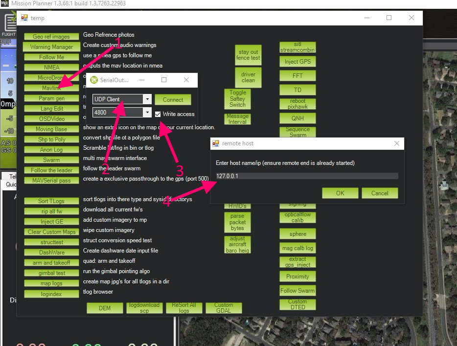
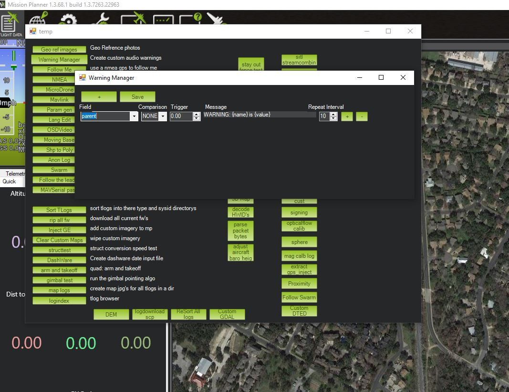

.. _common-mp-tools:

==============================
Mission Planner Advanced Tools
==============================

Mission Planner has many advanced tools which are normally hidden from the user. These can be accessed via pressing CTRL-F. Many have use only to developers or advanced users, but a few can be useful to regular users.

Some useful utilities are: MAVLink Inspector, BootLoader Upgrade, MAVLink (Forwarding), and Warning Manager.

MAVLink Inspector
=================

This allows a real time inspection of the MAVLink values being sent. A user can see any measurement/reading being sent and normally stored in a TLOG, in real time. A user selected number of historical points of a data value can be graphed real-time also.

BootLoader Upgrade
==================

Often the boot loader supplied by an autopilot vendor may be out of date. Using this button will automatically update the autopilots bootloader. If it is already current, then no update will occur.

Mavlink
=======

This allows forwarding of your connected autopilots MAVLink stream via the internet to another user with a public IP address. This is often used by users to help another user debug issues.

#. Select this tool
#. Next a dialog will open with drop-downs to allow selection of communication port. For remote connections usually UDP will be chosen. For TCP or UDP, the baud rate selection box is unimportant.
#. Click this box if you want the remote party to be able to change parameters on you autopilot or control it remotely.
#. When "Connect" is selected, depending on communications port, the public IP address of the recipient and port dialogs will open for input.

After this, the remote site should start getting MAVLink packets from your autopilot. They can use whatever ground station they chose to receive them.

.. note:: You can forward MAVLink packets to only one location.

.. note:: UDP is usually recommended instead of TCP since TCP requires acknowledgment of packets and network delays can slow down Joystick response to the point of causing crashes. UDP will continue to send control commands without waiting for acknowledgment of previous data reception.

Forwarding Locally
------------------

You can also forward locally so that multiple ground control stations can connect to the locally attached autopilot on the same PC. In this case just use the local PC's localhost ip address of 127.0.0.1. You then can connect another GCS like MAVProxy or QGC on the same PC. 

Warning Manager
===============

This allows the creation of custom audio warnings based on virtually any measurement/status reading being received over the MAVLink connection to the vehicle.

You can select an incoming data item from the drop-down list, and compare it against a limit and then have a phrase saved and spoken by Mission Planner.

[copywiki destination="planner"]