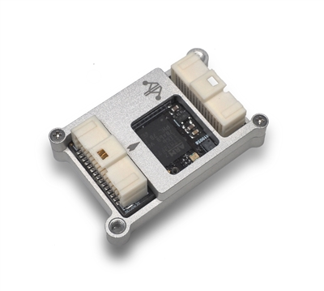

.. _common-mro-control-zero-F7:

=========================
mRobotics Control Zero F7
=========================

Specifications
==============

- 32-bit STM32F777 Cortex M4 core with FPU rev. 3 216 MHz/512 KB RAM/2 MB Flash
- F-RAM Cypress MF25V02-G 256-Kbit nonvolatile memory (Flash memory that performs as fast as RAM)

- Bosch BMI088 3-axis accelerometer/gyroscope (internally vibration dampened)
- Invensense ICM-20602 3-axis accelerometer/gyroscope
- Invensense ICM-20948 3-axis accelerometer/gyroscope/magnetometer
- Infineon DPS310 barometer (So smooth and NO more light sensitivity)

- Spektrum DSM / DSM2 / DSM-X® Satellite compatible input and binding
- Futaba S.BUS® & S.BUS2® compatible input
- FRSky Telemetry port output
- Graupner SUMD
- Yuneec ST24
- PPM sum input signal
- 8x PWM outputs (all DShot capable)
- 1x RSSI (PWM or voltage) input
- 6x UART (serial ports total), two with HW flow control
- USB console input with two endpoints, one defaults to MAVLink for GCS, one for SLCAN
- 1x I2C
- 1x SPI
- 1x CAN
- 1x JTAG (TC2030 Connector)
- 3x Ultra low noise LDO voltage regulators
- Tricolor LED

Uncased Weight and Dimensions
=============================
- Weight: 5.3g (.19 oz)
- Width: 20mm (.79”)
- Length: 32mm (1.26”)
- Height: 12.07mm (.475")

Default UART order
==================

- SERIAL0 = console = USB (normally for GCS connection)
- SERIAL1 = Telemetry1 = USART2
- SERIAL2 = Telemetry2 = USART3
- SERIAL3 = GPS1 = UART4
- SERIAL4 = GPS2 = UART8 (labelled as FrSky Telem, but can be used for any serial device, defaults to GPS protocol)
- SERIAL5 = User = UART7 (USER/DEBUG)
- SERIAL6 = OTG2 (virtual USB connection for SLCAN or passthru use)

Serial protocols can be adjusted to personal preferences.

Dshot capability
================

All motor/servo outputs are Dshot and PWM capable. However, mixing Dshot and normal PWM operation for outputs is restricted into groups, ie. enabling Dshot for an output in a group requires that ALL outputs in that group be configured and used as Dshot, rather than PWM outputs. The output groups that must be the same (PWM rate or Dshot, when configured as a normal servo/motor output) are: 1-4, 5/6, and 7/8.

More Information
================

Pinouts, wiring diagrams, setup information, etc. is shown here:

`mRo Control Zero <https://mrobotics.io/docs/mro-control-zero-f7/>`_

Where to Buy
============

`mRobotics <https://store.mrobotics.io/>`_