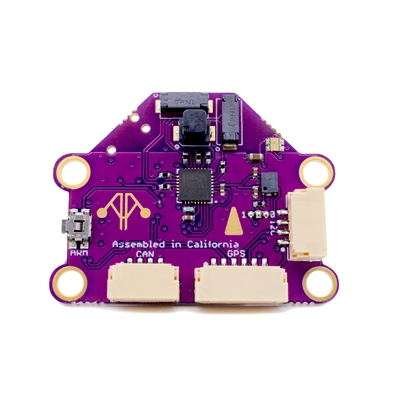
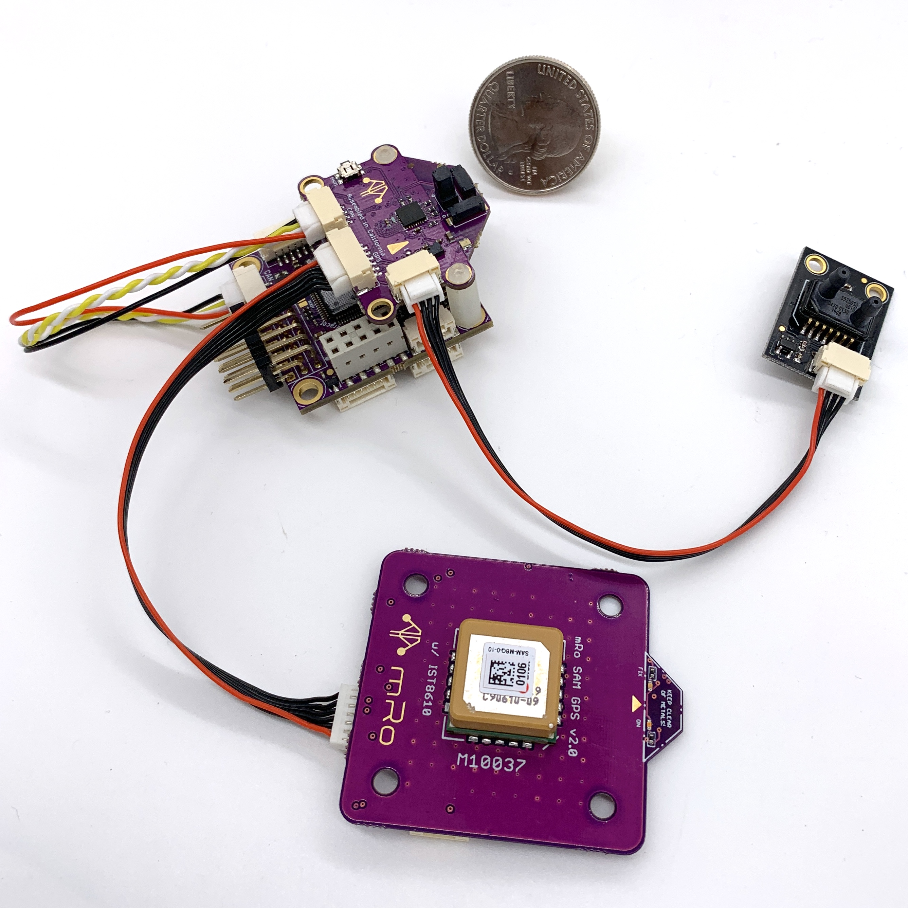

.. _common-mro-kitcan:

=====================================================
mRobotics KitCAN CAN/UAVCAN Adapter Node+Compass+Baro
=====================================================

The next generation of integration from the mRo :ref:`CAN/UAVCAN Adapter Node <common-mro-uavcan-adapter-node>`, the KitCAN integrates an ultra high precision magnetometer and barometer, in addition to providing an easy means of interfacing conventional GPS and Airspeed Sensors to UAVCAN, using a single CAN bus connection to the autopilot. It also includes an RGB LED and Arm Switch/Button.

Features
========

- UAVCAN to GPS (UART interface)
- UAVCAN to I2C Airspeed Sensor (MS5525 default configuration) and/or MAGNETOMETER (autodetect)
- UAVCAN integrated peripherals:
   - RM3100 High Precision Magnetometer
   - DPS310 Barometer
   - RGB LED
   - Safety Switch
- JST-GH Connectors 
- Mounting Holes: 14mm x 31.5mm, 3.3mm diameter

Pinouts
=======

GPS Port

========== =============== =================
Pin        Signal Name     Voltage/Tolerance
========== =============== =================
1 (red)     VCC             5V
2           TX (data out)   3.3V
3           RX (data in)    3.3V/5V
4           I2C SDA         3.3V/5V
5           I2C SCL         3.3V/5V
6           GND             --
========== =============== =================

CAN Port

========== =============== =================
Pin        Signal Name     Voltage/Tolerance
========== =============== =================
1 (red)     VCC             5V
2           CAN_H           CAN bus
3           CAN_L           CAN bus
4           GND             --
========== =============== =================

I2C Port

========== =============== =================
Pin        Signal Name     Voltage/Tolerance
========== =============== =================
1 (red)     VCC             5V
2           I2C SDA         3.3V/5V
3           I2C SCL         3.3V/5V
4           GND             --
========== =============== =================

.. note:: As delivered, the KitCAN will discover a MS5525 Airspeed sensor and/or any standard ArudPilot supported I2C Magnetometer that is connected to its I2C external bus

Typical System
==============

In this case, the Kitcan is connected to an :ref:`mRo Pixracer <common-pixracer-overview>` 
autopilot via CAN and is providing the intefaces for a MS5525 airspeed sensor and a typical GPS/Compass combo, the `mRo SAM GPS + IST8308 Mag <https://store.mrobotics.io/product-p/mro10037.htm>`_

Setup
=====

Verify the following parameters are set on your autopilot via your ground station.

- :ref:`CAN_P1_DRIVER<CAN_P1_DRIVER>` = 1 (assuming its on the first CAN bus of the autopilot)
- :ref:`GPS_TYPE<GPS_TYPE>` = 9 (UAVCAN) or if it will be the secondary GPS, set instead
- :ref:`GPS_TYPE2<GPS_TYPE2>` = 9 (UAVCAN)
- Reboot

Make sure the UAVCAN compass driver is not disabled. (:ref:`COMPASS_TYPEMASK<COMPASS_TYPEMASK>` bit 9 should not be set). 

If your controller has multiple compasses attached already, you may want to set the attached compass as a higher priority than others, if it has better precision or performance.

To enable the integrated I2C RGB LED set:

- :ref:`NTF_LED_TYPES<NTF_LED_TYPES>` bit 5 (UAVCAN) should be set in the autopilot. 

The integrated safety switch is automatically used, if the autopilot has enabled the use of safety switches via :ref:`BRD_SAFETYENABLE<BRD_SAFETYENABLE>` is "1" (default).

If you want to enable an attached I2C airspeed sensor, set:

- :ref:`ARSPD_TYPE<ARSPD_TYPE>` = 8 (UAVCAN)

If the attached sensor is not an MS5525 type with I2C address 0x76, then you must access your KitCAN's CAN parameters to select Airspeed type being attached to the adapter. Using Mission Planner (or :ref:`common-uavcan-gui`), go to the menu SETUP/Optional Hardware/UAVCAN/SLCan Mode CAN1/Parameters. Once the CAN Adapters parameters appear, change the following (this changes them inside the UAVCAN adapter, NOT the autopilot, allowing the adapter to use the correct driver and convert the information to UAVCAN airspeed format):

- :ref:`ARSPD_TYPE<ARSPD_TYPE>` = 4 (is default for an I2C-MS5525 with an 0x76 address which prevents conflict with the DSP310 integrated onboard with address 0x77). If another sensor is used, change the type to match that sensor.
- :ref:`ARSPD_USE<ARSPD_USE>` =  1
- :ref:`ARSPD_BUS<ARSPD_BUS>` =  0

Then reboot.

Firmware
========

This device uses the "f303-M100025" firmware located at https://firmware.ardupilot.org/AP_Periph. See the :ref:`SLCAN section of UAVCAN advanced setup<common-uavcan-setup-advanced>` for downloading instructions, if changes are desired or updates become available.

Where to Buy
============

- `mRobotics <https://store.mrobotics.io/product-p/mro10025b.htm>`_

