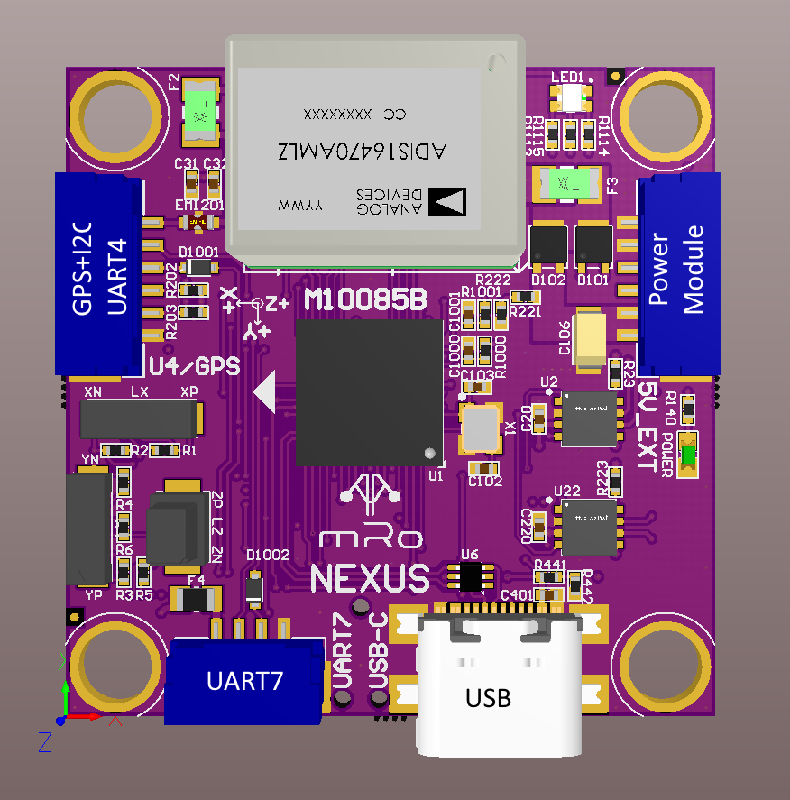

.. _common-mro-nexus:

============
mRo Nexus
============

The `mRo Nexus <https://store.mrobotics.io>`__ is new member of mRo's Pixracer autopilot family.

Overview
========

The `mRo Nexus <https://store.mrobotics.io>`__ is a member of the next generation of mRobotics' family of Pixracer autopilots. It has been designed for ultra compact applications which primarily use CAN peripherals, as well as standard GPS/Compass or Airspeed sensors. It includes an integrated ADS-B receiver for avoidance.

.. tip::

   At time of writing the autopilot is still being evolved/improved.
   The final version may very slightly from the information provided
   here.

Specifications
==============

-  **Processor**:

   -  MCU - STM32H743VIH6
   -  2MB flash allows full features of ArduPilot to be flashed

-  **Sensors**

   -  Gyro/Accelerometer: Invensense ICM-40609D / Gyro (? KHz)
   -  Barometer: DSP310
   -  RM3100 Precision Compass

-  **Power**

   -  5-5.5VDC from USB or PowerBrick connector. Optional/recommended
      `ACSP4 +5V/+12V Power Supply <https://store.mrobotics.io/product-p/auav-acsp4-mr.htm>`__.
   -  Ultra low noise LDOs for sensors and FMU

-  **Interfaces/Connectivity**

   -  Dual CAN/UAVCAN ports
   -  MicroSD card reader
   -  Micro-C USB
   -  RGB LED
   -  GPS (serial + I2C)
   -  UART for serial RC input
   -  Connectors: GPS+I2C (USART4),CAN1, CAN2, 
      USART7 (TxD, RxD), POWER-BRICK(VDD, Voltage, Current, GND).

-  **Dimensions**

   -  Weight ?
   -  Size

Connector pin assignments
=========================

Unless noted otherwise all connectors are JST GH

UART7 connector
---------------

===    ======       =================
PIN    SIGNAL       VOLTAGE/TOLERANCE
===    ======       =================
1       +5V             +5V
2       TX1             +3.3V/5V
3       RX1             +3.3V/5V
4       GND             GND
===    ======       =================

USART4 (GPS+I2C) connector
--------------------------

===    ======       =================
PIN    SIGNAL       VOLTAGE/TOLERANCE
===    ======       =================
1       +5V             +5V
2       TX              +3.3V/5V
3       RX              +3.3V/5V
4       SCL             +3.3V/5V
5       SDA             +3.3V/5V
6       GND             GND
===    ======       =================

CAN1 and CAN2 connectors
------------------------

===    ======       =================
PIN    SIGNAL       VOLTAGE/TOLERANCE
===    ======       =================
1       +5V             +5V
2       CH              +3.3V/5V
3       CL              +3.3V/5V
4       GND             GND
===    ======       =================

Power connector
---------------

===    =============   =================
PIN    SIGNAL          VOLTAGE/TOLERANCE
===    =============   =================
1      +5V in          +5V
2      +5V in          +5V
3      CURR sense in   +3.3V/5V
4      VOLT sense in   +3.3V/5V
5       GND             GND
6       GND             GND
===    =============   =================

Default UART order
==================

=========  ==================  =======================
Parameter  Default Protocol**  Connector/Suggested Use
=========  ==================  =======================
SERIAL0    console             USB
SERIAL1    Telemetry1          UART7/Serial RC input
SERIAL2    Telemetry2          USB (second composite USB interface)/SLCAN
SERIAL3    GPS1                UART4/GPS
=========  ==================  =======================

** User may change SERIALx_PROTOCOL as required for application

Where to Buy
============

- `mRobotics <https://store.mrobotics.io/>`__

